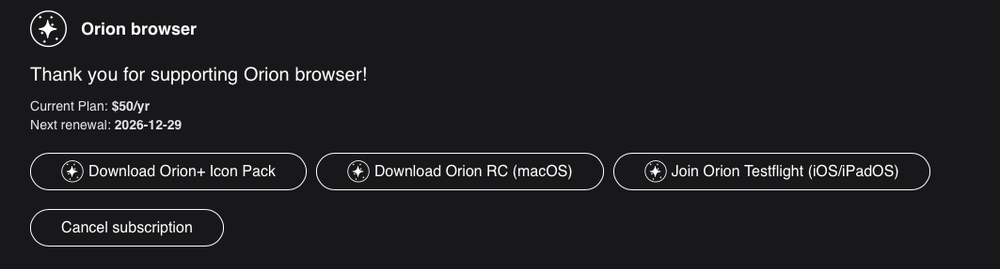
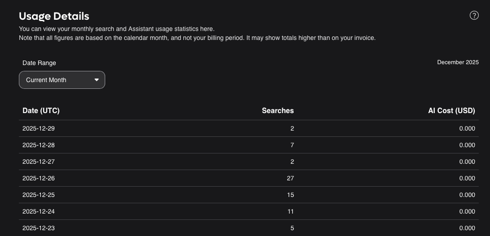

# Billing Settings

These settings control your billing options and status with Kagi, there are two tabs you will use:

* [Billing Settings](https://kagi.com/settings/billing)
* [Billing Usage](https://kagi.com/settings/consumption)

## Billing Settings

Your billing settings show your [Plan Type](../plans/plan-types.md), your account balance (if applicable), and the date of the next renewal (if on a paid plan), as well as:
##### Trial plan
- Trial searches used
- AI interactions
- Trial Assistant interactions used

##### Starter plan
- Total searches this period
- Assistant interactions this period

##### Professional plan and above
- Total [AI](../ai/assistant) cost for this period

##### You can also:

- [Sign up for a paid plan](https://help.kagi.com/kagi/plans/plan-management.html#signing-up-for-the-premium-plans)
- [Manage your billing](../plans/plan-management.md#managing-billing)
- [View and download past invoices](https://kagi.com/billing/portal)

## Switching a Plan

To switch your plan:

- Navigate to `Settings > Billing`
- Click `Switch Plan`
- Select the plan you want
- Follow the prompts

## Add Pre-paid Credit

To add funds to your account to pay for a subscription:

1. Navigate to `Settings > Billing`
2. Click `Add pre-paid credit` (if you don't see this option, click [here](https://kagi.com/settings/account_topup))
3. Select your payment method (PayPal, Stripe, or OpenNode)
4. Choose the amount in USD

After the credit has been added, you can [subscribe to a plan](https://kagi.com/settings/billing_plan).
You will still be redirected to Stripe during the process, but your credits will be used for payment and you will not need to enter a credit card. 

*Please note that sales tax or VAT may be added to the subscription price depending on your location.*

## Billing Settings: Retry billing

If your billing gets declined you will need to retry the billing attempt for the invoice by selecting the Manage Billing option under your Billing Settings

## Billing Settings: Orion browser

If you are a premium subscriber to Orion Browser, made by the same team that builds Kagi, you will see your subscription listed at the bottom of the page. 

There you will have the option to download the icon pack, the Release Candidate, as well as joining the TestFlight or cancel your subscription (though we will work hard to make sure you don't!)

## Usage details

The usage details section allows you to see details about your search and AI usage for the current month or view the monthly overview.