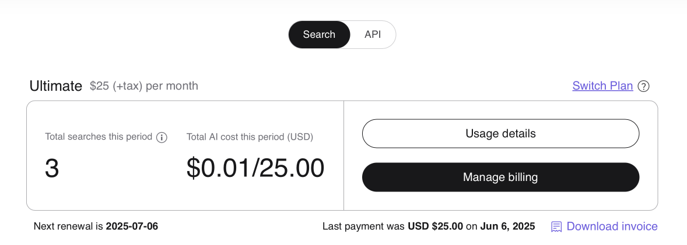
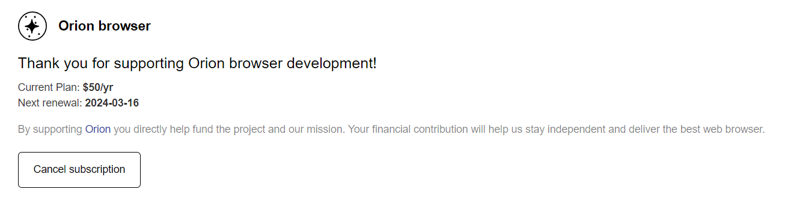
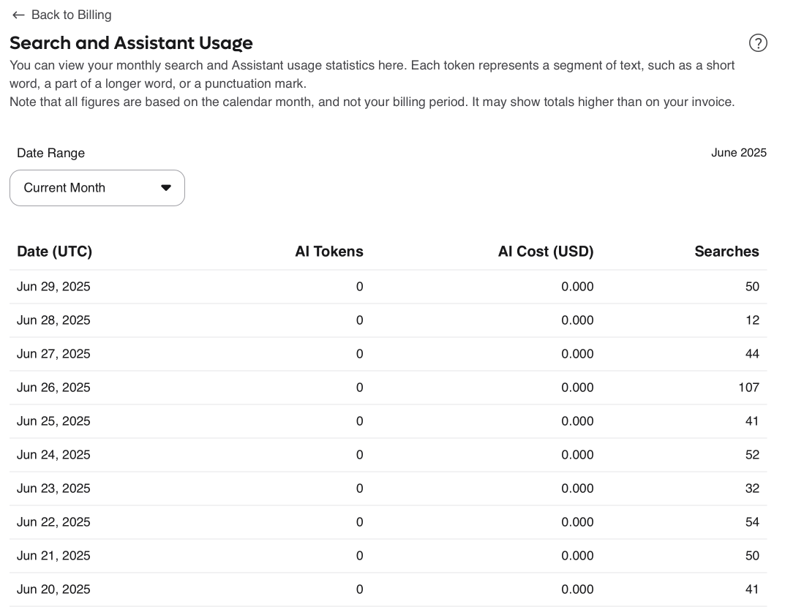

# Billing Settings

These settings control your billing options and status with Kagi, there are two tabs you will use:

* [Billing Settings](https://kagi.com/settings/billing)
* [Billing Usage](https://kagi.com/settings/consumption)

## Billing Settings

Your billing settings will show you your [Plan Type](../plans/plan-types.md) as well as:

* Total searches this period
* Searches used by AI (only on Trial plan)
* Total [AI](../ai/assistant) cost for this period 
* Amount of credit value
* Date of next renewal

You will also see options to:

* View your Usage details
* Manage your Billing
* Download an invoice

We have documentation that covers how to:

* [Sign up for the Premium Plan](../plans/plan-management.md#signing-up-for-the-premium-plans)
* [Manage your billing](../plans/plan-management.md#managing-billing)
* [Cancel your Subscription](../plans/plan-management.md#canceling-a-premium-plan)
* [Switch your Plan](#switching-a-plan)

## Switching a Plan

To switch your plan:

1. Navigate to Settings -> Billing
2. Click "Switch Plan"
3. Select a Plan you want to switch to
4. Follow the prompts

## Billing Settings: Retry Billing

If your billing gets declined you will need to retry the billing attempt for the invoice by selecting the Manage Billing option under your Billing Settings

## Billing Settings: Orion Support

If you are supporting the Orion Browser made by the same team that builds Kagi you will see the subscription listed at the bottom of the page with the option to cancel (though we will work hard to make sure you do not!)

## Usage details

The usage details section allows you to see details about your search and AI usage for the current month or view the monthly overview.

