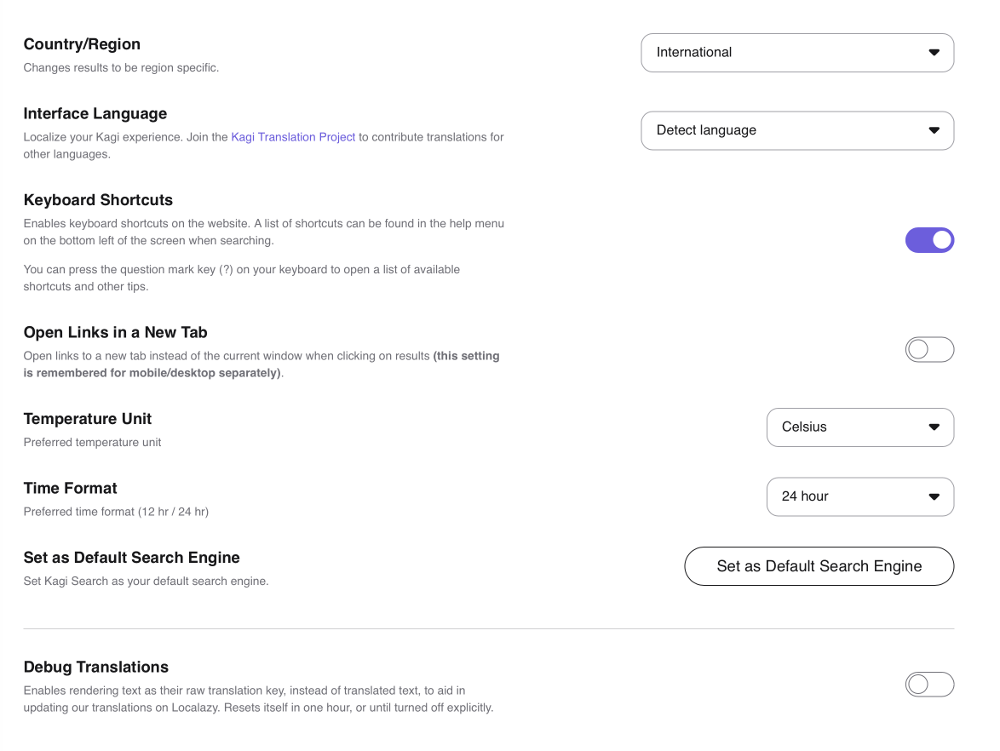

# General Settings

These are settings that control your search experience across the whole product.

## Overview

- **Country/Region** — You can constrain search results to come from a specific country/region or choose to see International results.
- **Keyboard Shortcuts** — You can enable or disable [keyboard shortcuts](../features/search-operators.md#keyboard_shortcuts) in Kagi Search. (If you press **?** on your keyboard (**shift + /**) while in search results, Kagi will open a scrollable window showing the keyboard shortcuts. You can also click or tap **Help** at the bottom of any Kagi webpage to see the shortcuts.)
- **Open Links in a New Tab** — Enable or disable opening links in a new tab instead of the current window when clicking on search results. This setting is stored for mobile and desktop separately.
- **Set as Default Search Engine** — Takes you to information about how to [set Kagi as your default search engine](../getting-started/setting-default.md).
