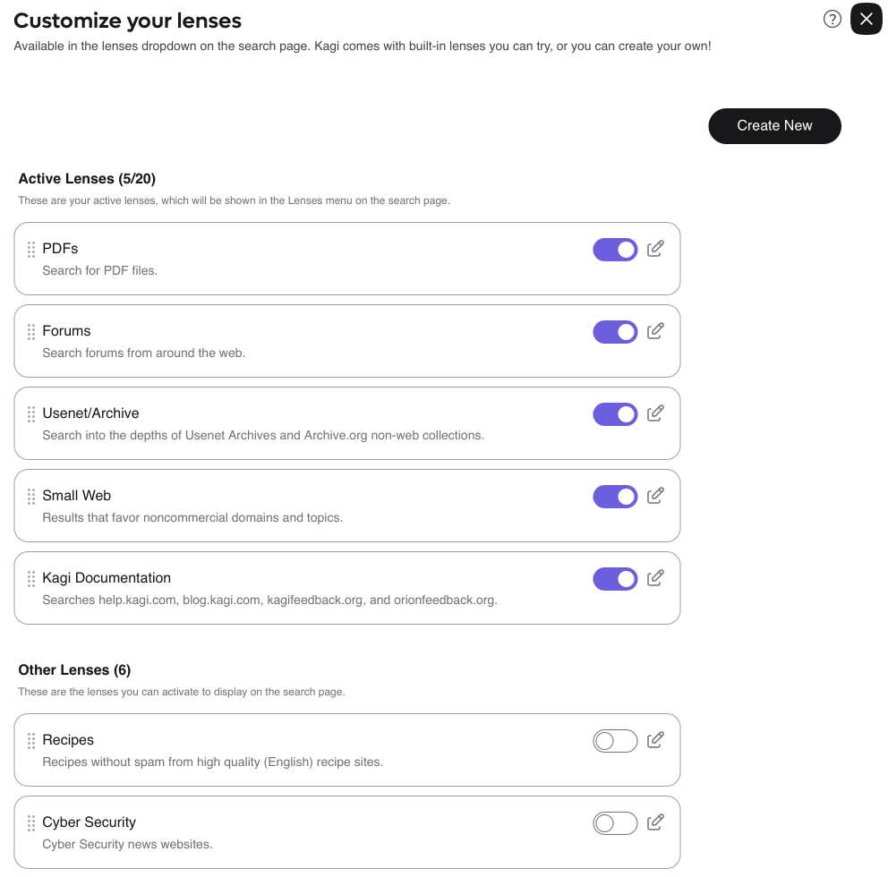

# Lenses Settings

[Lenses](../features/lenses.md) are a novel Kagi feature for doing focused searches on particular topics or domains.

The [Lenses Settings](https://kagi.com/settings?p=lenses) page allows you to enable and disable the available Lenses to suit your needs.
Only enabled lenses will appear in the dropdown while using Kagi search.

 
