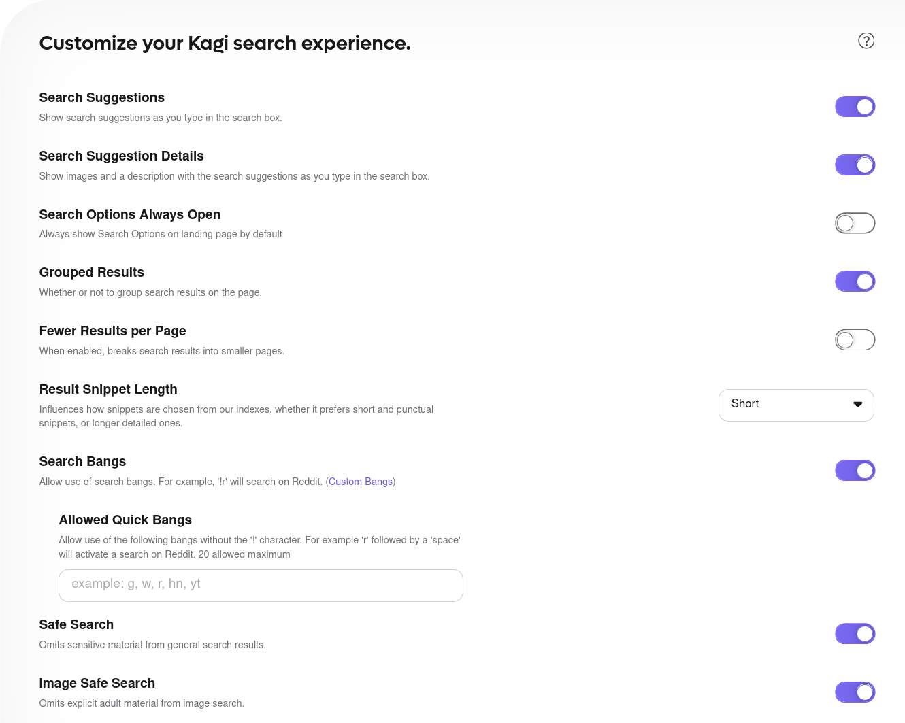
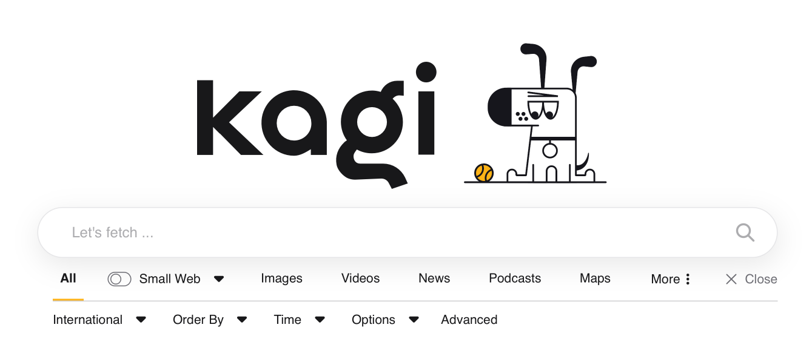
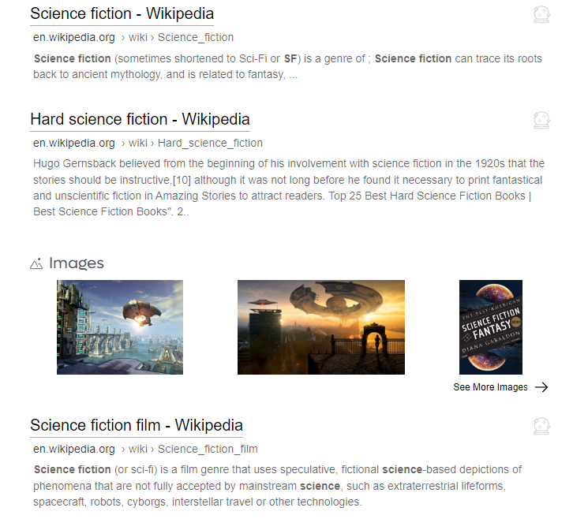

# Search Settings

These are settings that primarily affect Web search results.

## Overview

- **Search Suggestions** — Choose whether to see search suggestions as you type in the search box.
- **Search Suggestion Details** — Choose whether to see images and a description with the search suggestions as you type in the search box.
- **Advanced Search Always Open** — Choose whether to show advanced search options on landing pages by default. Here's what that looks like enabled:

- **Grouped Results** - Choose whether to group search results of the same domain on the page or unroll them into individual results, enabled by default. Here's what that looks like enabled:

Here's what that looks like disabled:

- **Fewer Results per Page** — Choose whether to break search results into smaller pages.
- **Result Snippet Length** — Influence how snippets are chosen from our indexes, whether to prefer short and punctual snippets, or longer detailed ones.
- **Search Bangs** — Choose whether to allow the use of [search bangs](../features/bangs.md). For example, [!r merge lane etiquette](https://kagi.com/search?q=!r%20merge%20lane%20etiquette) will search Reddit for you.
  - **Allowed Quick Bangs** — Choose whether to use up to 20 bangs without the '!' character. For example, 'r' followed by a 'space' would activate a search on Reddit.
- **Safe Search** — Choose whether to omit sensitive (mostly adult) material from general search results.
- **Image Safe Search** — Choose whether to omit explicit adult material from image search.

- **Inline Images** — Choose whether inline images will appear in results.
- **Inline Videos** — Choose whether inline videos will appear in results.
- **Inline News** — Choose whether inline news will appear in results.
- **Interesting Finds** — Choose whether Interesting Finds will appear in results.  This section typically features technical blog posts and opinion pieces from forums. It can be useful when researching or looking for what people are saying about a particular topic.
- **Inline Discussions** — Choose whether inline discussions will appear in results. Discussions are collected from forum posts related to your query.
- **Listicles** — Choose whether listicle results will be shown. Listicles are short-form writing that uses a list as its thematic structure. For example, a listicle might be called “The Top 10 Things in 2022”. This section gathers listicle-style pages in one place, keeping all other types of results free of their clutter.
- **Inline Maps** — Choose whether inline maps will appear in results.
- **Public Records** — Choose whether the Public Records widget will appear in results.
- **Podcasts** — Choose whether the Podcasts widget will appear in results.
- **Quick Peeks** — Choose whether the Quick Peek widget will appear in results.
- **Summary Box** — Choose whether the Summary Box widget will appear in results and autocomplete.
- **Related Searches** — Choose whether related searches will be shown with results.
- **Wikipedia** — Choose whether the Wikipedia widget will appear in results.