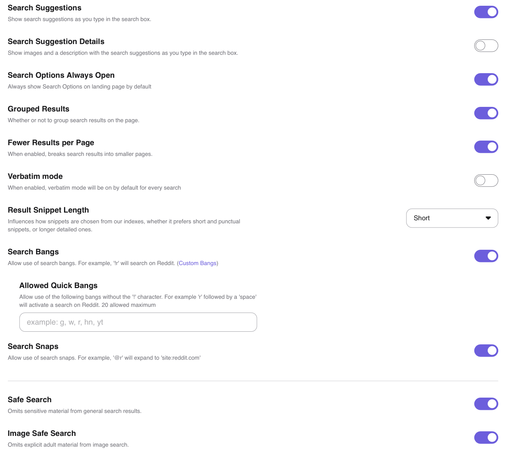

# Search Settings

These are settings that primarily affect Web search results.

## Overview

- **Search Suggestions** — Choose whether to see search suggestions as you type in the search box.
- **Search Suggestion Details** — Choose whether to see images and a description with the search suggestions as you type in the search box.
- **Search Options Always Open** — Choose whether to show advanced search options on landing pages by default. Here's what that looks like enabled:

- **Grouped Results** - Choose whether to group search results of the same domain on the page or unroll them into individual results, enabled by default. Here's what that looks like enabled:

Here's what that looks like disabled:

- **Fewer Results per Page** — Choose whether to break search results into smaller pages.
- **Verbatim mode** — Choose whether [verbatim mode](../features/verbatim) is automatically enabled when searching.
- **Result Snippet Length** — Influence how snippets are chosen from our indexes, whether to prefer short and punctual snippets, or longer detailed ones.
- **Search Bangs** — Choose whether to allow the use of [search bangs](../features/bangs.md). For example, [!r merge lane etiquette](https://kagi.com/search?q=!r%20merge%20lane%20etiquette) will search Reddit for you.
  - **Allowed Quick Bangs** — Choose whether to use up to 20 bangs without the '!' character. For example, 'r' followed by a 'space' would activate a search on Reddit.
- **Search Snaps** — Choose whether to allow the use of [search snaps](../features/snaps.md). For example, `@r` will be expanded into `site:reddit.com` when searching.
- **Safe Search** — Choose whether to omit sensitive (mostly adult) material from general search results.
- **Image Safe Search** — Choose whether to omit explicit adult material from image search.

