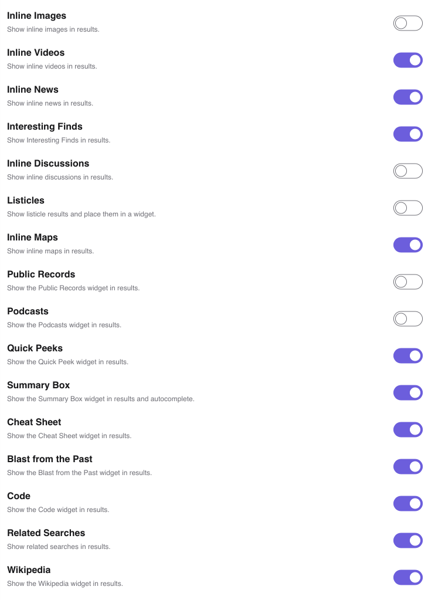

# Search widgets

Kagi offers various widgets intended to enhance your search results.
These can be configured in the [Search Widgets](https://kagi.com/settings/more_search) section of the settings.
Each widget can be individually toggled, allowing you to tailor your results to suit your needs.

- **Inline Images** — Choose whether inline images will appear in results.
- **Inline Videos** — Choose whether inline videos will appear in results.
- **Inline News** — Choose whether inline news will appear in results.
- **Interesting Finds** — Choose whether Interesting Finds will appear in results.  This section features technical blog posts and opinion pieces from forums, useful for research and understanding the public sentiment.
- **Inline Discussions** — Choose whether inline discussions will appear in results. Discussions are collected from forum posts related to your query.
- **Listicles** — Choose whether listicle results will appear in results. Listicles are short articles structured as lists, e.g., "Top 10 Things in 2025." This section groups listicle-style pages to reduce clutter.
- **Inline Maps** — Choose whether inline maps will appear in results.
- **Public Records** — Choose whether the Public Records widget will appear in results.
- **Podcasts** — Choose whether the Podcasts widget will appear in results.
- **Quick Peeks** — Choose whether the Quick Peek widget will appear in results.
- **Summary Box** — Choose whether the Summary Box widget will appear in results and autocomplete.
- **Cheat Sheet** — Choose whether the Cheat Sheet widget will appear for applicable searches. The cheat sheet widget provides cheat sheet for various programs. See [cheat.sh](https://cheat.sh) for more information.
- **Blast from the Past** — Choose whether the Blast from the Past widget will appear. This widget highlights interesing and notable articles from the past.
- **Code** — Choose whether the Code widget will appear when performing programming-related searches. 
- **Related Searches** — Choose whether related searches will be shown with results.
- **Wikipedia** — Choose whether the Wikipedia widget will appear in results.
