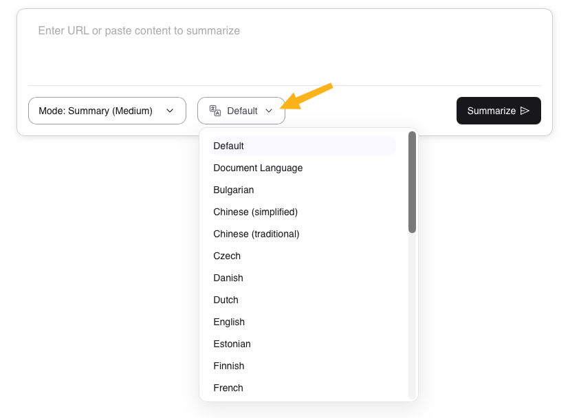

# Kagi Summarize

 

<video src="./media/kagi-summarizer.mp4" width="720" type="video/mp4" autoplay muted loop playsinline disablepictureinpicture />

Kagi Summarize (also known as Universal Summarizer) is a tool to summarize any page, video or podcast (given a transcript).

#### Available on:

- [Kagi Summarizer Website](https://kagi.com/summarizer/)
- Mobile App:
    - For [iOS](https://apps.apple.com/us/app/kagi-summarize/id6748308326)
    - For [Android](https://play.google.com/store/apps/details?id=com.kagi.summarize&hl=en_US)
- Browser Extensions:
    - [For Chrome](https://chromewebstore.google.com/detail/kagi-summarizer/dpaefegpjhgeplnkomgbcmmlffkijbgp)
    - [For Firefox](https://addons.mozilla.org/en-US/firefox/addon/kagi-search-for-firefox/)
- In the [search results](#in-search-results)
- Using the !sum [Bang](#via-bang)
- Using the [Orion browser](https://kagi.com/orion/) (available for Apple devices)
- Via the [Summarizer API](../api/summarizer.md)

## Kagi Summarizer website

On the [Kagi Summarize website](https://kagi.com/summarizer) you can enter the URL of any web page, PDF, PPTX, MP3, video, etc. that you want to have summarized.

Summarize is made using Kagi's own in-house models. There are currently three models in use:
  - Cecil (Consumer-grade, accessible via the website, browser extension or API)
      - Unlimited use via website or browser extension is included with your Kagi membership
  - Agnes (Consumer-grade, accessible via the browser extension or API)
  - Muriel (Enterprise-grade, accessible via the browser extension or API)

### Summarization modes

Kagi Summarize has three primary summarization modes selectable from the `Mode` dropdown:
- **Summary**: Coose between `Headline`, `Brief Summary`, `Digest`, `Medium` or `Long`
- **Bullet Points**: A bullet point summary of the page or link
- **ELI5**: A simplified, easy to understand summary

### Translation

{data-zoomable}

When summarizing, you can optionally have the summary translated using [Kagi Translate](../translate/index.md).

## In search results

You may find individual pages that you would like to summarize and Kagi is the first engine to offer a Summarize option.

{data-zoomable}

Expand the page options next to a search results and select `Quick Summary`, Kagi will then use its proprietary Summarizer technology in the back end to provide an easily digestible synthesis.

{data-zoomable}

Once complete you will see the individual page summary appear below the result. After reading the summary you can even choose to proceed to [Continue in Assistant](../ai/assistant.md).

## Via Bang

Quickly summarize any page using the [Bang `!sum`](../features/bangs.md#universal-summarizer). For example, you can type `!sum https://www.youtube.com/watch?v=JwLDrZmNIIA` in your search or URL bar to quickly get a summary of our custom bangs video tutorial.

## Via Bookmarklets

You can drag one or both of the following links in the bookmarks bar in your browser to immediately access Summarizer. You may rename the bookmarks however you want afterwards.

<a href="javascript:location='https://kagi.com/summarizer/index.html?url='+encodeURIComponent(location)">Summarize (same window)</a> 
<a href="javascript:(function(){window.open('https://kagi.com/summarizer/index.html?url='+encodeURIComponent(location))})()">Summarize (new window/tab)</a> 

## Via API
See [Summarizer API](../api/summarizer.md) for more details.

As mentioned at the start, two models are offered in the API. As for the differences between the two AI models, here is them summarizing the same [document](https://arxiv.org/pdf/2112.11446.pdf).

**Agnes:**

> The PDF document titled “Scaling Language Models: Methods, Analysis & Insights from Training Gopher” presents an analysis of Transformer-based language model performance across a wide range of model scales, from models with tens of millions of parameters up to a 280 billion parameter model called Gopher. The models are evaluated on 152 diverse tasks, achieving state-of-the-art performance across the majority. The study finds that gains from scale are largest in areas such as reading comprehension, fact-checking, and the identification of toxic language, but logical and mathematical reasoning see less benefit. The document also provides a holistic analysis of the training dataset and models behavior, covering the intersection of model scale with bias and toxicity. Finally, the study discusses the application of language models to AI safety and the mitigation of downstream harms. The key implication of this study is that larger language models can significantly improve performance on a wide range of natural language processing tasks, but there are also concerns about the potential for bias and toxicity in these models.
> The paper also provides a holistic analysis of the training dataset and the model’s behavior, examining the intersection of model scale with bias and toxicity. It discusses the application of language models to AI safety and the mitigation of downstream harms.

**Muriel:**

> This PDF document presents an analysis of Transformer-based language model performance across various scales, focusing on a 280 billion parameter model called Gopher. The models are evaluated on 152 diverse tasks, achieving state-of-the-art performance in the majority of them. The most significant gains from scaling are observed in areas such as reading comprehension, fact-checking, and toxic language identification, while logical and mathematical reasoning see less benefit.
>
> The paper also provides a holistic analysis of the training dataset and the model’s behavior, examining the intersection of model scale with bias and toxicity. It discusses the application of language models to AI safety and the mitigation of downstream harms.
>
> Key findings include:
> 1. Gopher outperforms current state-of-the-art language models in approximately 81% of tasks with comparable results, particularly in knowledge-intensive domains such as fact-checking and general knowledge.
> 2. Larger models are more likely to generate toxic responses when provided with toxic prompts, but they can also more accurately classify toxicity.
> 3. Gains from scale are largest in areas like reading comprehension, fact-checking, and the identification of toxic language. However, logical and mathematical reasoning see less benefit.
>
> The document also discusses challenges and future directions, such as:
> 1. Towards efficient architectures: The need for more efficient architectures to reduce the computational cost of training and inference.
> 2. Challenges in toxicity and bias: Addressing the issues of toxicity and bias in language models to ensure safe and fair AI systems.
> 3. Safety benefits and risks: Balancing the potential benefits of language models in AI safety with the risks associated with their misuse.
>
> In conclusion, the paper highlights the improved performance of large-scale language models like Gopher in various tasks and emphasizes the importance of addressing challenges related to toxicity, bias, and AI safety.
