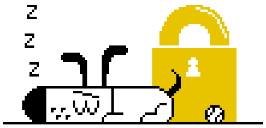

# Kagi Doggos

{data-zoomable}

Here at Kagi, we love our Doggo mascot, and we know our community feels the same way! This March, we’re thrilled to showcase community-created versions of our beloved Doggo on the Kagi search page, and celebrate the creativity and the amazing talent within our community.

Inspired by our community member’s [suggestion](https://kagifeedback.org/d/5911-community-artwork-doodles-on-home-and-search-page/), last month we ran an open call and received a fantastic array of artworks that we’re excited to share with everyone. 

A warm and heartfelt thank you to all who took part, and especially to the artists whose works will be featured: [Edin Pasovic](https://edinpasovic.art/), [fangmoder](https://x.com/fangmoder), [Eve Davison](https://noodlecreative.uk/), [Kevin](https://foofaraw.press/), and [Lynn](https://bsky.app/profile/art.lynn.cat). As a token of our gratitude, these artists received a 3-months free Ultimate plan subscription. 

We’re already looking forward to running another open call later this year, and to make this a recurring initiative. We are committed to humanizing the web, and we believe projects like this help to provide visibility to independent creators and their incredible work.

We’d love to hear your thoughts on this initiative! Join the conversation on [Kagi Discord](https://kagi.com/discord), or reach out to our graphic designer at nat@kagi.com.