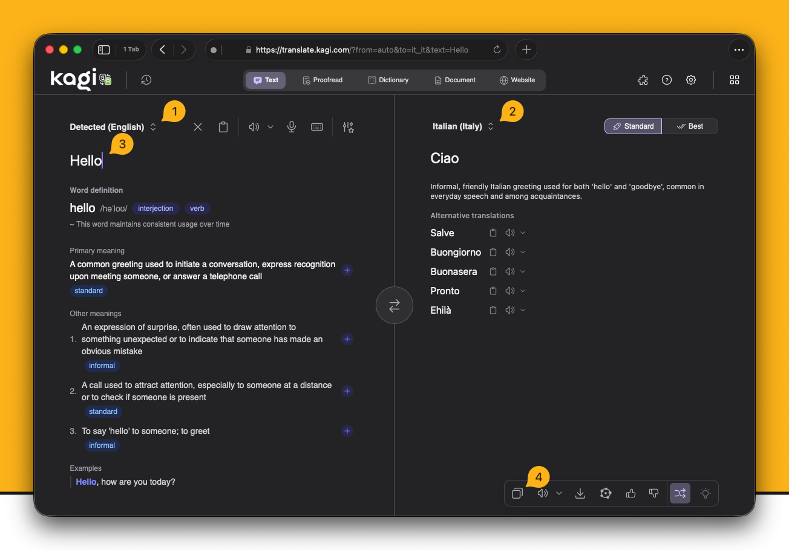
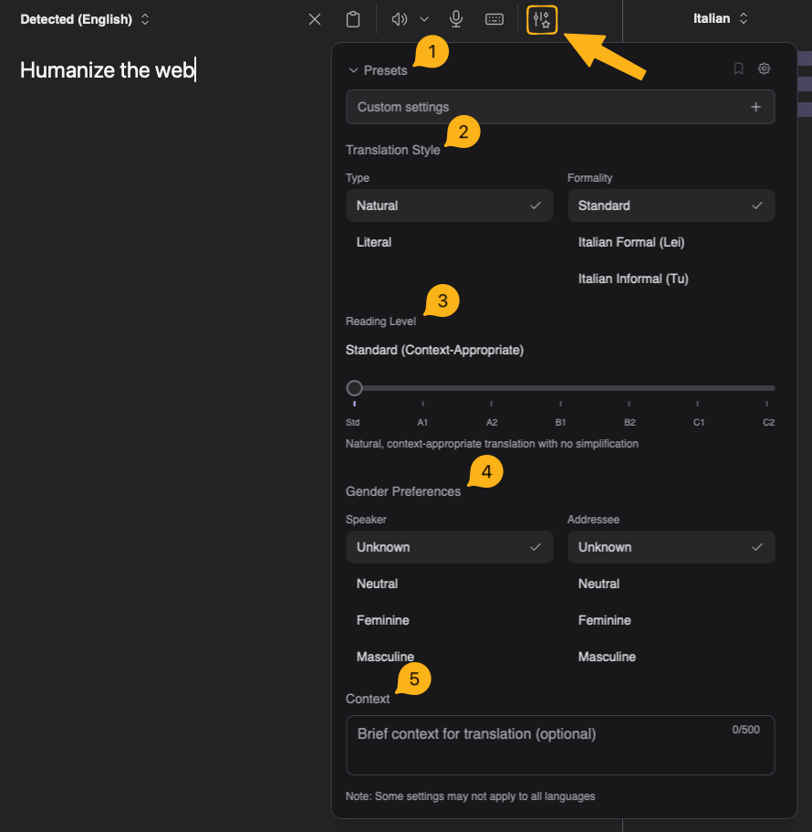
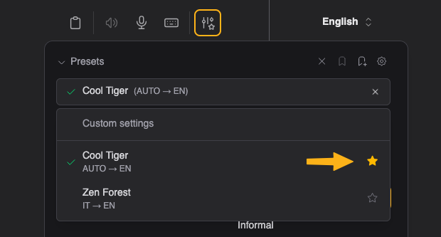
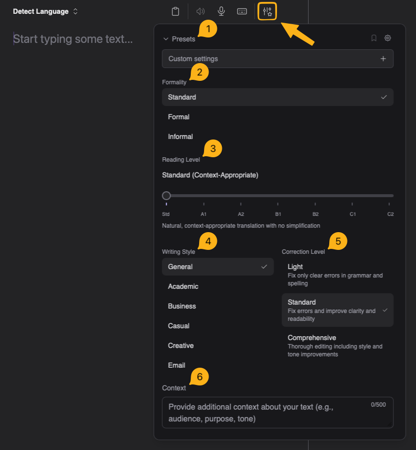
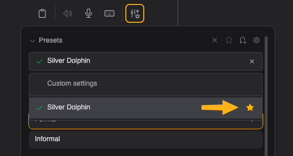
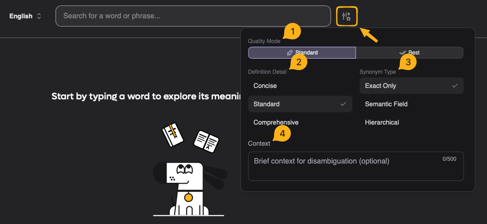
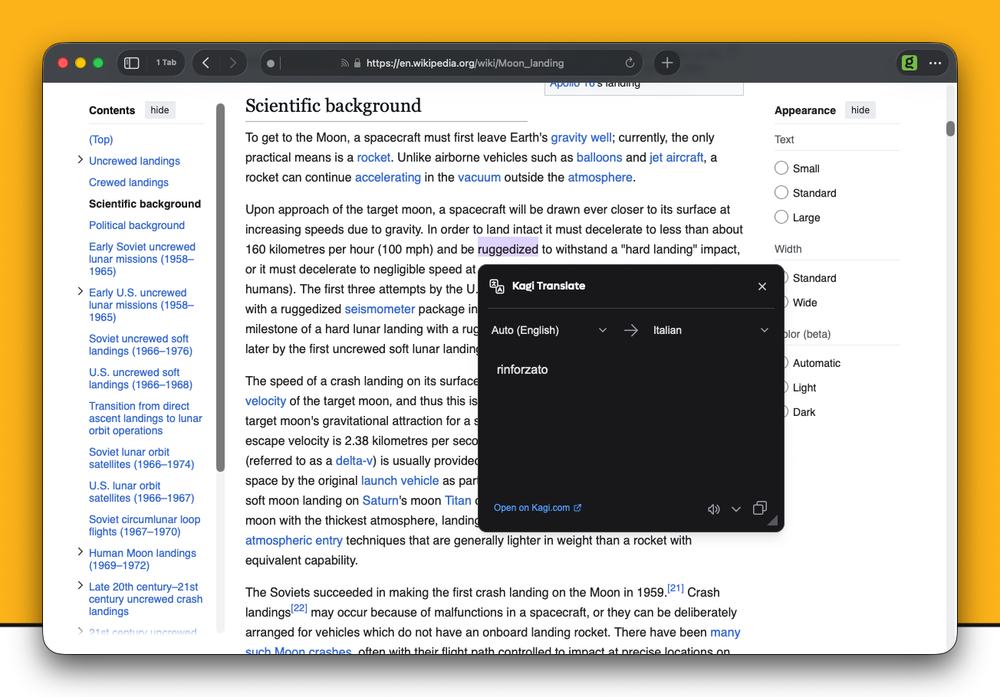

# Kagi Translate

<br>

<video src="./media/kagi_translate.mp4" width="720" type="video/mp4" autoplay muted loop playsinline disablepictureinpicture />

[Kagi Translate](https://translate.kagi.com) is a powerful language translation tool that supports 248+ languages. It combines advanced language models to deliver accurate, context-aware translations while maintaining privacy.

#### Available on:

- [Kagi Translate Website](https://translate.kagi.com)
- Android and iOS apps coming soon

## Features
- **Vast Language Support**: Translate between more than 248 languages
- **Context-aware Translation**: Preserves meaning, tone, and style of the original text
- **Language Options**: Text, Website, and Document translation, Proofreading, Dictionary, and Voice dictation
- **Privacy-focused**: Your translations are processed securely without storing personal data on servers

::: info The quality of translations can vary depending on the language pair. 
Less common languages may experience lower performance, while more common languages typically yield better results.
:::

## Text Translation

{data-zoomable}

1. Select source language or choose "Detected" to identify it automatically
2. Select target language
3. Type or copy and paste the text to translate
4. Translated text will appear in the output box. You can click the copy button to copy the translated text to your clipboard

### Translation Settings

{data-zoomable}

1. **Preset**: Choose or save your current settings as a preset. You can set a preset as the default from the presets dropdown to have it load automatically when opening the page.
{data-zoomable}
2. **Translation Style**: Select style and formality
3. **Reading Level**:  Simplify the translation based on reading level
4. **Gender Preferences**: Refer to the speaker and addressee using different genders
5. **Context**: Add context to the translation to improve translation results

## Proofreading

<video src="./media/kagi_translate_proofread.mp4" width="720" type="video/mp4" autoplay muted loop playsinline disablepictureinpicture />

Kagi Translate includes a proofreading mode that helps you correct mistakes, improve understanding, and avoid repetition. 

### Proofreading Settings

{data-zoomable}

1. **Preset**: Choose or save your current settings as a preset. You can set a preset as the default from the presets dropdown to have it load automatically when opening the page.
{data-zoomable}
2. **Formality**: The formality of the text
3. **Reading Level**: Simplify the text based on reading level
4. **Writing Style**:
 - **Academic**: Formal tone with precise academic vocabulary and passive voice where appropriate
 - **Business**: Professional tone with clear, concise language and business-appropriate vocabulary
 - **Casual**: Conversational tone with everyday vocabulary and acceptable contractions
 - **Creative**: Preserves artistic expression and the author's voice with careful attention to intentional stylistic choices
 - **Email**: Professional yet friendly tone with appropriate greetings and closings
5. **Correction Level**: Choose the intensity of corrections
6. **Context**: Add context to the translation to improve results

## Language Dictionary

<video src="./media/kagi_translate_dictionary.mp4" width="720" type="video/mp4" autoplay muted loop playsinline disablepictureinpicture />

### Dictionary Settings

{data-zoomable}

1. **Quality Mode**: Choose between standard or enhanced translation quality for dictionary lookups
2. **Definition Detail**: Select the level of detail for word definitions (concise, standard, or comprehensive)
3. **Synonym Type**: Choose the type of synonyms to display (common, formal, or contextual alternatives)
4. **Context**: Add additional context for words or phrases that may have multiple interpretations.

## Document Translation

You can translate documents up to 150 MB and 60k characters with the following file formats:
TXT, MD, DOC, DOCX, CSV, PDF, PPTX, XLSX, XLS, RTF, TSV, HTML, ODT, ODS, JSON, YAML, SRT, ASS, ENV, LOG, VTT, MDX, RMD, IPYNB, TEX, WS, ROFF.

::: warning Documents must follow official file structure standards.
Files converted from other formats or not following standard structure may result in broken translations, even if they appear to render properly.
:::

## Website Translation
Option 1:
1. Open [Kagi Translate](https://translate.kagi.com)
2. Paste the website URL in the input box
3. Select your target language
4. Click the translated URL

Option 2:
- Add ```translate.kagi.com/``` before any URL in your browser
  Example: ```translate.kagi.com/example.com```

### Browser Bookmarklet
1. Drag this link to your bookmarks bar: <a href="javascript:(function(){var%20selectedText=window.getSelection().toString().trim();window.location.href='https://translate.kagi.com/'+(selectedText?'?text='+encodeURIComponent(selectedText):encodeURIComponent(window.location.href));})();">Kagi Translate</a>
2. Use the bookmarklet for:
   - Translating selected text: Select text, then click bookmarklet
   - Translating entire page: Click bookmarklet without selecting text

### URL Parameters

If you want to create custom [Bangs](../features/bangs.md), integrate it into your favorite launcher, set a bookmark to specific setup or any other automation, you can look at this page with info about the [URL parameter reference](./url-parameters.md) for the complete list of query options, examples, and mode-specific settings you can pass to Translate.

## Coss-Device Sync and History

You can sync your settings and presets across devices by navigating to ```Settings > General > Cross-Device Sync```.

By default, your translation history is only stored locally and never leaves your device. However, you have the option to sync history across devices by enabling ```Cloud Storage for History```.

## Browser Extension

{data-zoomable}

You can download the [Kagi Translate Extension Here](https://translate.kagi.com/extension) for your browser to easily translate web pages, selected text, emails, and posts on a variety of social media websites.

You can enable or disable website integrations in the extension's settings.

::: info Note
Some integrations may require a Kagi subscription of any plan to use.
:::

## Important notes

- **Media Titles**: Kagi Translate tends to use "official" translations for well-known media titles, which may differ significantly from literal translations. For instance, the Japanese manga title "Sousou no Frieren" is translated as "Frieren: Beyond Journey's End," reflecting the commercially accepted version rather than the literal "Funeral Frieren."
- **Translation History**: For your privacy, your translation history is stored locally on your device, not on our servers. We never save your data. Translations are stored until you clear your site data. You can manage your history (clear or export as JSON) in the settings.
