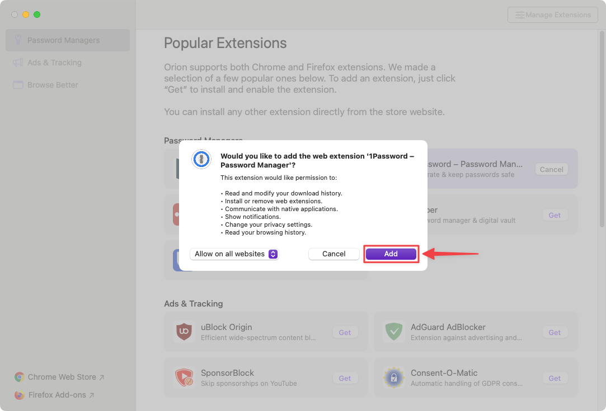
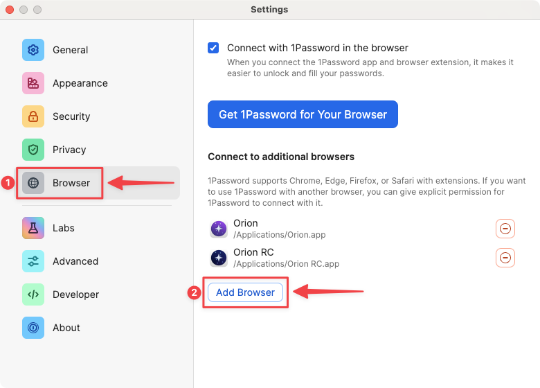

# 1Password & Orion

## 1Password Extension

1Password is now compatible with Orion thanks to the joint effort between 1Password and Orion teams. To use 1Password in Orion you will need the latest version of 1Password browser extension (to get it, choose **Tools** > **Extensions**, then click **Popular Extensions** in Orion).

 

 

 

## 1Password App

To use 1Password with Orion, you need to have the 1Password app installed (build 81009030 +), and set the 1Password release channel to **Nightly** (you can set it in **1Password** > **‌Settings** > **Advanced** > **Release Channel** > **Nightly** and then check for updates) since it allows browser whitelisting (you will need to add Orion as a whitelisted app).

 

 

## Whitelisting Orion in 1Password

To add Orion as a whitelisted app in 1Password, first choose **1Password** > **‌Settings** > **Browser** > **Add Browser**, then select **Orion** in your Applications folder and click **Open**, you will be presented with a modal to provide Orion with access to 1Password. To continue, press **Authorize**.

 

 

 

 

## 1Password Global Autofill

1Password 8 for macOS has a global autofill feature that does not require using any browser extension. To use it, click inside a login field and press the **Command** and **\\** keys at the same time.
