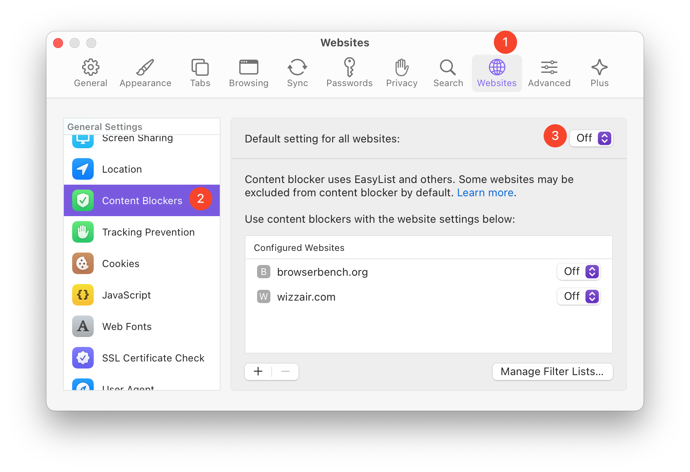

# uBlock Origin on macOS

 

Users of the [uBlock Origin](https://en.wikipedia.org/wiki/UBlock_Origin) browser extension for content filtering are a passionate bunch. When we tell them Orion allows them to run uBlock in a WebKit-based browser on macOS, some have cried. But, they've assured us these are tears of joy!

## Orion Content Blocking vs. uBlock Origin
Orion's built-in blocker is about 90% as efficient as uBlock Origin using default settings. But, our built-in blocker is faster. We designed it to be a great choice for most users.

For power users who want that last 10% with uBlock, we recommend disabling Orion's content blocker globally. Running both Orion blocking and uBlock may cause interference with each other.

To disable Orion's content blocking:

1. In Orion, click the **Orion** menu and choose **Settings**.

 

2. Click the **Websites** tab.
3. Click  **Content Blockers** in the list of options.
4. Set "Default settings for all websites" to **Off**.

 

We recommend leaving Orion's Tracking Prevention **on**. It uses WebKit's machine-learning-based technology and complements uBlock Origin to provide the best overall protection.

You can then install the uBlock Origin extension for [Chrome](https://chrome.google.com/webstore/detail/ublock-origin/cjpalhdlnbpafiamejdnhcphjbkeiagm) or [Firefox](https://addons.mozilla.org/en-US/firefox/addon/ublock-origin/) in Orion.
