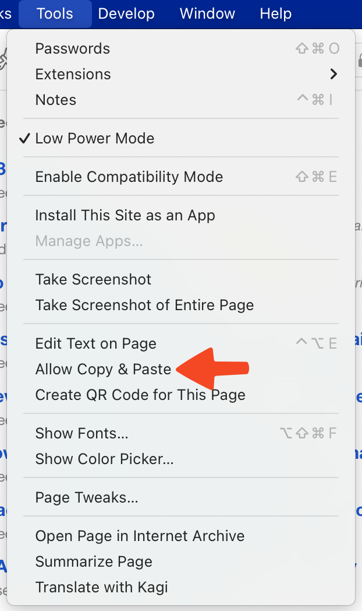

# Allow Copy Paste

Some webpages prevent copy or paste. It's annoying! You can easily override this in Orion for macOS.

1. While on the annoying webpage, click the **Tools** menu.
2. Click **Allow Copy & Paste**.

 
