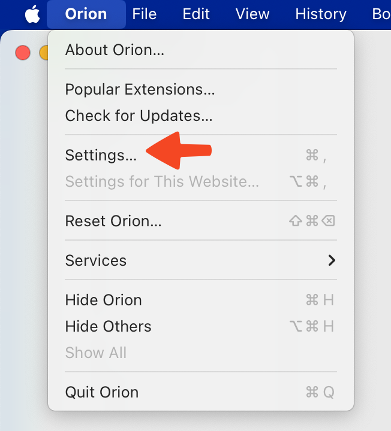
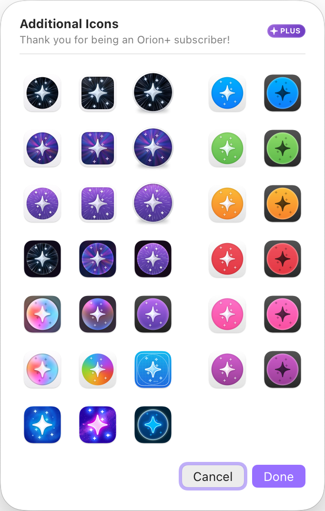
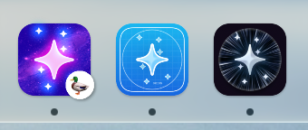

# Special App Icons

Orion's app icon can be changed in the settings.

1. In your menu bar, go to **Orion** > **Settings**.
 
2. Navigate to the Appearance tab.
3. The App Icon configuration can be found at the bottom.

 

The first three options are available to everyone.
Clicking the rightmost icon opens an Orion+-exclusive menu with more app icon options, which will allow you to choose the perfect app icon for your desktop.

 

## Tips and tricks

1. Each profile can have its own app icon.
- Give your dock some additional flair by using app icons.

 

2. None of the special icons interest me. I want to bring my own.
- You can add any icon you wish. Please see [How do I change the app icon?](../faq/faq.md#how-do-i-change-the-app-icon) in the FAQ.
