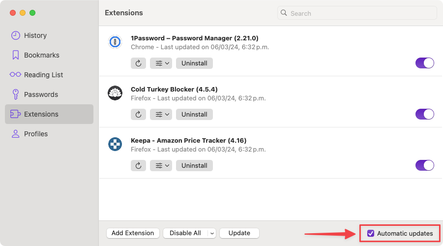

#  Automatic Extension Updates

If you have installed any browser extensions in Orion, keeping them up-to-date is now done automatically. Orion will regularly verify that the installed version of each extension matches the one available in the Chrome or Firefox web stores. If there are any updates available, they will be downloaded automatically.

You can enable this feature by following these steps:
1. In your menu bar, go to **Tools** > **Extensions** > **Manage Extensions**.
2. In the Manage Extensions window, enable the **Automatic updates** checkbox.

{data-zoomable}
