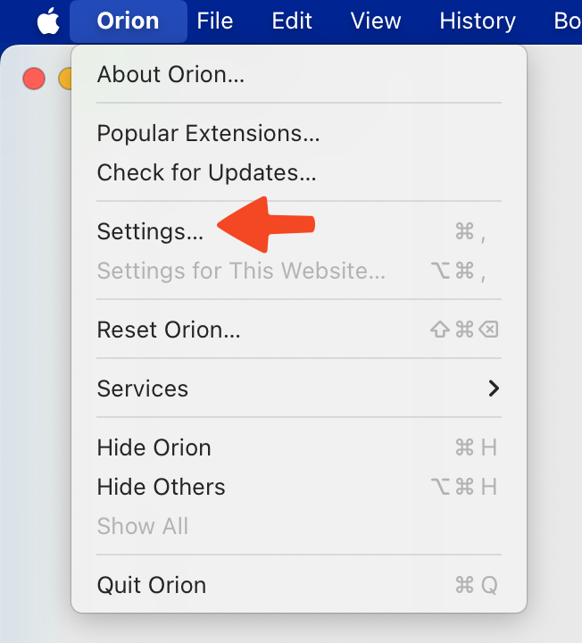
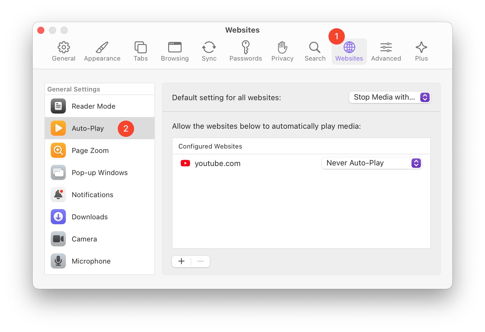

# Block Auto-Play

Many websites have videos and other media that automatically play when you load webpages.

On Orion for macOS, all media with sound is automatically stopped by default. There is a setting to quickly change auto-play behavior across all websites. Unique auto-play settings can also be made for specific websites.

To configure auto-play settings:

1. Click the **Orion** menu.
2. Click **Settings**.

 

3. Click the **Websites** tab of Settings.
4. Click on **Auto Play** from the list of settings on the left of the window.

 

There is a **Default settings for all websites** option at the top right of the window that can be set to:

- Allow all Auto-Play
- Stop Media with Sound
- Never Auto-Play

There is also an area in the lower right of the window where you can add (**+** button) or remove (**-** button) websites and give listed websites specific auto-play settings.
