# Containers

Orion has built-in support for containers.
Containers enable users to separate specific activities into color-coded containers.
The main benefit of containers is that they are isolated from one another, allowing the user to use sites (e.g., email) while logged into different accounts.
Since they are isolated, you can use containers to enhance your browsing privacy by, for example, having the URLs of some big tech company always open in the same container so their cookies stay in that container only.

## Configuring containers

Containers can be configured via the menu bar: **File** -> **Containers** -> **Manage...**

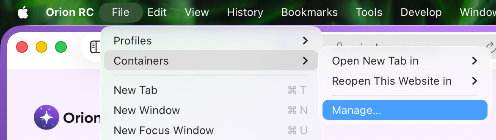 

By default, Orion has three default containers ready to be used:
Shopping,
Social media, and
Flights.

Using these is completely optional, and they can be edited or removed as seen fit.

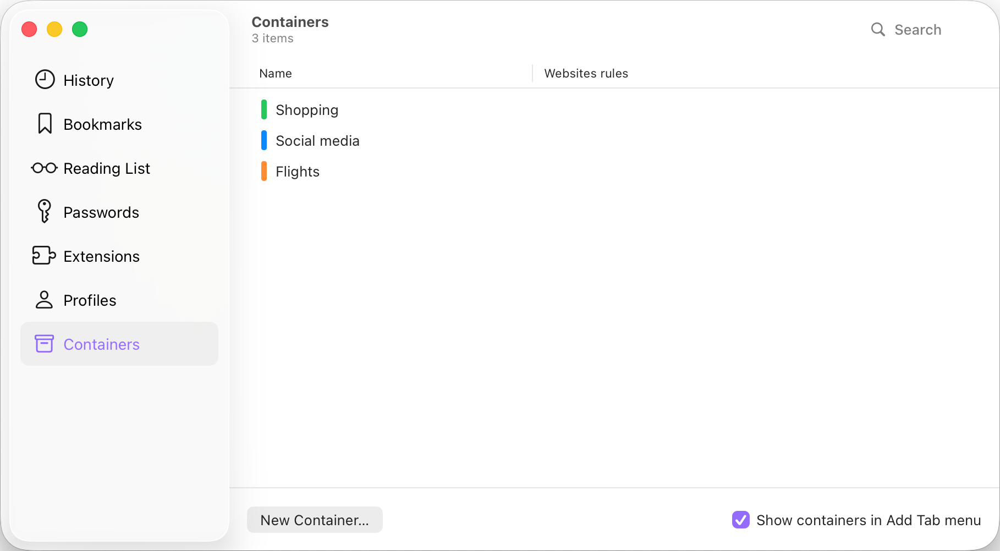 

### Website rules

**Website rules** allow you to tie a specific URL to a specific container.
You can add website rules by either double-clicking the rules area or by right-clicking the area and selecting **Manage Website Rules**.

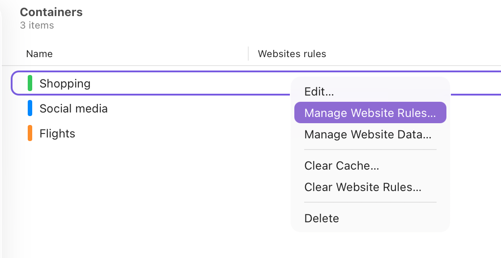 

The most detailed website rule has priority.

For example, you could have the main domain (e.g., kagi.com) open in Container 1 and configure a subdomain of it (e.g., blog.kagi.com) to open in Container 2. If you then visit https://kagi.com/welcome, Orion opens the page in Container 1, but when you click on the Blog link on the page header, it opens in Container 2 because a more specific rule exists.

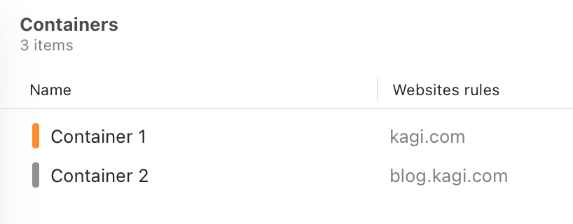 

### Managing container data 

You can view what data websites have stored in your containers in the container settings.
Right-click the desired container and select **Manage Website Data...**

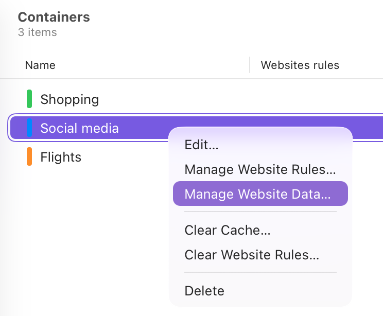 

In the resulting window, you can remove data on a domain basis or remove everything.

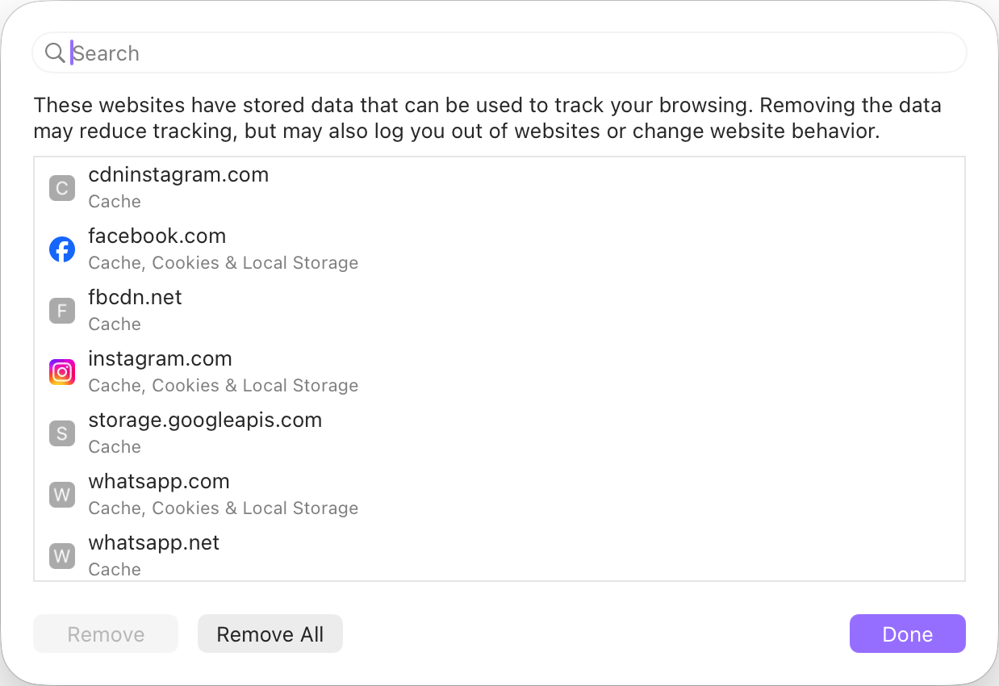 

## Using containers

There are several ways to access containers.

### Tab context menu

Right-clicking any tab comes with the option to reopen the tab in the specified container.

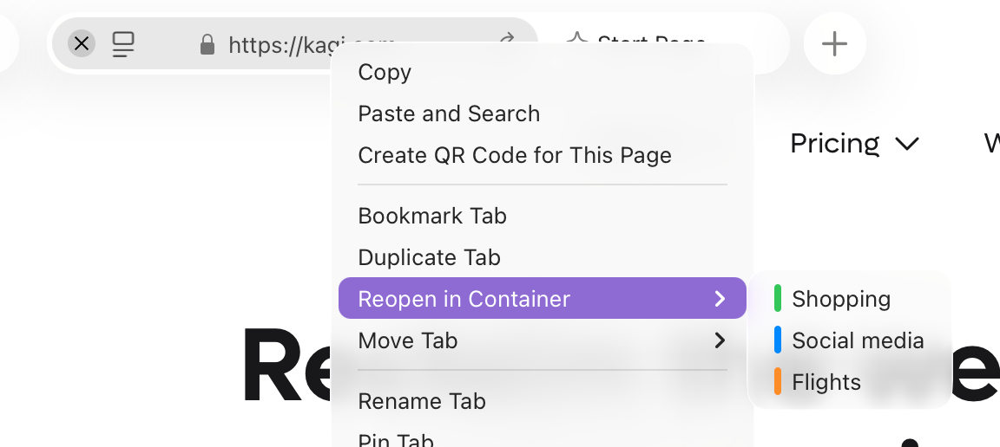 

### New tab button

Right-clicking the new tab button allows you to open a new tab in a specified container. 

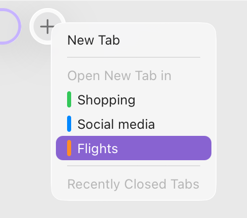 

Please note that this option is only visible if you have it enabled in the container.

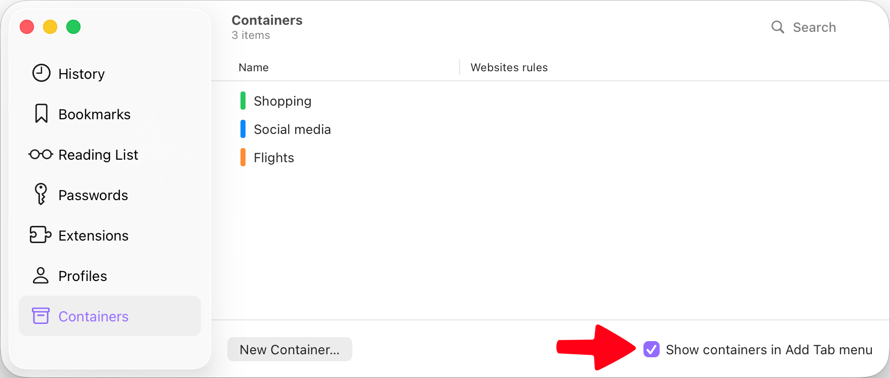 

### Link context menus

Link context menus also have the option to open the link in a container of your choosing.

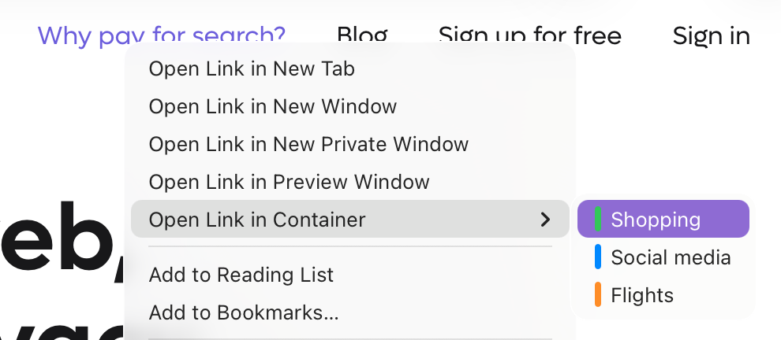 

### Menu bar

You can also open a new container tab or reopen the current tab in a container through the menu bar.

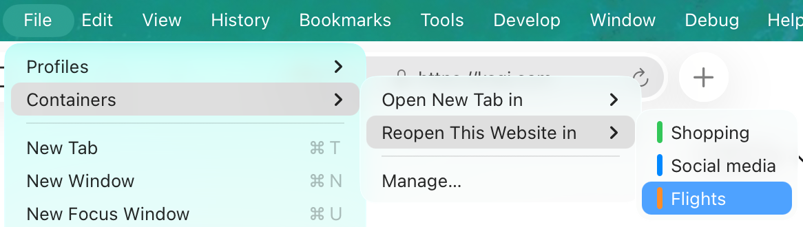 

### Making the container rule permanent

After opening a URL in a container, you can easily have it always open in the same container from now on.

- In the menubar, select File -> Containers -> Always use '...' for this site.
- In the tab context menu, you will have the same option to always use the current container for the site you have open.

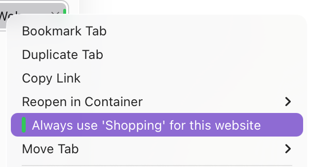 

Both options add the current page to the website rules of that container.
