#  Orion's Content Blocker

## Table of Contents
- [Default Blocklists](#default_blocklists)
- [Custom Blocklists](#custom_blocklists)
- [Updating Blocklists](#updating_blocklists)
- [Adding Blocklists on macOS](#adding_blocklists_macos)
- [Adding Blocklists on iOS](#adding_blocklists_ios)
- [Impact of Number of Blocking Rules on Performance](#performance_chart)
- [Third-Party Blocklists](#third_party_blocklists)
- [Regional Blocklists](#regional_blocklists)
- [Custom Filters](#custom-filters-customfilters)
- [Blocklist Syntax](#blocklist-syntax)
- [Contributing to Blocklists](#contributing_blocklists)

## Default Blocklists {#default_blocklists}

Orion includes the following blocklists by default. 
The blocklists in **bold** are enabled by default and provide sufficient protection against most ads and trackers.
- **EasyList**
- **EasyPrivacy**
- Hagezi Light DNS Blocklist
- Hagezi Pro Plus Mini
- Fanboy's Annoyance
- Privacy Essentials
- Block third-party fonts

On macOS, you can enable or disable these blocklists in **Orion** > **Settings** > **Privacy**, then click the **Manage Filter Lists...** button.

On iOS, the blocklists can be managed in the settings: **⋯** > **Settings** > Scroll down to the **Content Blockers** section, open it and tap **Manage Content Blocker**.

## Custom Blocklists {#custom_blocklists}

In addition to the default blocklists, Orion allows you to customize its ad blocker by using custom blocklists. 
Blocklists are lists of domains that are known to serve ads, trackers, malware, and other annoyances.
Orion checks web page requests against these lists and blocks any requests to the listed domains.
This prevents ads from being displayed and trackers from following you around.

## Updating Blocklists {#updating_blocklists}

Blocklists are constantly updated as new ad/tracking domains appear. List maintainers work to identify and add new ad-serving domains as they pop up.

On macOS, to manually update blocklists, go to **Orion** > **Settings** > **Privacy** and click **Update Now**.
Wait for the "Processing update" message to disappear.

On iOS, blocklists can be updated in the settings: **⋯** > **Settings** > Scroll down to the **Content Blockers** section and tap **Update Now**.

 

 

 

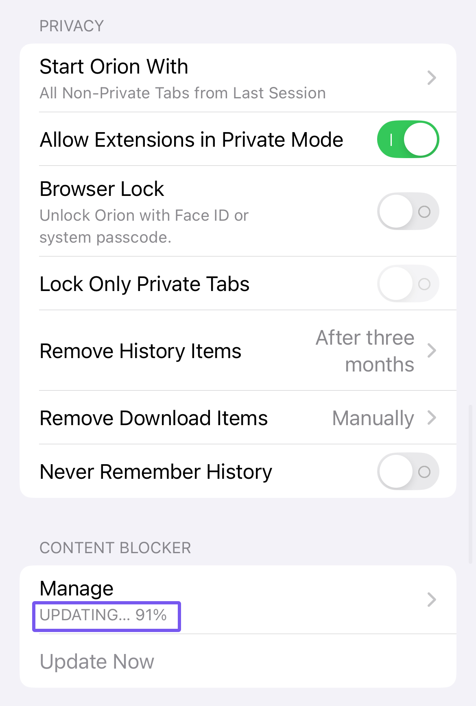 

## Adding Blocklists on macOS {#adding_blocklists_macos}

To add a blocklist to Orion on macOS, go to **Orion** > **Settings** > **Privacy** and click the **Manage Filter Lists...** button.

Please note that Orion is compatible with Adblock Plus style blocklists.

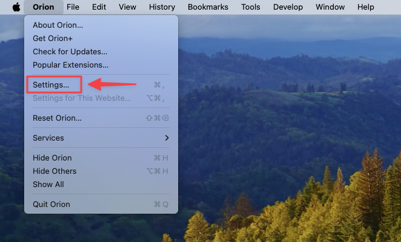 

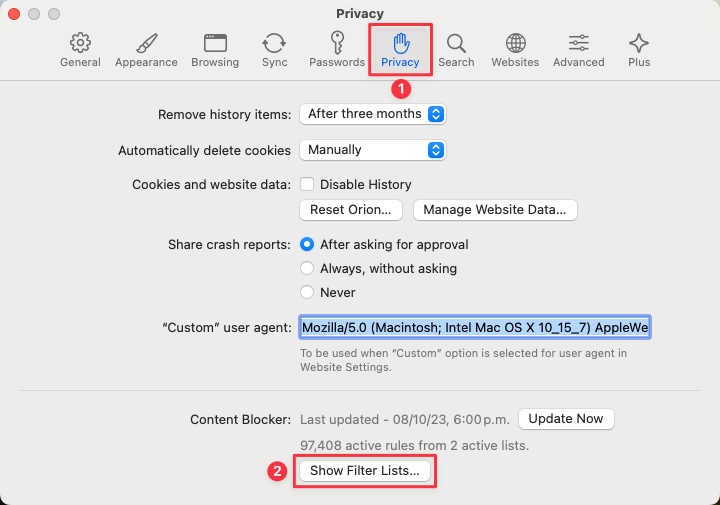 

Next, in the modal that opens, click the **+** button.

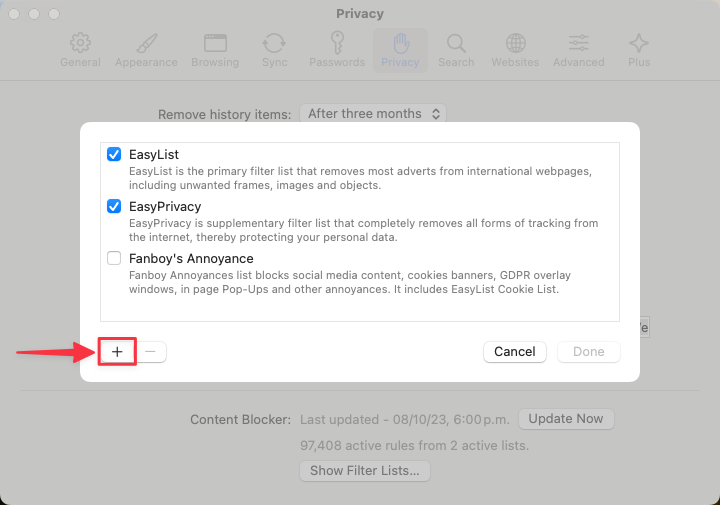 

Then, paste the URL of the blocklist you wish to add and click the **Add** button. Finally click **Done**.

 

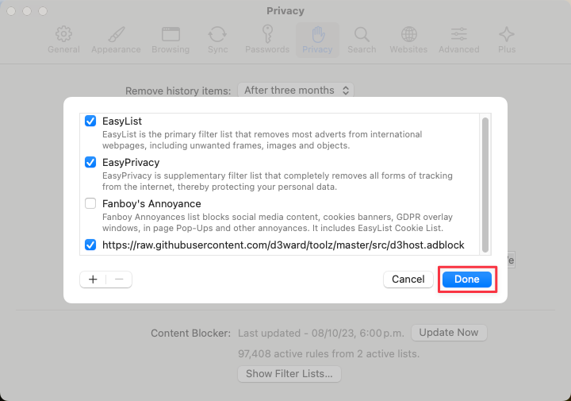 

## Adding Blocklists on iOS {#adding_blocklists_ios}

To add a blocklist to Orion on iOS, go to **⋯** > **Settings** > Scroll down to **Content Blocker** and tap **Manage** > **Add New**.

Before following the steps, it is advised to have the blocklist URL already copied to your clipboard.
Please note that Orion is compatible with Adblock Plus style blocklists.

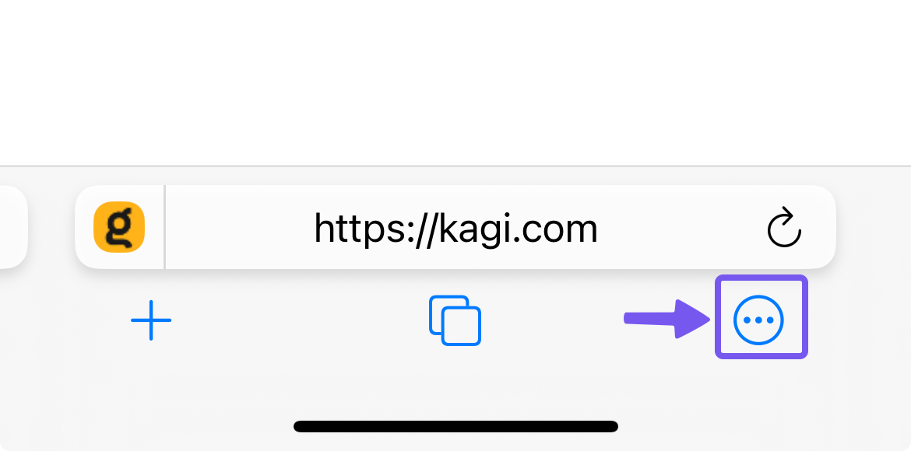 
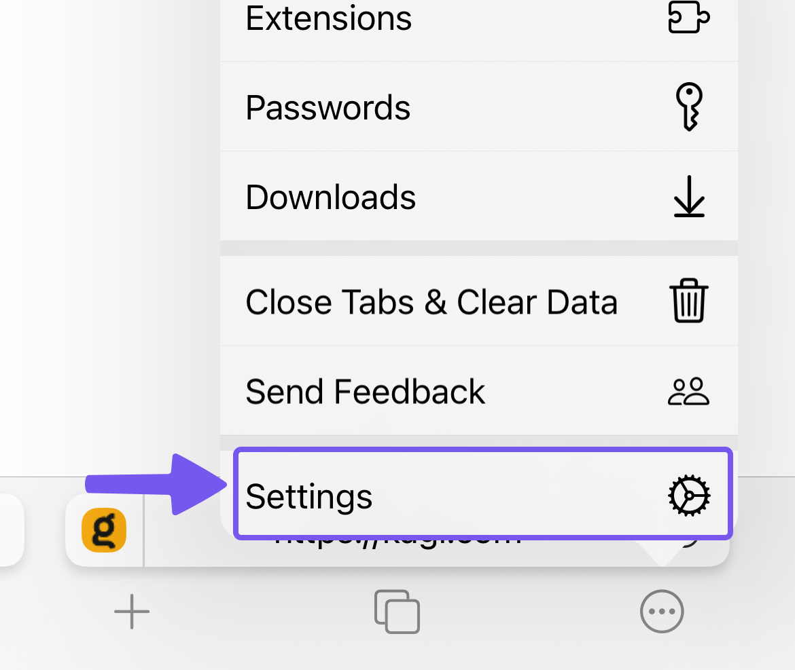 

Scroll down to the **Content Blocker** section of the settings and tap **Manage**.

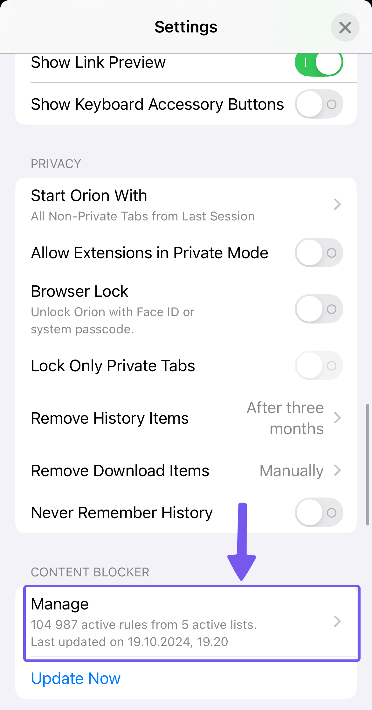 

In the **Manage Content Blocker** window, click the **Add New** button.

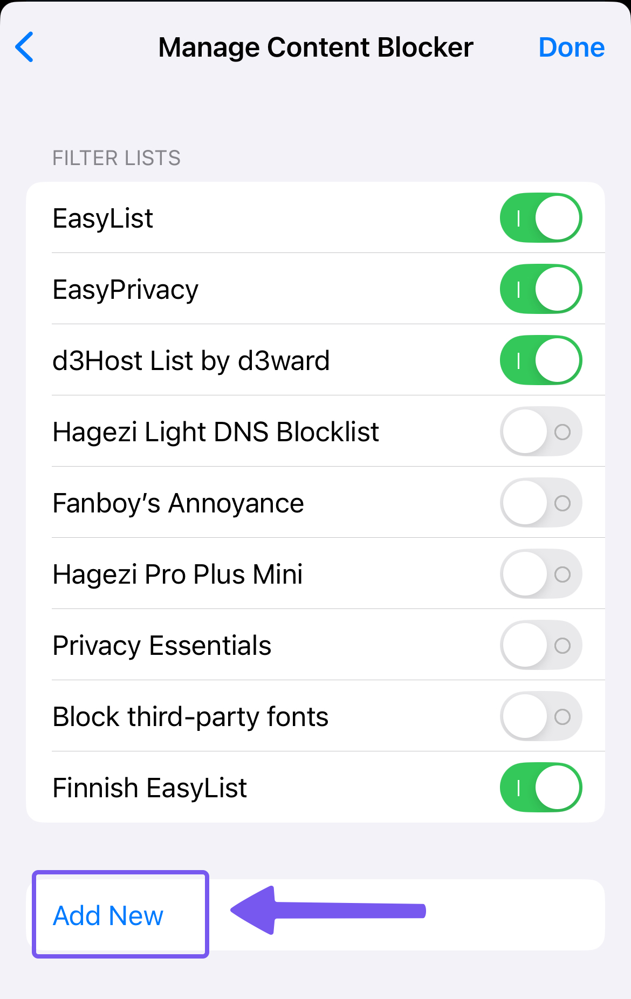 

Then, paste the URL of the blocklist you wish to add and tap the **Done** button in the top-right corner of the window.
Finally, tap **Done** in the Manage Content Blocker window.

The Custom Filter Name field can have any name you see fit.

 

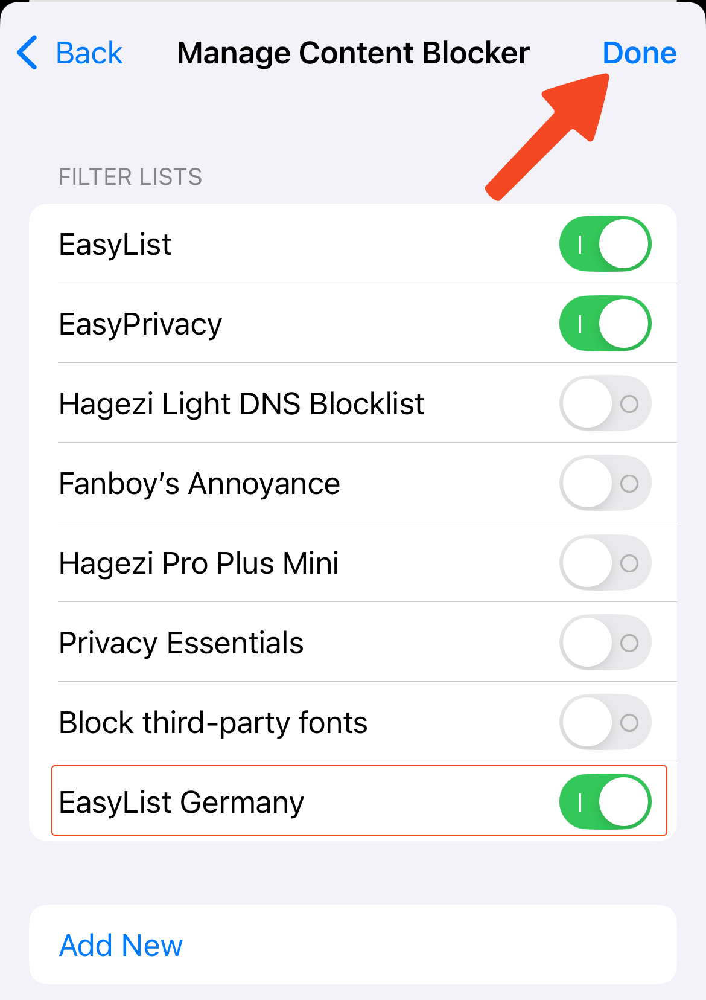 

## Impact of Number of Blocking Rules on Performance {#performance_chart}

Orion's content blocker compiles each blocklist to convert it into native WebKit content blocking rules.
This results in minimal performance impact, depending on the number of blocking rules that are active.
The following chart illustrates the relationship between Orion's WebKit performance and the number of blocking rules:

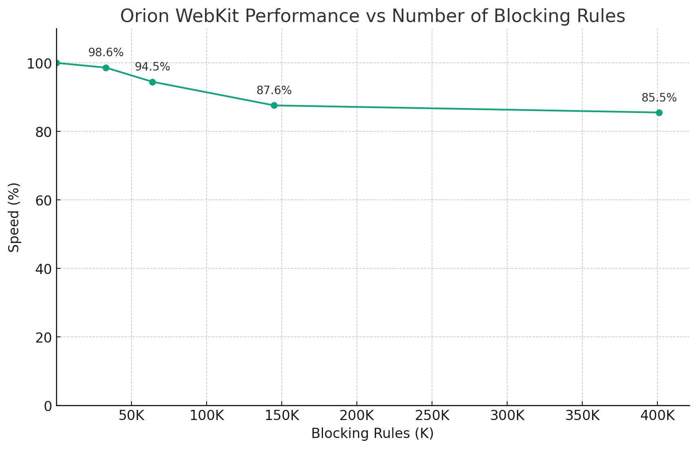 

## Third-Party Blocklists {#third_party_blocklists}

There are different types of lists - general ad lists, regional lists, malware lists, privacy lists, etc. You can customize your ad blocking by choosing which lists you want to add to Orion.

The [FilterLists](https://filterlists.com/) website provides a comprehensive directory of blocklists you can add to Orion.

### Privacy

Show filters
  

AdGuard Tracking Protection - [Info](https://adguard.com/kb/general/ad-filtering/adguard-filters/)  
`https://raw.githubusercontent.com/AdguardTeam/FiltersRegistry/master/filters/filter_3_Spyware/filter.txt`

Hagezi's Personal Blocklist - [Info](https://github.com/hagezi/dns-blocklists)  
`https://raw.githubusercontent.com/hagezi/dns-blocklists/main/adblock/personal.txt`

yokoffing's Privacy Essentials - [Info](https://github.com/yokoffing/filterlists)  
`https://raw.githubusercontent.com/yokoffing/filterlists/main/privacy_essentials.txt`

Block Outsider Intrusion into LAN - [Info](https://github.com/uBlockOrigin/uBlock-issues/issues/1070)  
`https://raw.githubusercontent.com/uBlockOrigin/uAssets/master/filters/lan-block.txt`

#### URL Tracking Parameters

*Orion cannot filter URL parameters, even when using uBlock Origin. See [Chrome and Firefox Extensions Support](https://help.kagi.com/orion/browser-extensions/macos-extensions.html#chrome-and-firefox-extensions-support) and [Supported WebExtensions APIs](https://help.kagi.com/orion/browser-extensions/macos-extensions.html#supported-webextensions-apis) for more details.*

Actually Legitimate URL Shortener Tool - [Info](https://github.com/DandelionSprout/adfilt)  
`https://raw.githubusercontent.com/DandelionSprout/adfilt/master/LegitimateURLShortener.txt`

#### Fonts
  
Block third-party fonts - [Info](https://github.com/yokoffing/filterlists)  
`https://raw.githubusercontent.com/yokoffing/filterlists/main/block_third_party_fonts.txt`

### Ads

Show filters
  
  
Peter Lowe's ad & tracking server list - [Info](https://pgl.yoyo.org/as/#about)  
`https://pgl.yoyo.org/adservers/serverlist.php?hostformat=adblockplus&showintro=1&mimetype=plaintext`

d3Host List - [Info](https://github.com/d3ward/toolz)  
`https://raw.githubusercontent.com/d3ward/toolz/master/src/d3host.adblock`

### Annoyances

Show filters
  

AdGuard Annoyances - [Info](https://adguard.com/kb/general/ad-filtering/adguard-filters/)  
`https://raw.githubusercontent.com/AdguardTeam/FiltersRegistry/master/filters/filter_14_Annoyances/filter.txt`

AdGuard Social Media - [Info](https://adguard.com/kb/general/ad-filtering/adguard-filters/)  
`https://raw.githubusercontent.com/AdguardTeam/FiltersRegistry/master/filters/filter_4_Social/filter.txt`

EasyList Cookie List - [Info](https://easylist.to/#easylist-cookie-list)  
`https://secure.fanboy.co.nz/fanboy-cookiemonster.txt`

I don't care about cookies - [Info](https://www.i-dont-care-about-cookies.eu/)  
`https://www.i-dont-care-about-cookies.eu/abp/`

yokoffing's Annoyance List - [Info](https://github.com/yokoffing/filterlists)  
`https://raw.githubusercontent.com/yokoffing/filterlists/main/annoyance_list.txt`

Browse websites without logging in - [Info](https://github.com/DandelionSprout/adfilt)  
`https://raw.githubusercontent.com/DandelionSprout/adfilt/master/BrowseWebsitesWithoutLoggingIn.txt`

#### Paywalls
  
Bypass Paywalls Clean filter - [Info](https://gitlab.com/magnolia1234/bypass-paywalls-clean-filters)  
`https://gitlab.com/magnolia1234/bypass-paywalls-clean-filters/-/raw/main/bpc-paywall-filter.txt`

### Security

Show filters
  
  
NoCoin Filter List - [Info](https://github.com/hoshsadiq/adblock-nocoin-list/)  
`https://raw.githubusercontent.com/hoshsadiq/adblock-nocoin-list/master/nocoin.txt`

Dandelion Sprout's Anti-Malware List - [Info](https://github.com/DandelionSprout/adfilt)  
`https://raw.githubusercontent.com/DandelionSprout/adfilt/master/Dandelion%20Sprout's%20Anti-Malware%20List.txt`

iam-py-test's The malicious website blocklist - [Info](https://github.com/iam-py-test/my_filters_001)  
`https://raw.githubusercontent.com/iam-py-test/my_filters_001/main/antimalware.txt`

## Regional Blocklists {#regional_blocklists}

EasyList maintains [supplementary blocklists](https://easylist.to/pages/other-supplementary-filter-lists-and-easylist-variants.html) that can enhance ad blocking on non-English websites.

The list of regional filters is provided below.
Please visit the [EasyList website](https://easylist.to/pages/other-supplementary-filter-lists-and-easylist-variants.html) for more information.

Show filters
  

EasyList Germany  
`https://easylist.to/easylistgermany/easylistgermany.txt`

EasyList Italy  
`https://easylist-downloads.adblockplus.org/easylistitaly.txt`

EasyList Dutch  
`https://easylist-downloads.adblockplus.org/easylistdutch.txt`

Liste FR (French)  
`https://easylist-downloads.adblockplus.org/liste_fr.txt`

EasyList China  
`https://easylist-downloads.adblockplus.org/easylistchina.txt`

RU AdList (Russian, Ukrainian)  
`https://easylist-downloads.adblockplus.org/advblock.txt`

Bulgarian list  
`http://stanev.org/abp/adblock_bg.txt`

ABPindo (Indonesian)  
`https://raw.githubusercontent.com/heradhis/indonesianadblockrules/master/subscriptions/abpindo.txt`

Liste AR (Arabic)  
`https://easylist-downloads.adblockplus.org/Liste_AR.txt`

EasyList Czech and Slovak  
`https://raw.githubusercontent.com/tomasko126/easylistczechandslovak/master/filters.txt`

Latvian List  
`https://raw.githubusercontent.com/Latvian-List/adblock-latvian/master/lists/latvian-list.txt`

EasyList Hebrew  
`https://raw.githubusercontent.com/easylist/EasyListHebrew/master/EasyListHebrew.txt`

Dandelion Sprout's Nordic Filters  
`https://raw.githubusercontent.com/DandelionSprout/adfilt/master/NorwegianExperimentalList%20alternate%20versions/NordicFiltersABP-Inclusion.txt`

EasyList Lithuania  
`https://raw.githubusercontent.com/EasyList-Lithuania/easylist_lithuania/master/easylistlithuania.txt`

EasyList Spanish  
`https://easylist-downloads.adblockplus.org/easylistspanish.txt`

EasyList Portuguese  
`https://easylist-downloads.adblockplus.org/easylistportuguese.txt`

ABPVN List (Vietnamese)  
`https://raw.githubusercontent.com/ABPindo/indonesianadblockrules/master/subscriptions/abpindo.txt`

EasyList Polish  
`https://easylist-downloads.adblockplus.org/easylistpolish.txt`

IndianList  
`https://easylist-downloads.adblockplus.org/indianlist.txt`

KoreanList  
`https://easylist-downloads.adblockplus.org/koreanlist.txt`

ROList (Romanian)  
`https://www.zoso.ro/pages/rolist.txt`

## Custom Filters {#custom_filters}

Orion allows you to create your own filters directly in Orion Settings.

On macOS, you can enable this feature in **Orion** > **Settings** > **Privacy** > **Manage Filter Lists**, then check the **Custom Filters** checkbox, and specify the rules in the text area.

On iOS, custom filters can be added in the **Manage Content Blocker** window.
Once finished, tap **Done** in the top right corner of the window.

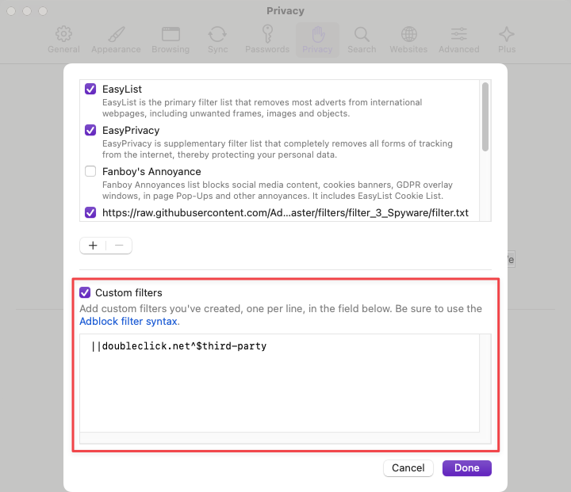 

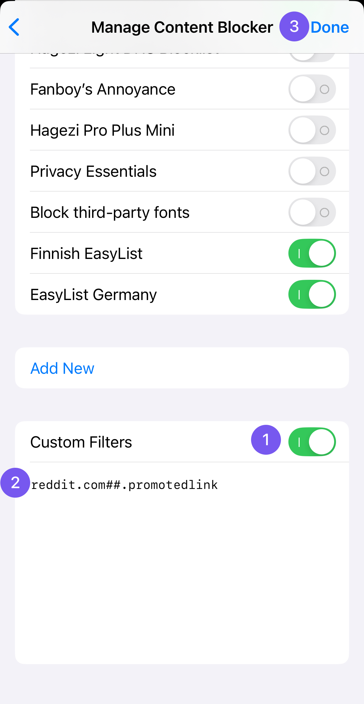 

## Blocklist Syntax {#blocklist-syntax}

Orion follows the Adblock Plus standard for its blocklist syntax.
This means any filters created for Adblock Plus are compatible with Orion.
You can learn how to create your own blocklists by following the [step-by-step guide](https://adblockplus.org/filter-cheatsheet) or visiting the full [blocklist syntax reference](https://help.adblockplus.org/hc/en-us/articles/360062733293-How-to-write-filters) for more technical details.

Note: Snippet filters are not supported.

## Contributing to Blocklists {#contributing_blocklists}

Many blocklists are open-source and maintained by independent groups and communities.
Anyone can submit domains for inclusion in the lists.
