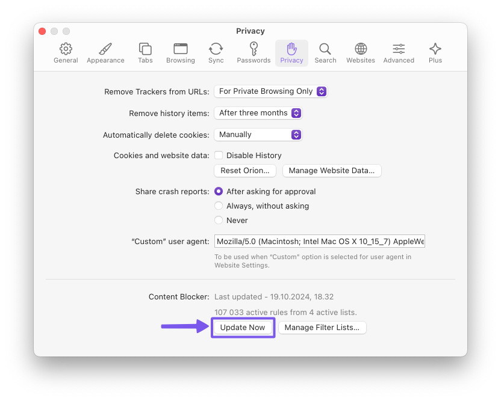
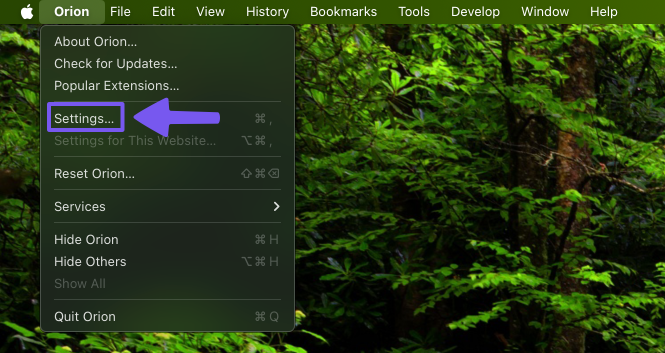
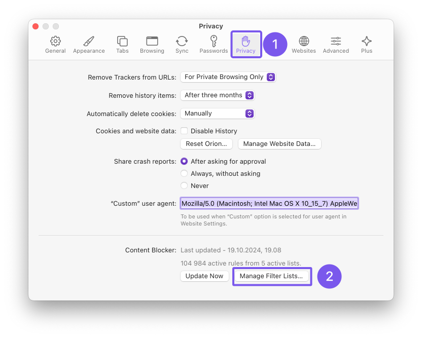
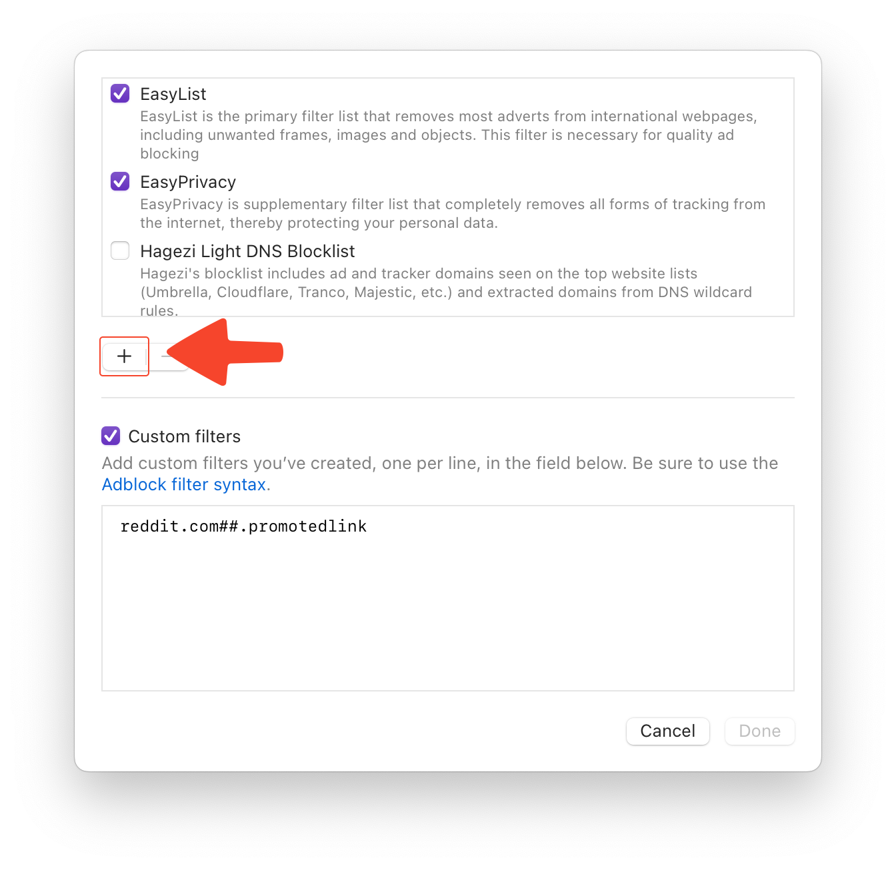
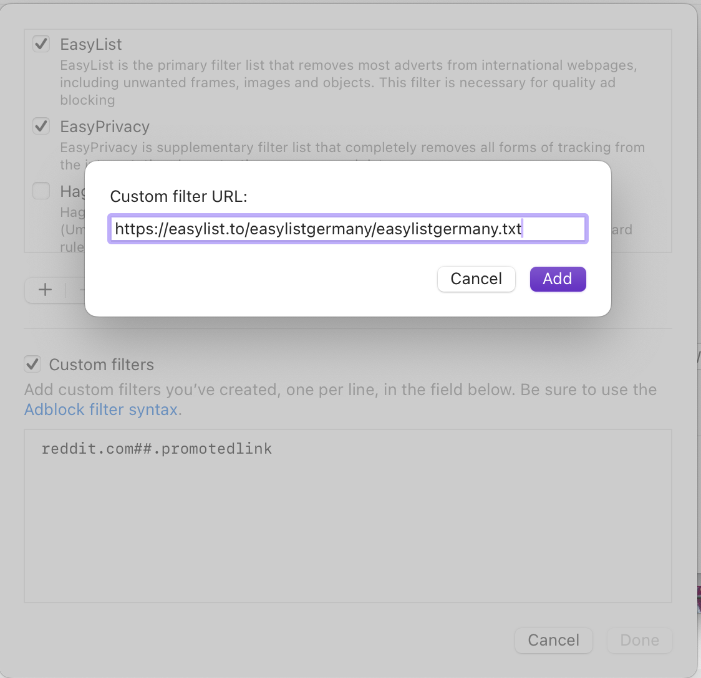
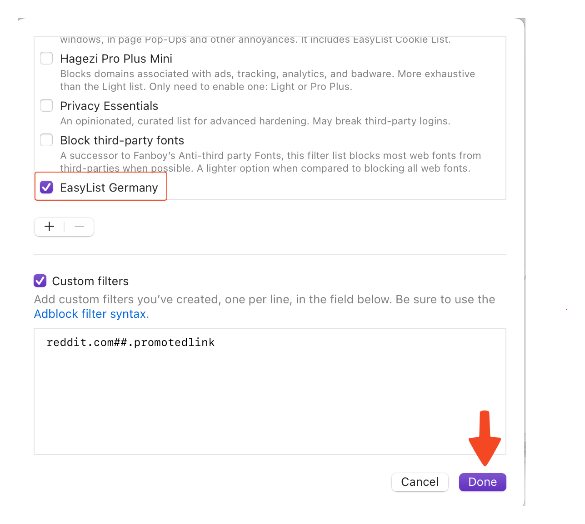

# Custom Blocklists

> **Note**: The Custom Blocklists feature is currently only available in Orion RC version.

Orion for Mac allows you to customize it's ad blocker by using custom blocklists. Blocklists are lists of domains that are known to serve ads, trackers, malware and other annoyances. Orion checks web page requests against these lists and blocks any requests to the listed domains. This prevents ads from being displayed and trackers from following you around.

## Updating Blocklists

Blocklists are constantly updated as new ad/tracking domains appear. List maintainers work to identify and add new ad-serving domains as they pop up.

To manually update blocklists, go to **Orion** > **Settings** > **Privacy** and click **Update Now**. Wait for the "Processing update" message to disappear.

 

 

## Adding Blocklists

To add a block list to Orion go to **Orion** > **Settings** > **Privacy** and click the **Show Filter Lists** button.

 

 

Next, in the modal that opens, click the **+** button.

 

Then, paste the URL of the block list you wish to add and click the **Add** button. Finally click **Done**.

 

 

## Impact of Number of Blocking Rules on Performance

Orion's ad blocker compiles each blocklist to convert it to native WebKit content blocking rules.
This results in minimal performance impact dependent on the number of blocking rules that are active.
The following chart illustrates the relationship between Orion's WebKit performance vs the number of blocking rules:

 

## Third-Party Blocklists

There are different types of lists - general ad lists, regional lists, malware lists, privacy lists, etc. You can customize your ad blocking by choosing which lists you want to add to Orion.

The [FilterLists](https://filterlists.com/) website provides a comprehensive directory of blocklists you can add to Orion.

### Privacy

Show filters
  

AdGuard Tracking Protection - [Info](https://adguard.com/kb/general/ad-filtering/adguard-filters/)  
`https://raw.githubusercontent.com/AdguardTeam/FiltersRegistry/master/filters/filter_3_Spyware/filter.txt`

Hagezi's Personal Blocklist - [Info](https://github.com/hagezi/dns-blocklists)  
`https://raw.githubusercontent.com/hagezi/dns-blocklists/main/adblock/personal.txt`

yokoffing's Privacy Essentials - [Info](https://github.com/yokoffing/filterlists)  
`https://raw.githubusercontent.com/yokoffing/filterlists/main/privacy_essentials.txt`

Block Outsider Intrusion into LAN - [Info](https://github.com/uBlockOrigin/uBlock-issues/issues/1070)  
`https://raw.githubusercontent.com/uBlockOrigin/uAssets/master/filters/lan-block.txt`

#### URL Tracking Parameters

*Orion cannot filter URL parameters, even when using uBlock Origin. See [Chrome and Firefox Extensions Support](https://help.kagi.com/orion/browser-extensions/macos-extensions.html#chrome-and-firefox-extensions-support) and [Supported WebExtensions APIs](https://help.kagi.com/orion/browser-extensions/macos-extensions.html#supported-webextensions-apis) for more details.*

Actually Legitimate URL Shortener Tool - [Info](https://github.com/DandelionSprout/adfilt)  
`https://raw.githubusercontent.com/DandelionSprout/adfilt/master/LegitimateURLShortener.txt`

#### Fonts
  
Block third-party fonts - [Info](https://github.com/yokoffing/filterlists)  
`https://raw.githubusercontent.com/yokoffing/filterlists/main/block_third_party_fonts.txt`

### Ads

Show filters
  
  
Peter Lowe's ad & tracking server list - [Info](https://pgl.yoyo.org/as/#about)  
`https://pgl.yoyo.org/adservers/serverlist.php?hostformat=adblockplus&showintro=1&mimetype=plaintext`

d3Host List - [Info](https://github.com/d3ward/toolz)  
`https://raw.githubusercontent.com/d3ward/toolz/master/src/d3host.adblock`

### Annoyances

Show filters
  

AdGuard Annoyances - [Info](https://adguard.com/kb/general/ad-filtering/adguard-filters/)  
`https://raw.githubusercontent.com/AdguardTeam/FiltersRegistry/master/filters/filter_14_Annoyances/filter.txt`

AdGuard Social Media - [Info](https://adguard.com/kb/general/ad-filtering/adguard-filters/)  
`https://raw.githubusercontent.com/AdguardTeam/FiltersRegistry/master/filters/filter_4_Social/filter.txt`

I don't care about cookies - [Info](https://www.i-dont-care-about-cookies.eu/)  
`https://www.i-dont-care-about-cookies.eu/abp/`

yokoffing's Annoyance List - [Info](https://github.com/yokoffing/filterlists)  
`https://raw.githubusercontent.com/yokoffing/filterlists/main/annoyance_list.txt`

Browse websites without logging in - [Info](https://github.com/DandelionSprout/adfilt)  
`https://raw.githubusercontent.com/DandelionSprout/adfilt/master/BrowseWebsitesWithoutLoggingIn.txt`

#### Paywalls
  
Bypass Paywalls Clean filter - [Info](https://gitlab.com/magnolia1234/bypass-paywalls-clean-filters)  
`https://gitlab.com/magnolia1234/bypass-paywalls-clean-filters/-/raw/main/bpc-paywall-filter.txt`

### Security

Show filters
  
  
NoCoin Filter List - [Info](https://github.com/hoshsadiq/adblock-nocoin-list/)  
`https://raw.githubusercontent.com/hoshsadiq/adblock-nocoin-list/master/nocoin.txt`

Dandelion Sprout's Anti-Malware List - [Info](https://github.com/DandelionSprout/adfilt)  
`https://raw.githubusercontent.com/DandelionSprout/adfilt/master/Dandelion%20Sprout's%20Anti-Malware%20List.txt`

iam-py-test's The malicious website blocklist - [Info](https://github.com/iam-py-test/my_filters_001)  
`https://raw.githubusercontent.com/iam-py-test/my_filters_001/main/antimalware.txt`

## Regional Blocklists

EasyList maintains [supplementary blocklists](https://easylist.to/pages/other-supplementary-filter-lists-and-easylist-variants.html) that can improve ad blocking on non-English websites.

The list of regional filters is below. Please visit the [EasyList website](https://easylist.to/pages/other-supplementary-filter-lists-and-easylist-variants.html) for more information.

Show filters
  

EasyList Germany  
`https://easylist.to/easylistgermany/easylistgermany.txt`

EasyList Italy  
`https://easylist-downloads.adblockplus.org/easylistitaly.txt`

EasyList Dutch  
`https://easylist-downloads.adblockplus.org/easylistdutch.txt`

Liste FR (French)  
`https://easylist-downloads.adblockplus.org/liste_fr.txt`

EasyList China  
`https://easylist-downloads.adblockplus.org/easylistchina.txt`

RU AdList (Russian, Ukrainian)  
`https://easylist-downloads.adblockplus.org/advblock.txt`

Bulgarian list  
`http://stanev.org/abp/adblock_bg.txt`

ABPindo (Indonesian)  
`https://raw.githubusercontent.com/heradhis/indonesianadblockrules/master/subscriptions/abpindo.txt`

Liste AR (Arabic)  
`https://easylist-downloads.adblockplus.org/Liste_AR.txt`

EasyList Czech and Slovak  
`https://raw.githubusercontent.com/tomasko126/easylistczechandslovak/master/filters.txt`

Latvian List  
`https://raw.githubusercontent.com/Latvian-List/adblock-latvian/master/lists/latvian-list.txt`

EasyList Hebrew  
`https://raw.githubusercontent.com/easylist/EasyListHebrew/master/EasyListHebrew.txt`

Dandelion Sprout's Nordic Filters  
`https://raw.githubusercontent.com/DandelionSprout/adfilt/master/NorwegianExperimentalList%20alternate%20versions/NordicFiltersABP-Inclusion.txt`

EasyList Lithuania  
`https://raw.githubusercontent.com/EasyList-Lithuania/easylist_lithuania/master/easylistlithuania.txt`

EasyList Spanish  
`https://easylist-downloads.adblockplus.org/easylistspanish.txt`

EasyList Portuguese  
`https://easylist-downloads.adblockplus.org/easylistportuguese.txt`

ABPVN List (Vietnamese)  
`https://raw.githubusercontent.com/ABPindo/indonesianadblockrules/master/subscriptions/abpindo.txt`

EasyList Polish  
`https://easylist-downloads.adblockplus.org/easylistpolish.txt`

IndianList  
`https://easylist-downloads.adblockplus.org/indianlist.txt`

KoreanList  
`https://easylist-downloads.adblockplus.org/koreanlist.txt`

ROList (Romanian)  
`https://www.zoso.ro/pages/rolist.txt`

## Contributing to Blocklists

Many blocklists are open source and maintained by independent groups and communities. Anyone can submit domains for inclusion in the lists.
