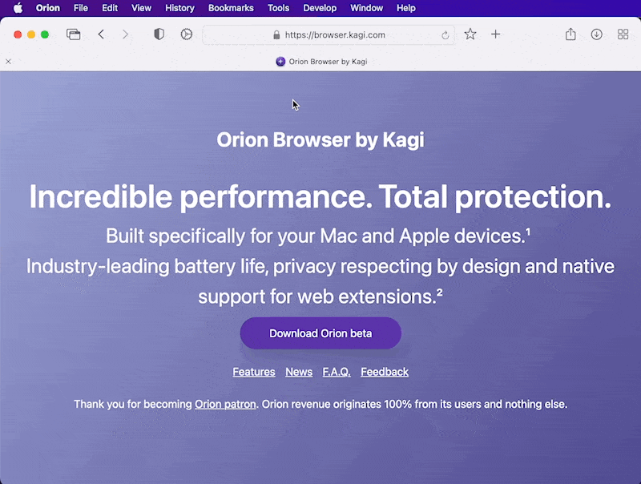

# Edit Text on Page

Sometimes you may want to quickly edit text on a page so you can take that perfect screenshot. Orion for macOS makes this possible.

1. While on the webpage, click the **Tools** menu.
2. Click **Edit Text on Page**.
3. Make your text edits.
4. Use the **Tools** menu again and choose **Edit Text on Page** to stop editing.

 
