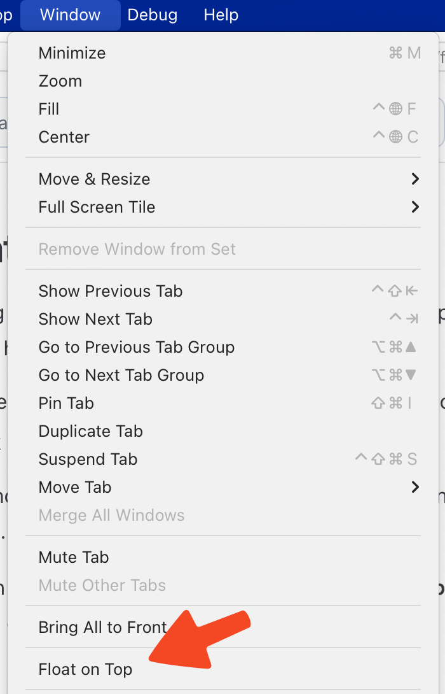

# Float on Top

Floating a window on top is a feature of many paid apps on the Mac App Store. Orion for macOS has it built-in for free.

1. While viewing a window in Orion that you want to float, click the **Window** menu.
2. Click **Float on Top**.

<<<<<<< HEAD
 

=======
>>>>>>> main
The window will now float on top of all others. You can use the same menu option to disable floating.

You can also add a keyboard shortcut for **Float on Top**. Please see the [Keyboard Shortcuts](./../../orion/support-and-community/keyboard-shortcuts) page to get started.

