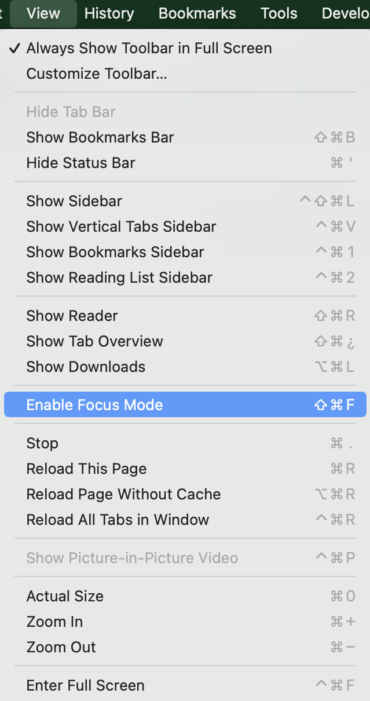
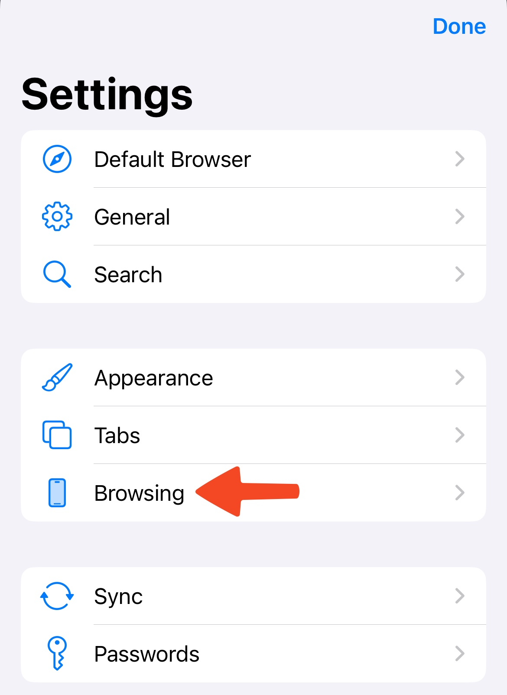
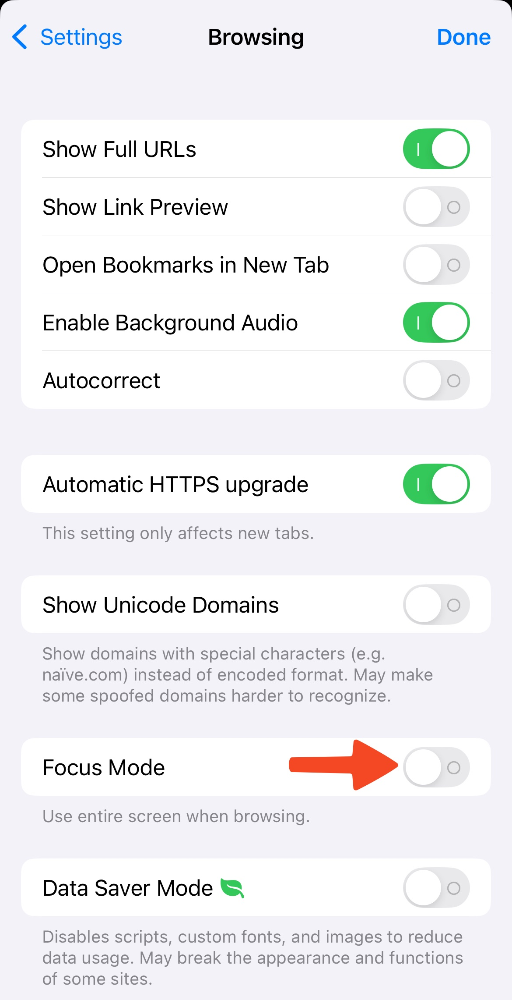
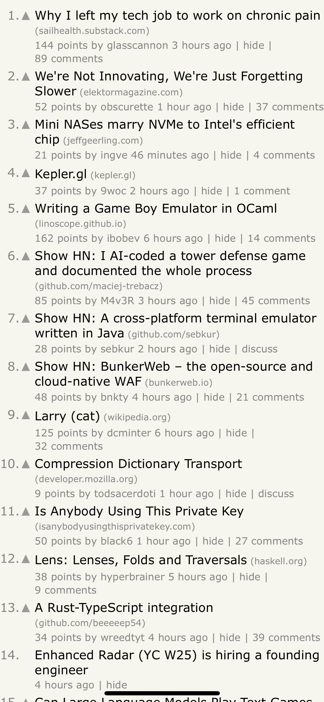
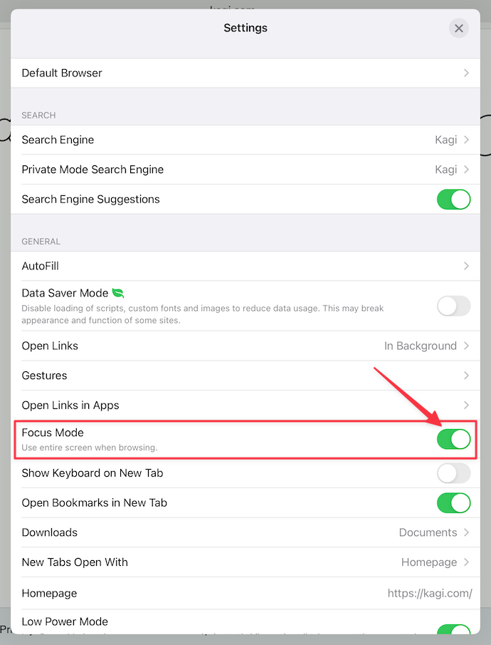

# Focus Mode

Focus Mode allows you to completely remove toolbars from your browser interface. Browse the web distraction-free! Here's an example on macOS.

 

## Table of Contents

- [macOS Focus Mode](#macos)
- [iOS Focus Mode](#ios)
- [iPadOS Focus Mode](#ipados)

## macOS Focus Mode

You can enter Focus Mode by clicking the **View** menu and choosing **Enable Focus Mode**. Or, you can type **Shift-Command-F** on your keyboard.

 

To exit Focus Mode, click the **View** menu and choose **Disable Focus Mode**. Or, you can type **Shift-Command-F** again on your keyboard.

## iOS Focus Mode

1. Tap the three-dot menu (•••) in the bottom-right corner of your screen.
2. Tap **Settings**.

 

3. Go to **Browsing** and enable **Focus Mode**.

Below are examples of Kagi search and [Hacker News](https://news.ycombinator.com) in Focus Mode. 

## iPadOS Focus Mode

1. Tap the three-dot menu (•••) in the upper-right corner of your screen.
2. Tap **Settings**.

 

3. Turn on **Focus Mode**.

 

Here's an example of CNN in Focus Mode.

 

