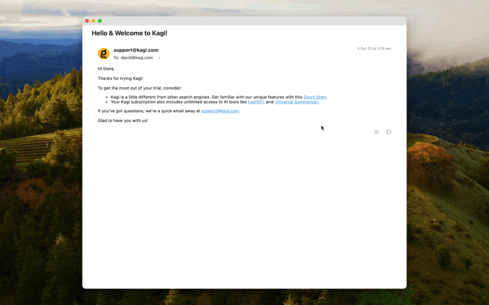

# Link Previews

Sometimes you want to quickly take a peek at a link without opening it in a new tab. Orion makes this possible thanks to its  External Link Previews. You can use this feature inside Orion and also in other apps.

{data-zoomable}

## Using Link Previews in Orion

To preview a link in Orion, simply hold the Shift key and then click on the link.

## Enabling Link Previews in Other Apps

To enable Link Previews while using other apps, follow these steps:
1. In your menu bar, select **Orion** > **Settings**.
2. Click on the **General** tab.
3. If you see an option to make Orion your default web browser at the bottom of the window, click **Set Default**.
4. Switch to the **Browsing** tab and make sure the **Open external links in Preview** checkbox is enabled.

## Using Link Previews in Other Apps

Once Link Previews are enabled, you can use them by simply clicking on a link in a third-party app. The link will open on top of that app instead of switching to the main Orion window. If you prefer to open a link as a tab in Orion, simply hold the Shift key before clicking the link.
