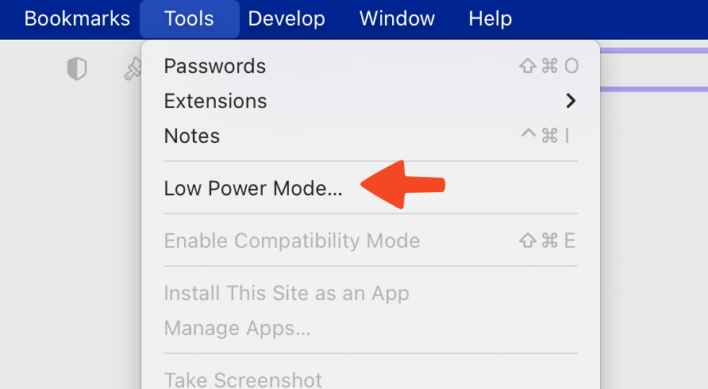
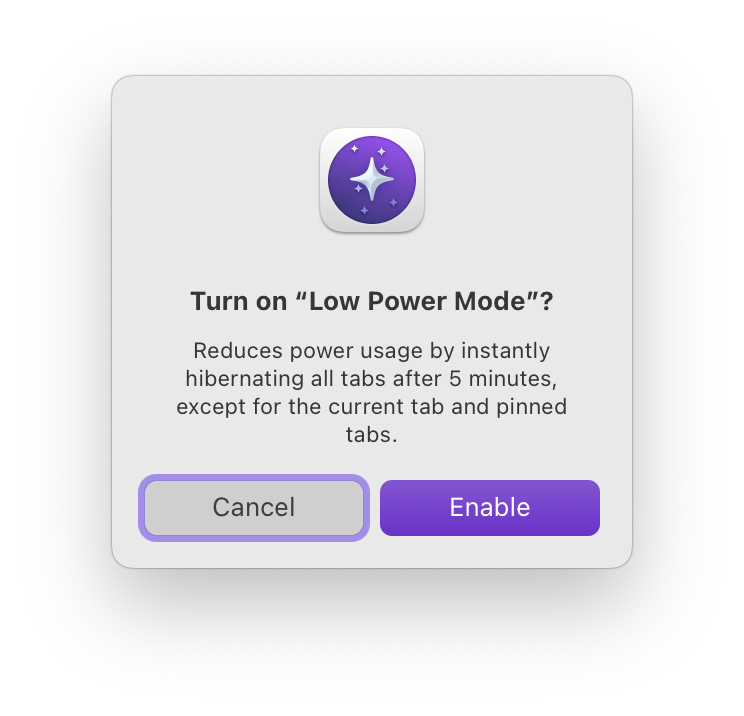
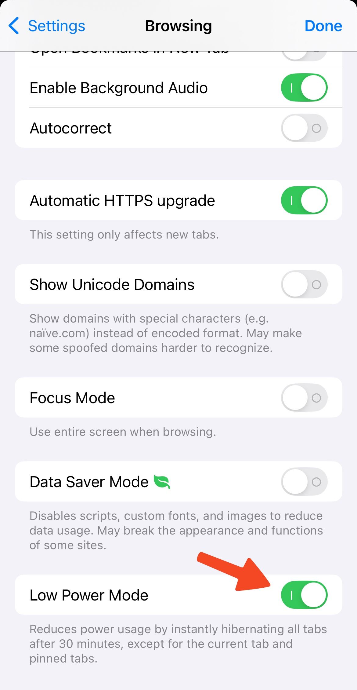

# Low Power Mode

Inspired by the same feature on iPhone, Low Power Mode reduces Orion's power consumption up to 90%. It does this by cleverly suspending browser tabs you haven't used after five minutes.

## Table of Contents

- [macOS Low Power Mode](#macos)
- [iOS Low Power Mode](#ios)
- [iPadOS Low Power Mode](#ipados)

## macOS Low Power Mode {#macos}

You can enable Low Power Mode by clicking the **Tools** menu and then clicking **Low Power Mode...**.

 

You can then click the **Enable** button in the window that appears.

 

You can disable Low Power Mode using the same menu option.

## iOS Low Power Mode {#ios}

You can enable Low Power Mode in Orion's Settings.

1. Tap the three-dot menu (•••) in the bottom-right corner of your screen.
2. Tap **Settings**.

 

3. Go to **Browsing** and enable **Low Power Mode**.

  
  

You can disable Low Power Mode from the same place.

## iPadOS Low Power Mode {#ipados}

You can enable Low Power Mode in Orion's Settings.

1. Tap the three-dot menu (•••) in the upper-right corner of your screen.
2. Tap **Settings**.

 

3. Turn on **Low Power Mode**.

 

You can disable Low Power Mode from the same place.
