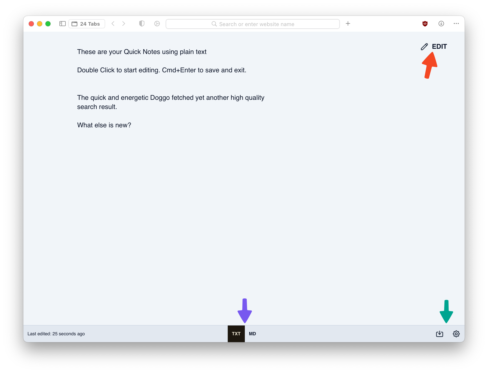

# Notes

Orion Notes allow you to easily store ideas and information without having to switch to another app, notes are stored locally on your computer. To use Notes simply click on the **Tools** menu and choose **Notes** or press **Control-Command-I** to open Notes in a new tab, you can then double click to edit the note. When you are done, press **Command-Enter** to save your changes and exit edit mode.

 

Tips:
- You can write your notes as standard text by selecting the TXT option at the bottom of the window, or using [Markdown](https://www.markdownguide.org) by selecting the MD button.
- You can export your notes as a file by clicking the download button at the bottom right corner of the window.
- In settings you will find more options such as Save Revision History, Theme, Font and Custom CSS. To access settings press the gear icon at the bottom right corner of the window.
