# Password Management

## Table of Contents
- [Orion's Password Manager](#orions_password_manager)
- [Password Storage & Sync](#password_storage_sync)
- [Importing Safari Passwords into Orion on macOS](#import_safari_passwords)
- [Syncing Passwords in Orion](#syncing_passwords)
  - [macOS](#syncing_passwords_macos)
  - [iOS](#syncing_passwords_ios)
  - [iPadOS](#syncing_passwords_ipados)
- [Using Safari Passwords in Orion on macOS](#using_safari_passwords)
- [1Password & Orion](#1password)

## Orion's Password Manager {#orions_password_manager}
Orion includes a built-in Password Manager that makes it easy to store and automatically fill your usernames and passwords.

To use Orion's Password Manager, simply fill your login credentials in your favorite website and you will be prompted to save them when you submit the form.

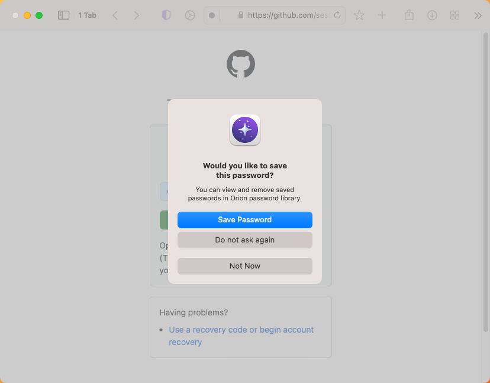{width=500px data-zoomable}

The next time you visit that website, Orion will show you the list of saved passwords so you can select the one you need, Orion will then fill the login information automatically.

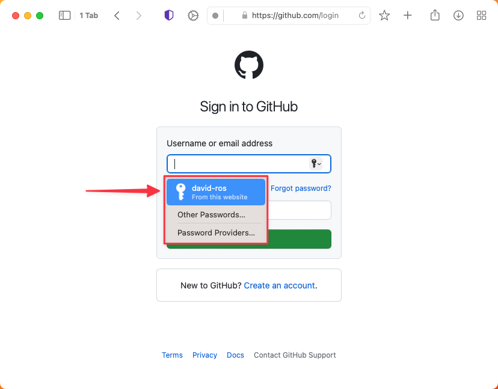{width=500px data-zoomable}

Orion also allows you to manage your saved passwords. To access the Passwords window, go to the **Tools** menu and click on **Passwords**.

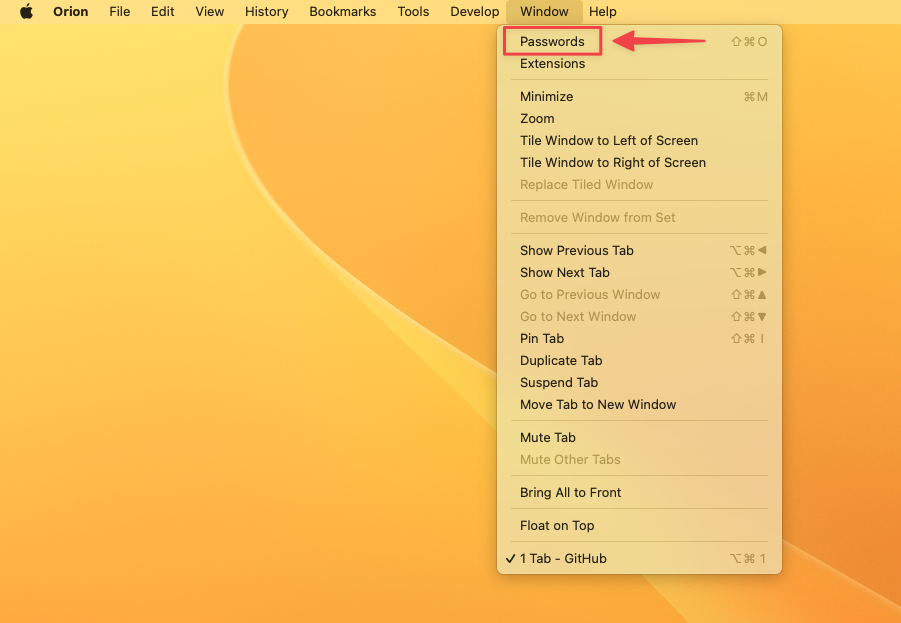{width=500px data-zoomable}

This will open the Passwords window which will be locked to protect your privacy. Use your macOS password to unlock it.

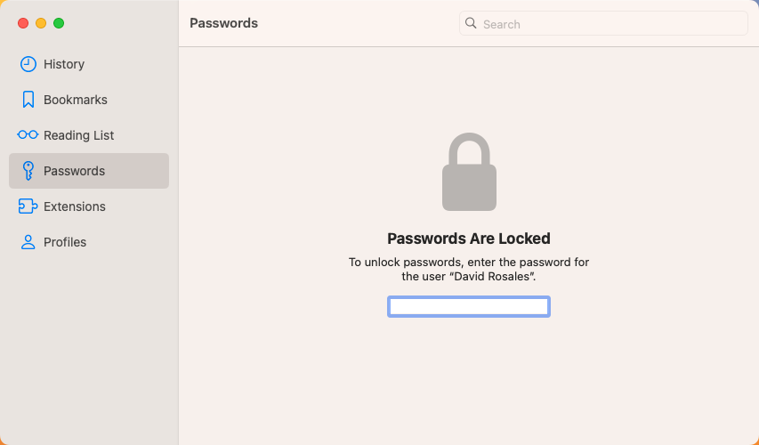{width=500px data-zoomable}

Once you have entered your password, Orion will show you the list of all your saved passwords, you can click on any of them to reveal them. 

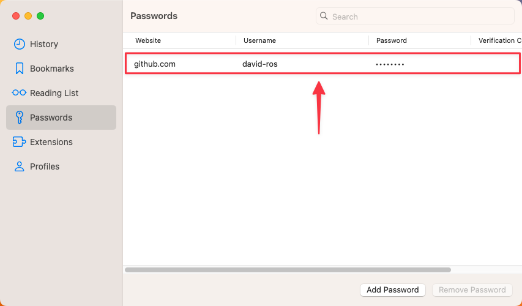{width=500px data-zoomable}

You can also right click on a password to show additional options such as **Copy Website**, **Copy Username**, **Copy Password** and **Edit**. You can also use the **Add Password** and **Remove Password** buttons when needed.

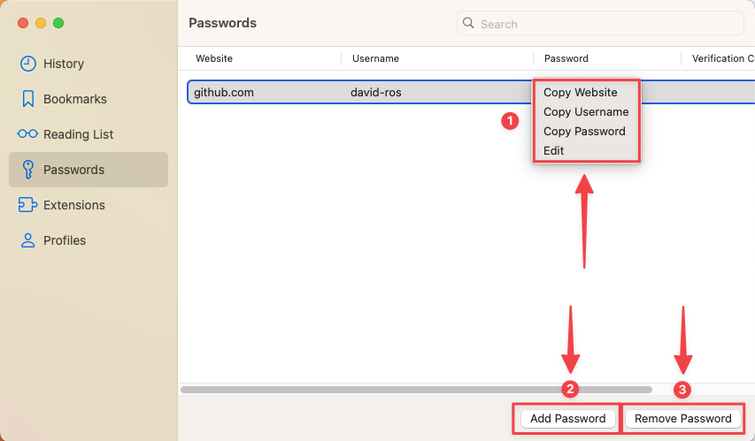{width=500px data-zoomable}

## Password Storage & Sync {#password_storage_sync}

Many users of Safari on Apple devices use iCloud Keychain to automatically sync Safari data, including website passwords, across devices.

Third-party web browsers, like Orion, cannot sync with the Keychain used by Safari. Orion must use its own Orion-specific Keychain. Safari cannot see the Orion Keychain and Orion cannot see the Safari Keychain.

If you want to use your Safari passwords in Orion, you will need to import the passwords into Orion on macOS. Then, you can use the passwords in Orion on all Apple devices through Orion's own Keychain sync.

## Importing Safari Passwords into Orion on macOS {#import_safari_passwords}

Orion on macOS can import your passwords from Safari 15+ on macOS. These versions of Safari ship with macOS 12 (Monterey) and newer. They are also available on macOS 11 (Big Sur) through the [Safari Technology Preview](https://developer.apple.com/safari/download/).

1. Open Safari and select **File** > **Export** > **Passwords** and select a location to save the passwords file. Note that this file will be saved without encryption so
choose the location appropriately and consider deleting it once import is complete.

2. In Orion, click the **File** menu, choose **Import From**, and select **Safari**.

{width=500px data-zoomable}

3. Orion can import various types of data from Safari, including passwords. Select your desired import data types by checking or unchecking the appropriate boxes, then click the **Import** button.

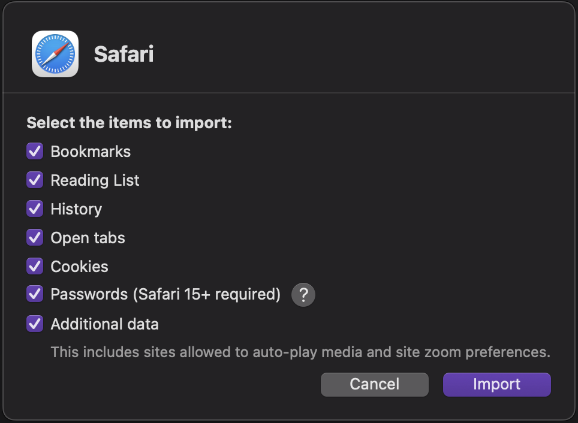{width=300px data-zoomable}

4. Select the passwords file you exported in step 1.

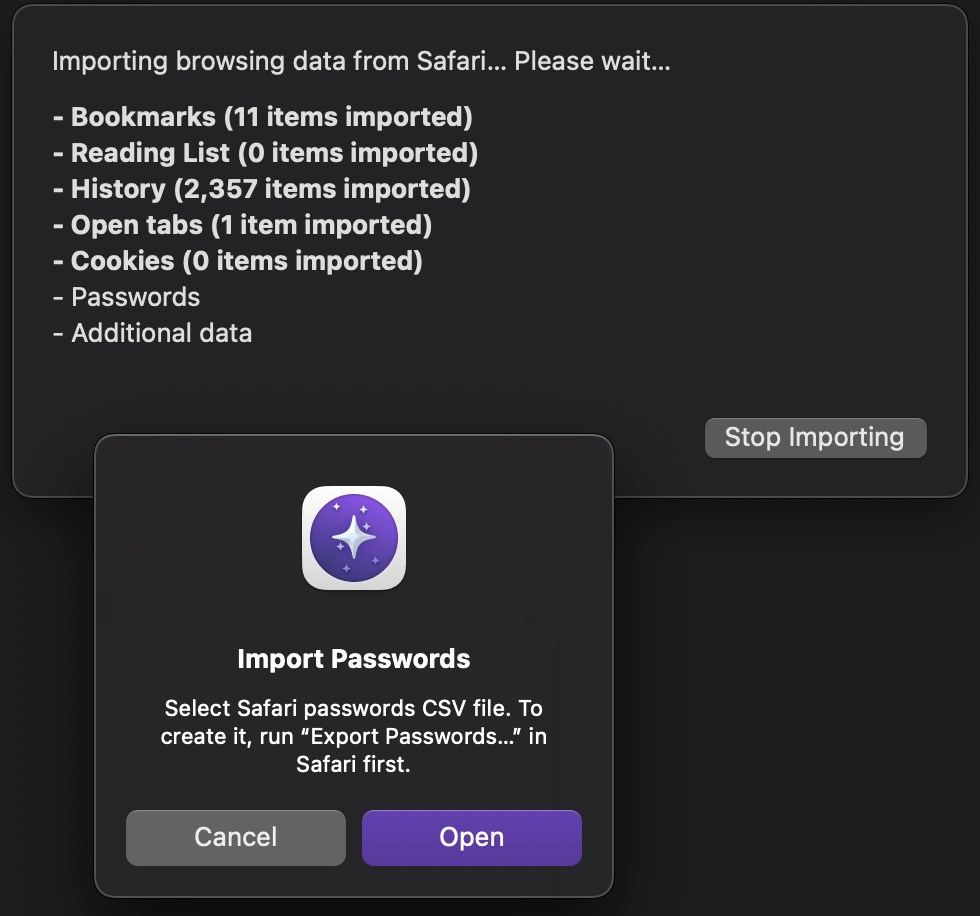{width=300px data-zoomable}

## Syncing Passwords in Orion {#syncing_passwords}

To sync Orion passwords across devices, perform these steps <u>on each device</u>.

### macOS {#syncing_passwords_macos}

1. Click the Apple menu (), click **System Settings**.
   - If you're using macOS 3.14 (Mojave), you don't need to click Apple ID.
   
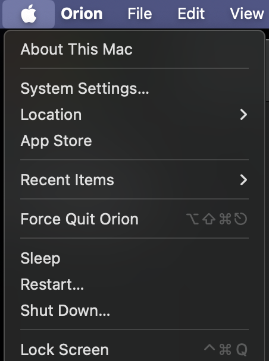{width=300px data-zoomable}

2. Open **iCloud**.

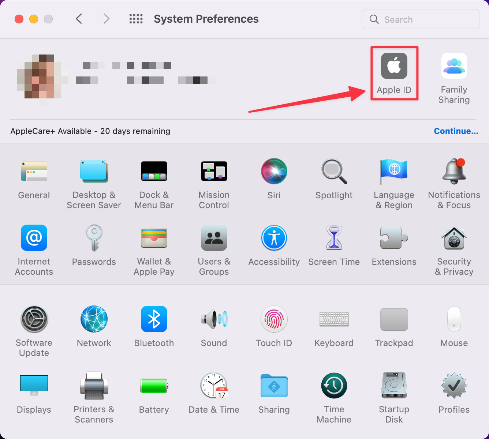{width=500px data-zoomable}

3. Open **Passwords**.

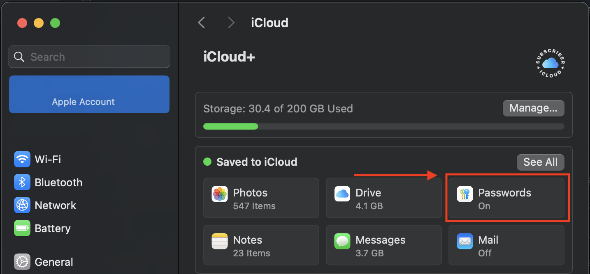{width=500px data-zoomable}

4. Enable **Sync this Mac**.

{width=300px data-zoomable}

### iOS {#syncing_passwords_ios}

1. Open the Settings app for your device.
2. Tap your name at the top of Settings.
3. Tap iCloud.
4. Turn on **Passwords and Keychain** if it isn't already on.

{width=300px data-zoomable}

{width=300px data-zoomable}

### iPadOS {#syncing_passwords_ipados}

1. Open the Settings app for your device.
2. Tap your name at the top left corner of Settings.
3. Tap iCloud.

{width=500px data-zoomable}

4. Turn on **Keychain** if it isn't already on.

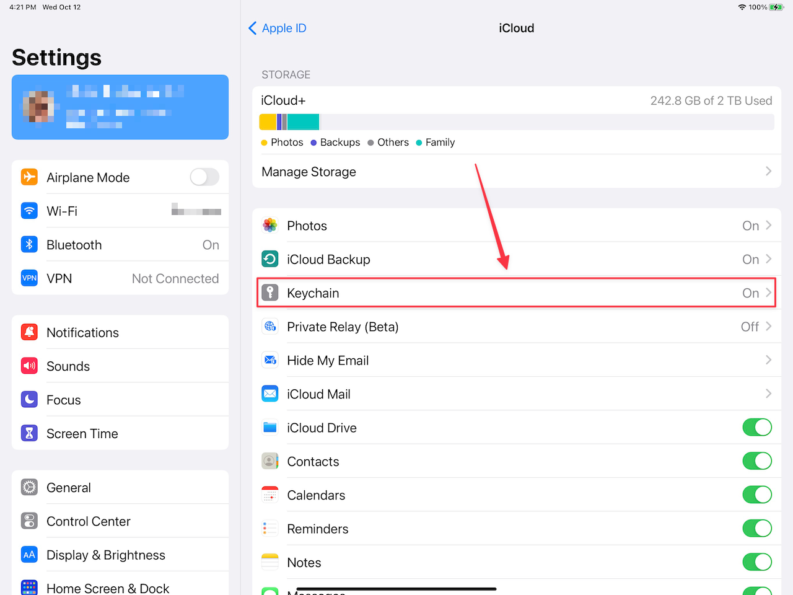{width=500px data-zoomable}

{width=500px data-zoomable}

## Using Safari Passwords in Orion on macOS {#using_safari_passwords}

As an alternative to importing passwords from Safari into Orion, you can also access your Safari passwords in Orion directly. To enable this, first go to **Orion** > **Settings** > **Passwords**, and then disable the **Use Orion's Keychain** checkbox.

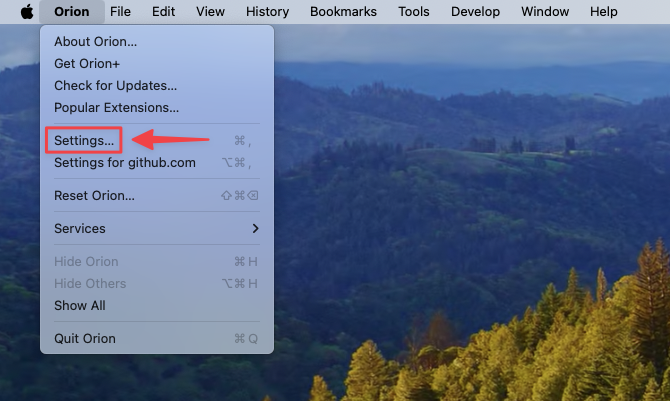{width=500px data-zoomable}

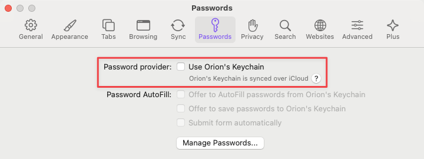{width=500px data-zoomable}

Now, to access your Safari passwords simply click the key icon in the login screen of your favorite website.

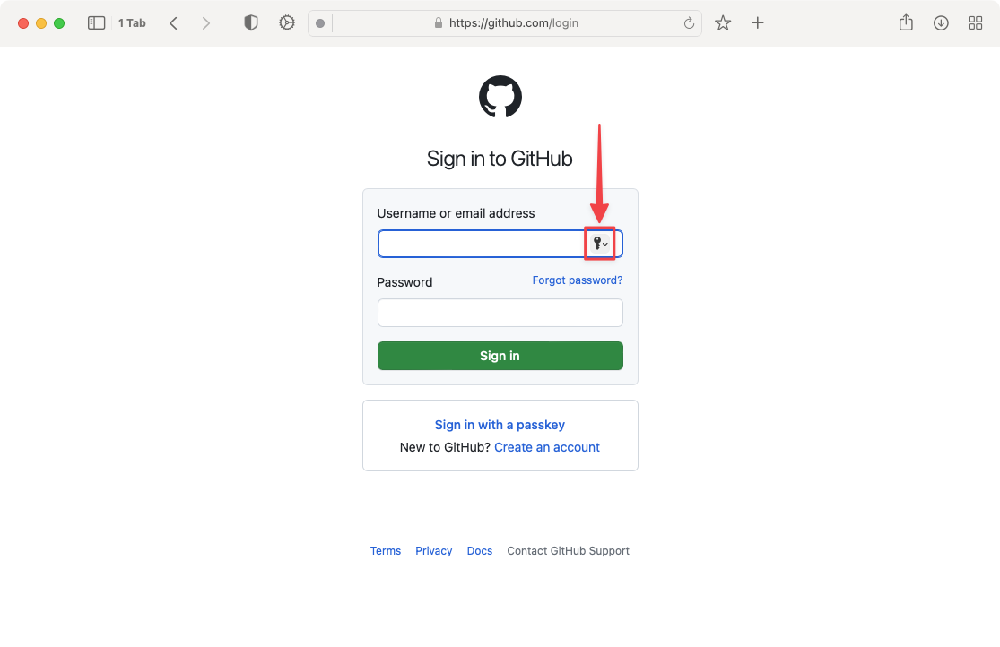{width=500px data-zoomable}

Then, click the **Passwords** button.

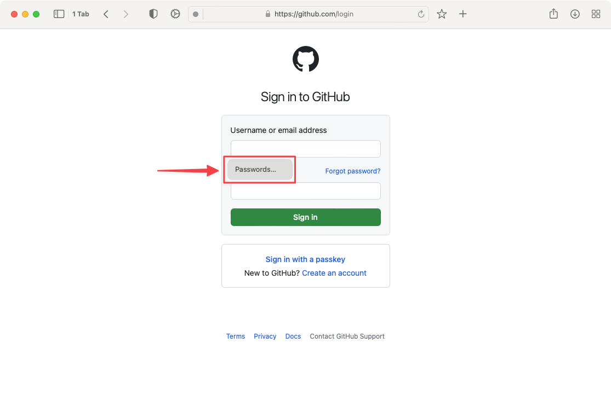{width=500px data-zoomable}

Next, you will be prompted to unlock your passwords with **Touch ID** or with your **macOS password**.

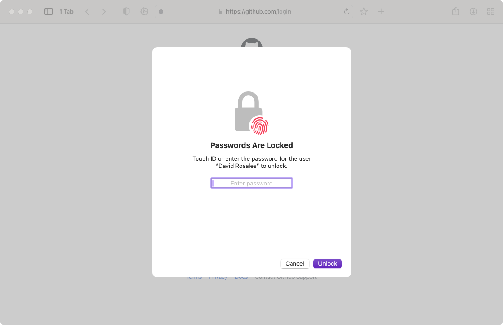{width=500px data-zoomable}

Finally, select the desired password from the list and click on **Choose Password**.

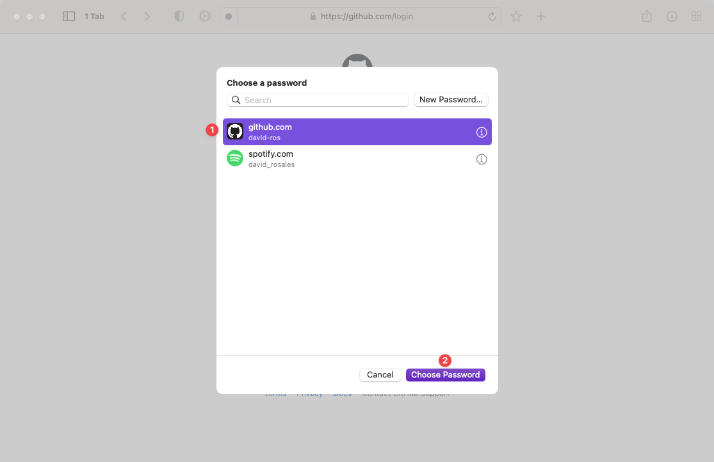{width=500px data-zoomable}

## 1Password & Orion {#1password}

1Password is now compatible with Orion thanks to the joint effort between 1Password and Orion teams. To use 1Password in Orion please follow [these instructions](../browser-extensions/1password.md).
