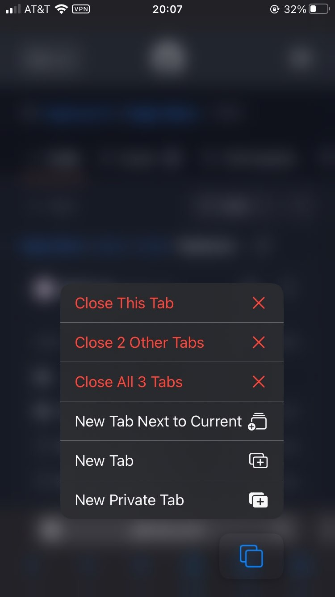

# Press and hold shortcuts

Orion provides some advanced functionality to its users through the implementation of press and hold shortcuts.

## Table of Contents

- [History breadcrumb jumps](#history_breadcrumb_jumps)
- [Quick new private tab](#quick_new_private_tab)
- [Advanced tab management](#advanced_tab_management)
- [Instant reader mode](#instant_reader_mode)
- [Quick reload without content blockers](#quick_reload_without_content_blockers)

 

## History breadcrumb jumps {#history_breadcrumb_jumps}
### On Orion iOS
You can quickly jump backwards or forwards in your tab history by pressing and holding the `<` or `>` toolbar navigation options respectively. 

Doing so will open a menu of your tabs backwards or forwards history and allow you to quickly jump to where you want to go.

This provides an advanced and speedy alternative to having to press the `<` or `>` toolbar navigation options repeatedly. 

 
 

## Quick new private tab {#quick_new_private_tab}
### On Orion iOS
You can quickly open a new tab in a different context (private or normal) by pressing and holding the `+` toolbar navigation option. 

Doing so will open a menu where you can select to open a `New Tab` or `New Private Tab`. 

This provides an advanced and speedy alternative to having to navigate to the desired context (private or normal) before being able to open a new tab in that context.

 

## Advanced tab management {#advanced_tab_management}
### On Orion iOS
You can quickly `open a new tab`, `open a new private tab`, `close the current tab`, `close all tabs excluding the current`, `close all tabs including the current`, or `open a new tab next to current` by pressing and holding the tabs toolbar navigation option. 

Doing so will open a menu where you can select one of the above options. 

This provides an advanced and speedy alternative to manual tab management. 

 

## Instant reader mode {#instant_reader_mode}
### On Orion iOS
You can instantly load a page into reader mode by pressing and holding the websites icon in the location bar.  
Equally, you can instantly deactivate reader mode by pressing and holding the document icon in the location bar.

This provides an advanced and speedy alternative to opening the website settings menu to enable/disable reader mode. 

 

## Quick reload without content blockers {#quick_reload_without_content_blockers}
### On Orion iOS
You can quickly reload a page with content blockers disabled by pressing and holding the refresh option in the location bar. 

Doing so will open a menu where you can select `Reload Without Content Blockers`.

This provides an advanced and speedy alternative to opening the website settings menu to load a page with content blockers disabled. 

 
