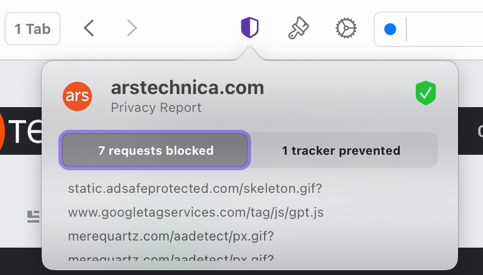

# Privacy Report

Privacy Report provides you with a convenient way to view the requests and trackers that have been blocked by the built-in [Ad & Tracking Blocker](https://help.kagi.com/orion/privacy-and-security/ad-tracking-blocking.html).

To use Privacy Report, simply click the shield icon to the left of the address bar.
This will present you with a summary of the requests and trackers that have been blocked for the current webpage.

 

You can click on the categories to expand them and view the full list of resources blocked for the current webpage.

 

If you wish to see an even quicker summary of how Orion has protected your privacy, you can enable a minimal badge for the shield icon that shows the number of blocked requests and trackers. You can enable the badge by right clicking the shield icon and selecting **Show Notification**.

 
