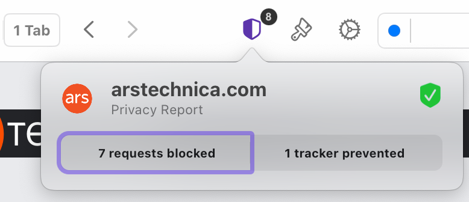

# Privacy Report

Privacy Report provides you with a convenient way to view the requests and trackers that have been blocked by the built-in [Ad & Tracking Blocker](https://help.kagi.com/orion/privacy-and-security/ad-tracking-blocking.html).

To use Privacy Report, simply click the shield icon to the left of the address bar, this will present you with a summary of  the requests and trackers that have been blocked for the current webpage.

 

You may click on the arrows to expand each section and view the full list of resources blocked for the current webpage.

 