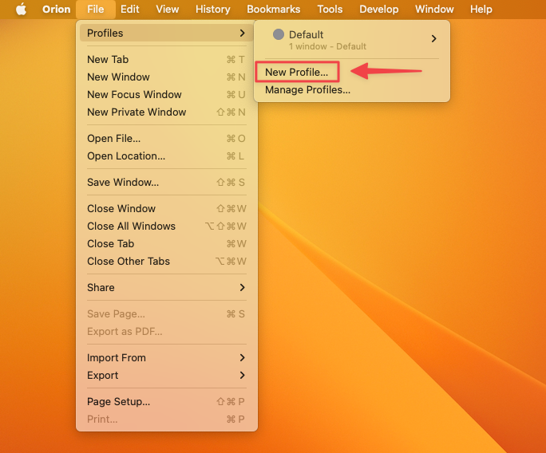
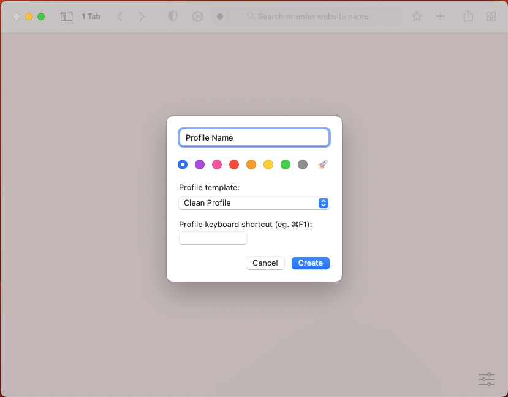
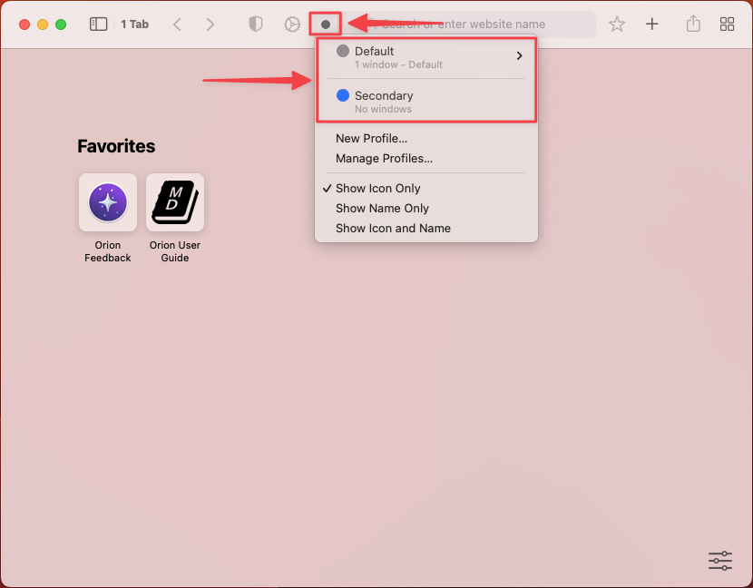
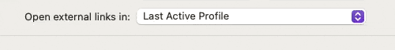

# Profiles

With Orion Profiles, you can create multiple identities to be used online and keep all your Orion information separate, like bookmarks, history, passwords, extensions, and other settings.

To create new and manage existing profiles, Use the File -> Profiles menu. Every Orion installation comes with the Default profile.

 

When you create a profile, you can give it a name, choose a color, select a profile template, and assign a keyboard shortcut.

 

To switch between different profiles, click on the colored circle on the left of the search bar and select the desired profile from the dropdown menu.

 

Orion has complete isolation of Profile information at the app level. That means that Profiles will have their own separate:

- Settings
- Passwords
- Extensions
- Bookmarks
- History
- Sessions and website data

Moreover, Profiles in Orion appear as separate apps in your Dock. The app-level separation between profiles has multiple advantages, such as if one of your Profiles crashes, the others are left intact.

Also, you can keep different profiles in your Dock and launch them with one click.

## Open External Links in Last/Default Profile

If you have set up multiple profiles in Orion, you may want to specify if you want external links to open in the last profile used, or to always open in your default profile.

You can access this setting by following these steps:
1. In your menu bar, select **Orion** > **Settings**.
2. From the General tab, select your desired option in the **Open External Links In** dropdown.

{data-zoomable}
