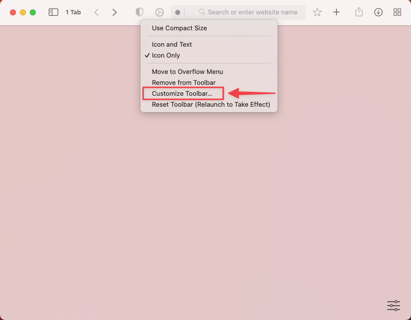
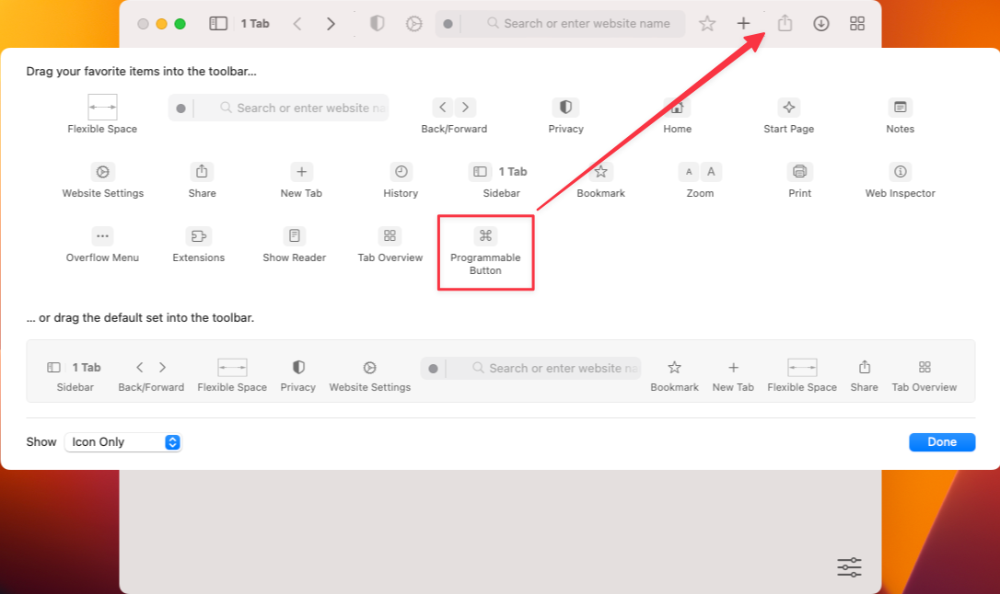
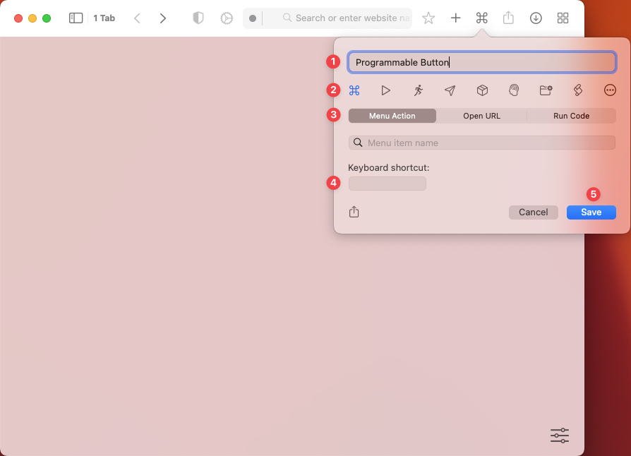
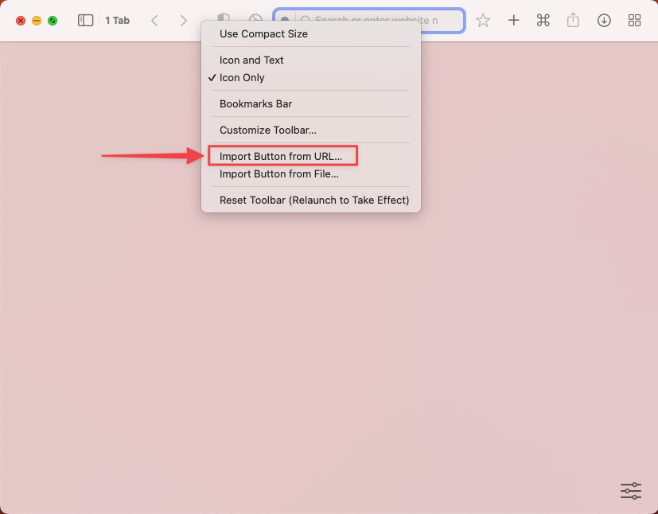

# Programmable Buttons

Orion allows you to extend its functionality by using Programmable Buttons. To add a Programmable Button, right-click anywhere on the Toolbar and select **Customize Toolbar**.

 

A modal will appear with all available buttons. Drag the Programmable Button to the desired location in the toolbar and click **Done**.

 

Now click on the Programmable Button in the toolbar.

 

Next, customize the Programmable Button:
1. Give it a name
2. Select an icon
3. Choose the action type:
	1. Menu Action. Map the button to a menu item.
	2. Open URL. The button will open the desired URL (use %u and %t to replace the current page URL or title).
	3. Run Code. Execute custom JavaScript or AppleScript code. You can show the code's output in the sidebar.
4. Assign a keyboard shortcut

 

## Open-Source Programmable Buttons

The Orion community has created several [open-source Programmable Buttons](https://github.com/OrionBrowser/ProgrammableButtons) that you can import to Orion easily. To import a Programmable Button right-click and copy the link to the button. Then, right-click on an empty section of the Orion toolbar and select **Import Button from URL**.

 

Finally, paste the URL in the text field and click **Import**.

 
