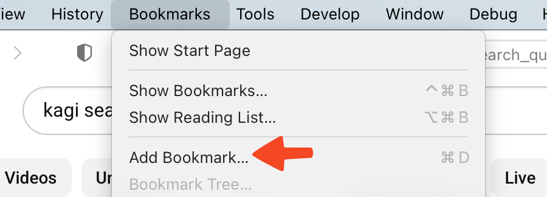
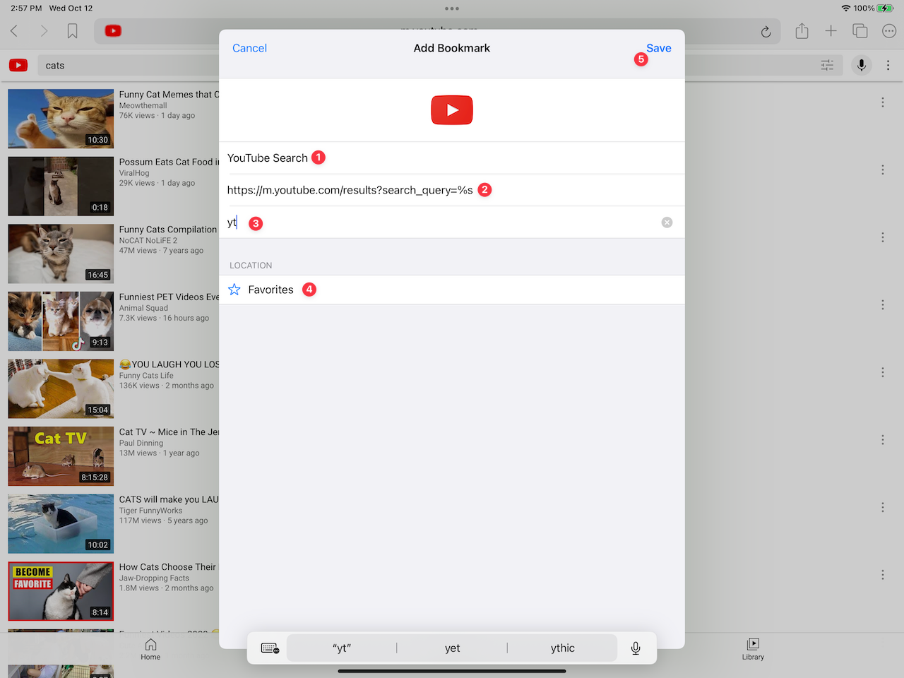

# Using Quick Searches

## Table of Contents

- [macOS Quick Searches](#macOS)
- [iOS Quick Searches](#iOS)
- [iPadOS Quick Searches](#iPadOS)

## macOS Quick Searches {#macOS}

You can search specific websites directly in Orion with Quick Search bookmarks that use invocation keywords.

For example, let's create a YouTube Quick Search bookmark:

1. Visit the following URL and start adding a new bookmark for it, but don't save the bookmark yet: [https://www.youtube.com/results?search_query=cats](https://www.youtube.com/results?search_query=cats)

 

 

2. In the window that appears, make several changes:
  - Under the **"Add this page to:"** label, choose whether you want the new bookmark saved to **Favorites** or some other location.
  - Change the Title of the bookmark from "cats - YouTube" to a broader search title of your choice, such as "YouTube Search".
  - Click the **More Options** button.
  
 

3. In the updated window, make two more changes:
  - In the URL of the bookmark, replace the "cats" search query text with **%s** so the URL is now: https://www.youtube.com/results?search_query=%s
  - Add **yt** as the "Invocation character or keyword".
  - Click the **Add** button

 

Now, typing **yt cats** in Orion's address bar will send you into a search for "cats" on YouTube. And, typing **yt dogs** in Orion's address bar will send you into a search for "dogs" on YouTube. You can use the **yt** invocation keyword to search YouTube for anything.

 

You can repeat this process with the search results page for any website to add another Quick Search bookmark.

You can also edit any existing search results bookmark to make it into a Quick Search bookmark.

## iOS Quick Searches {#iOS}

**Quick Searches will be coming to iOS soon and these instructions explain how they will work.**

You can search specific websites directly in Orion with Quick Search bookmarks that use invocation keywords.

For example, let's create a YouTube Quick Search bookmark:

1. Visit the following URL and start adding a new bookmark for it, but don't save the bookmark yet: [https://m.youtube.com/results?search_query=cats](https://m.youtube.com/results?search_query=cats)

 

 

 

2. In the window that appears, make several changes:
  - Change the Title of the bookmark from "cats - YouTube" to a broader search title of your choice, such as "YouTube Search".
  - In the URL of the bookmark, replace the "cats" search query text with **%s** so the URL is now: https://www.youtube.com/results?search_query=%s
  - Add **yt** as the "Invocation character or keyword".
  - Under **Location**, choose whether you want the new bookmark saved to **Favorites** or some other location.
  - Click the **Save** button

 

Now, typing **yt cats** in Orion's address bar will send you into a search for "cats" on YouTube. And, typing **yt dogs** in Orion's address bar will send you into a search for "dogs" on YouTube. You can use the **yt** invocation keyword to search YouTube for anything.

You can repeat this process with the search results page for any website to add another Quick Search bookmark.

You can also edit any existing search results bookmark to make it into a Quick Search bookmark.

## iPadOS Quick Searches {#iPadOS}

**Quick Searches will be coming to iPadOS soon and these instructions explain how they will work.**

You can search specific websites directly in Orion with Quick Search bookmarks that use invocation keywords.

For example, let's create a YouTube Quick Search bookmark:

1. Visit the following URL and start adding a new bookmark for it, but don't save the bookmark yet: [https://m.youtube.com/results?search_query=cats](https://m.youtube.com/results?search_query=cats)

 

 

 

2. In the window that appears, make several changes:
  - Change the Title of the bookmark from "cats - YouTube" to a broader search title of your choice, such as "YouTube Search".
  - In the URL of the bookmark, replace the "cats" search query text with **%s** so the URL is now: https://www.youtube.com/results?search_query=%s
  - Add **yt** as the "Invocation character or keyword".
  - Under **Location**, choose whether you want the new bookmark saved to **Favorites** or some other location.
  - Click the **Save** button

 

Now, typing **yt cats** in Orion's address bar will send you into a search for "cats" on YouTube. And, typing **yt dogs** in Orion's address bar will send you into a search for "dogs" on YouTube. You can use the **yt** invocation keyword to search YouTube for anything.

You can repeat this process with the search results page for any website to add another Quick Search bookmark.

You can also edit any existing search results bookmark to make it into a Quick Search bookmark.
