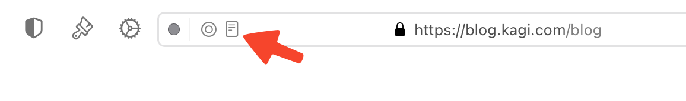
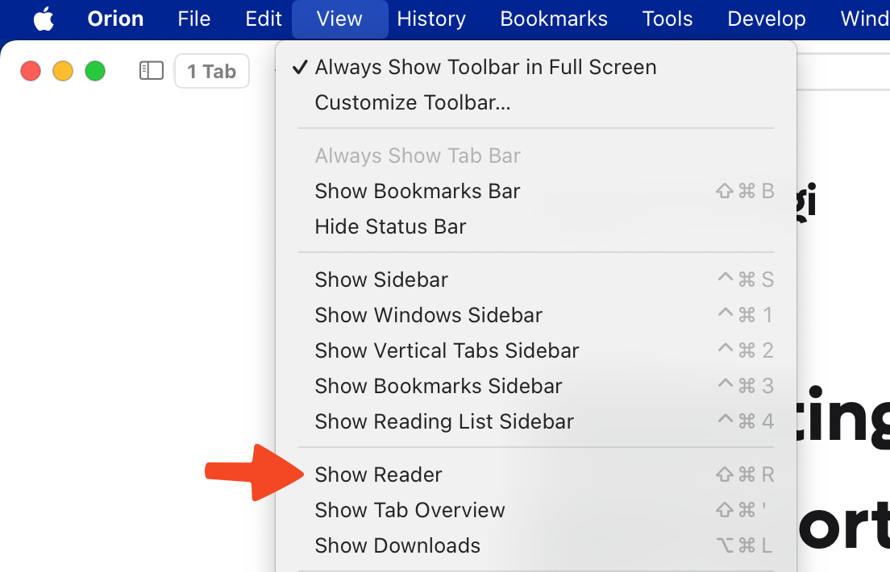

# Reader Mode

Sometimes you just want to read the article on a website, not wade through ads, video embeds, and other distractions. Reader Mode is here to help. (Note that Orion's [ad-blocking](../privacy-and-security/ad-tracking-blocking.md) is deliberately disabled in the macOS example below.)

 

## Table of Contents

- [macOS Reader Mode](#macos_reader_mode)
- [iOS Reader Mode](#ios_reader_mode)
- [iPadOS Reader Mode](#ipados_reader_mode)

## macOS Reader Mode {#macos_reader_mode}

You can enable Reader Mode in three different ways while viewing a webpage.

- Click the icon on the left side of the address bar that looks like a document.

 

- Use the **View** menu and choose **Show Reader**.

 

- Type **⇧⌘R** (**Shift** and **Command** and **R**) on your keyboard.

You can use the reverse of the three methods above to disable Reader Mode.

While in Reader Mode, you can use the icon on the right side of the address bar that looks like two letter A's to configure the layout the mode uses. You can control:

- Text size
- Background color
- Font
- Content width
- Text justification
- Borders

 

You can view and manage the Reader Mode settings for all websites in Orion's Settings.

  
 
   

## iOS Reader Mode {#ios_reader_mode}

You can enable Reader Mode by tapping on the icon for the current website in the address bar and then tapping Reader Mode.

 

While in Reader Mode, you can use the icon on the left side of the address bar that looks like a document to configure the layout the mode uses. You can control:

- Text size
- Font
- Background color
- Text justification

From this menu you can also tap **Reader Mode** again to disable the mode.

 

You can view and manage the Reader Mode settings for all websites in Orion's Settings.

  
 
 Tap **Reader Mode**.
 
  
 
  

## iPadOS Reader Mode {#ipados_reader_mode}

You can enable Reader Mode by tapping on the icon for the current website in the address bar and then tapping Reader Mode.

 

While in Reader Mode, you can use the icon on the left side of the address bar that looks like a document to configure the layout the mode uses. You can control:

- Text size
- Font
- Background color
- Text justification

From this menu you can also tap **Reader Mode** again to disable the mode.

 

You can view and manage the Reader Mode settings for all websites in Orion's Settings.

  
 
  Tap **Reader Mode**.
  
  
 
  
