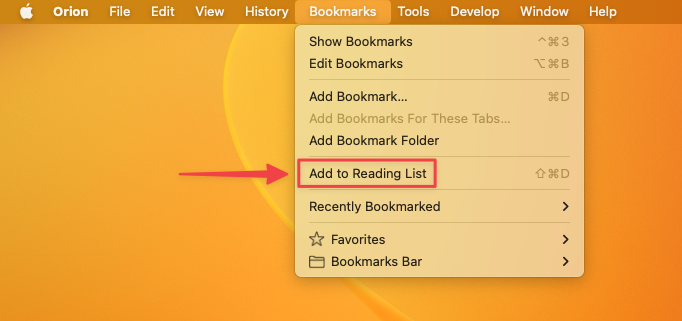
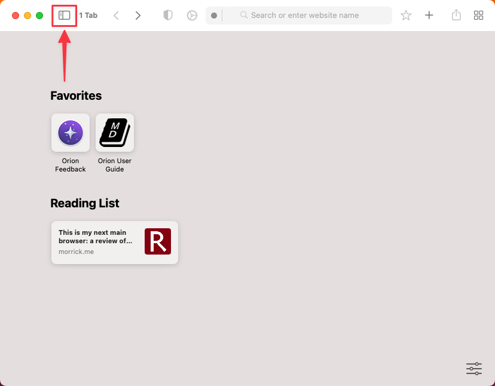
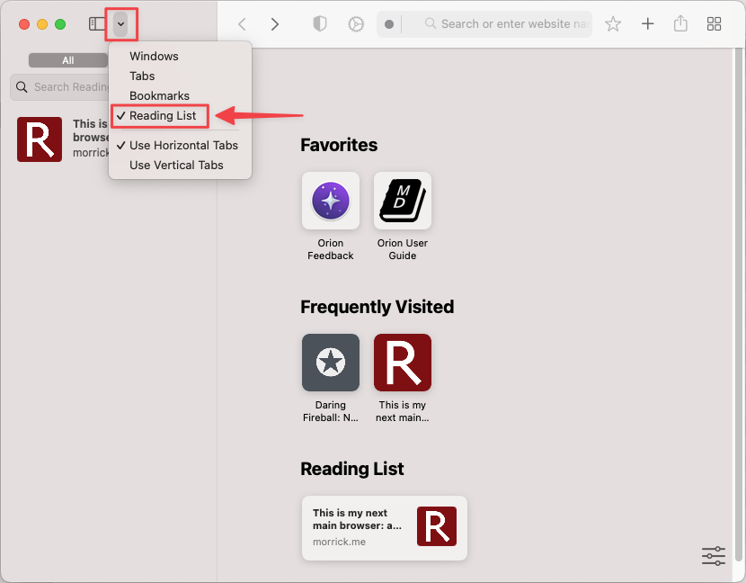
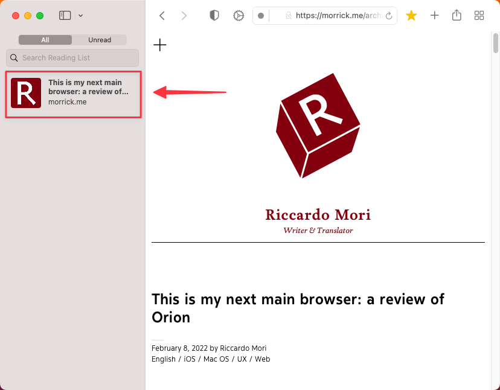

# Reading List

As you browse the web you will find interesting webpages that you might want to read later. Orion allows you to easily add any webpage to your Reading List so you can read it at a convenient time.

## Adding webpages to your Reading List {#adding}

To add a webpage to your Reading List simply click on the **Bookmarks** menu and choose **Add to Reading List** or press **Shift-Command-D** from your keyboard.

 

## Viewing your Reading List contents {#viewing}

To view the list of webpages in your Reading List, click on the Sidebar icon and make sure **Reading List** is selected in the dropdown. Then, click on the title of the webpage that you want to read.

 

 

 

Tips:
- You can switch between the **All** and **Unread** tabs to filter the list of webpages.
- Use the search bar to find a specific article using keywords.
- To save a webpage to read offline, simply right click on a webpage and select **Save Offline**
- To remove a webpage from your Reading List, right click on the webpage and select **Remove Item**
- To remove all items from your Reading List, right click on any webpage and select **Clear All Items...**
