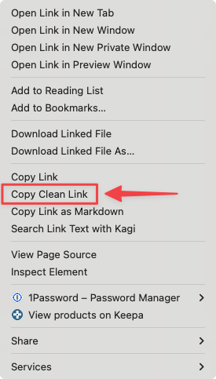

# Remove Trackers from Copied Links

Many websites add tracking parameters to links to analyze user behaviors and to optimize targeted advertising. Orion includes a feature that lets you strip those tracking parameters from copied links so that your privacy is protected when you share those links with other people.

To use this feature, right click on the link you want to share and select **Copy Clean Link**. Note that this option will only be available for links that contain tracking parameters.

{data-zoomable}
