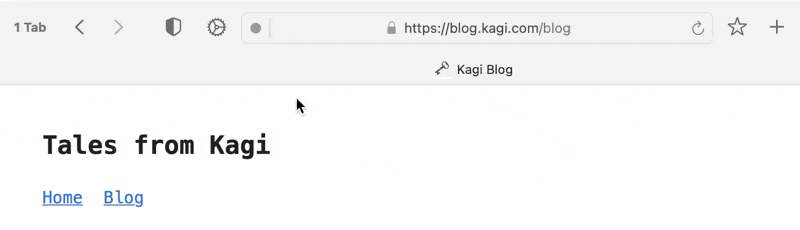

# RSS Feed Detection

As you browse the web, you may want to subscribe to RSS feeds of the sites you find interesting. Orion makes this easy by displaying an RSS icon in the address bar to identify sites that have RSS feeds.

{data-zoomable}

When you click the RSS icon, you will be presented with a list of all RSS feeds available for the current website. Each feed will have the following buttons next to it:
- Copy. Copies the feed's URL to your clipboard so you can manually paste it in your RSS reader. 
- Add (+). Opens your RSS reader and subscribes to the RSS feed.
