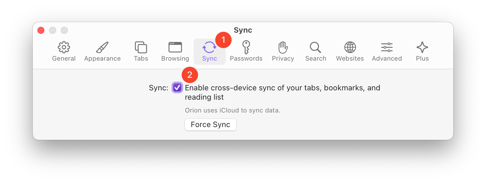

# Syncing Orion Data

 

## Table of Contents

To sync Orion tabs, bookmarks, and reading lists across devices, perform these steps <u>on each device</u>.

- [macOS](#syncing_macos)
- [iOS](#syncing_ios)
- [iPadOS](#syncing_ipados)
- [Troubleshooting](#troubleshooting)

## macOS  {#syncing_macos}

1. In Orion, use the **Orion** menu to open Settings.

 

2. Click the **Sync** tab and check the box for **Enable cross-device sync of your tabs, bookmarks, and reading list**.

 

## iOS  {#syncing_ios}

1. Open the Orion app.
2. Tap the three-dot menu (•••) in the lower-right corner of the screen.
3. Tap **Settings**.

 

4. In the **Sync** section, turn on Sync if it isn't already on.

 

## iPadOS {#syncing_ipados}

1. Open the Orion app.
2. Tap the three-dot menu (•••) in the upper-right corner of the screen.
3. Tap **Settings**.

 

4. In the **Sync** section, turn on Sync if it isn't already on.

 

## Troubleshooting Syncing Data Issues {#troubleshooting}

If you find that your most recent data has not been synced over, please checkout our [troubleshooting syncing data issues guide](../support-and-community/troubleshooting/troubleshooting-syncing-data-issues.md) to help get everything working again. If your problem persists, please submit a bug report to [Orion feedback forum](https://orionfeedback.org) so we can investigate and fix the issue.
