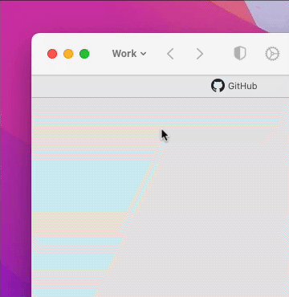
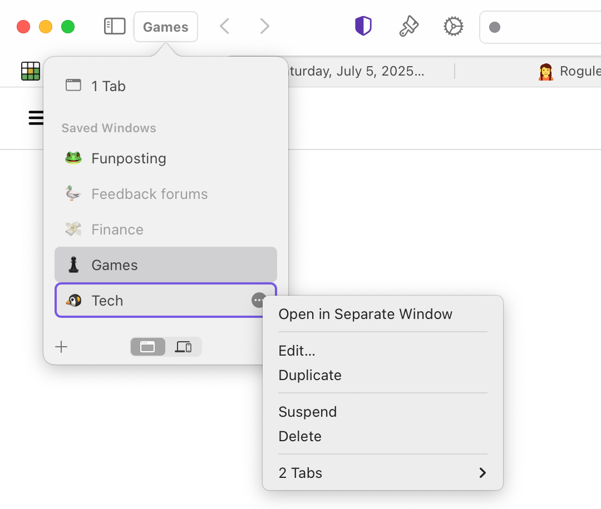
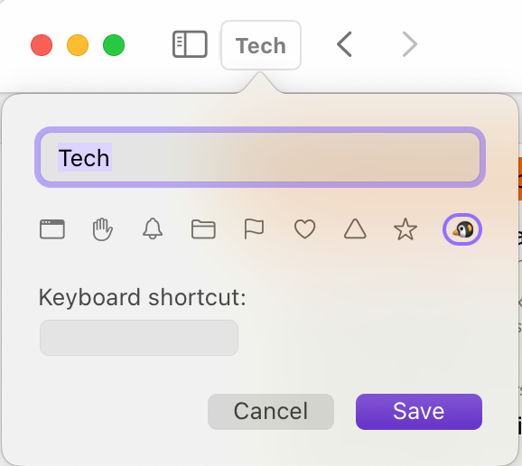
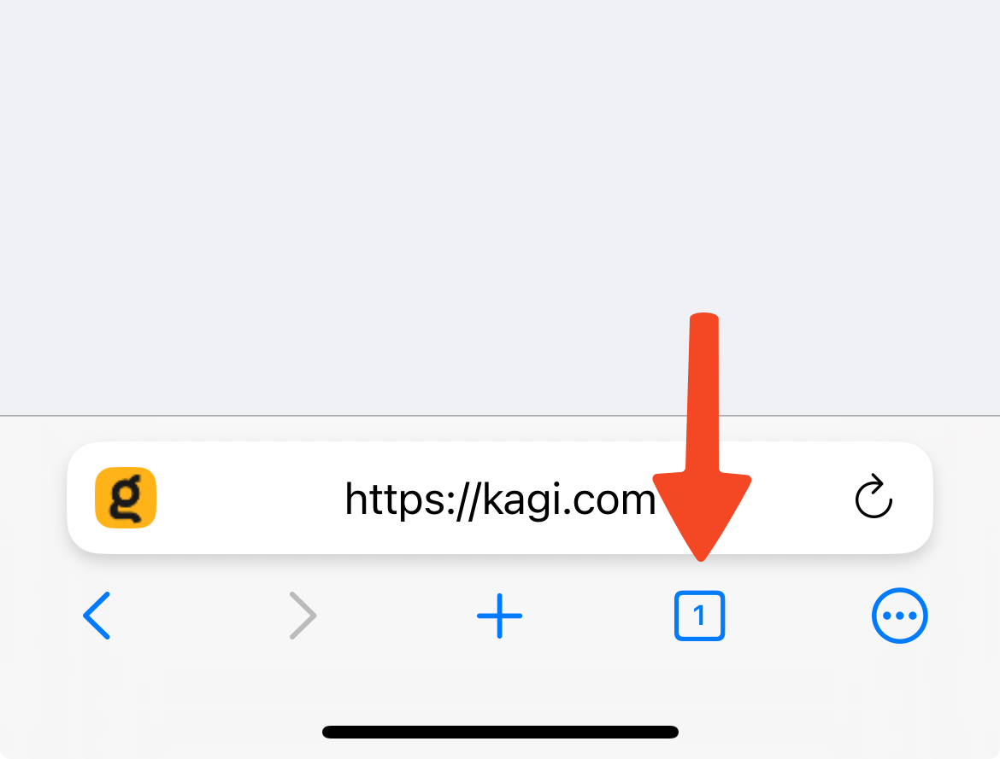
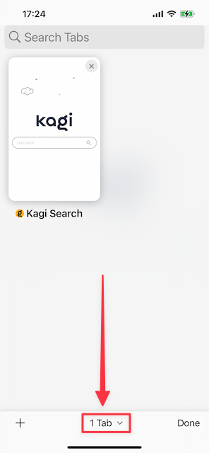
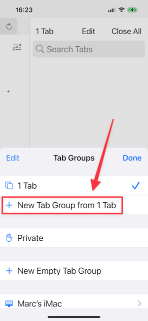
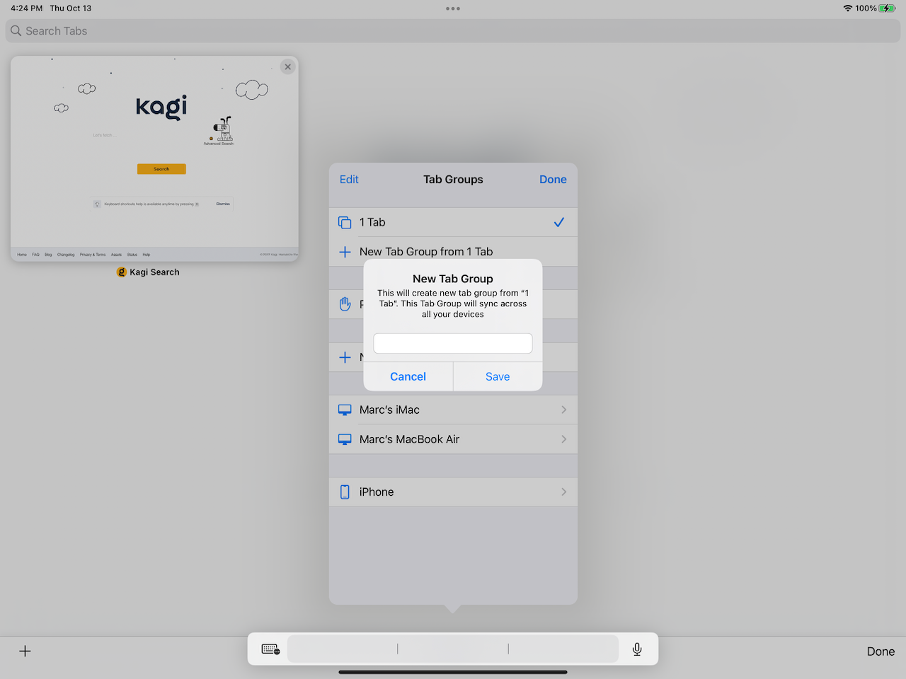

# Tab Groups

In Orion, Tab Groups are also called Named Windows. You can [sync](syncing-data.md) the tabs in a Named Window across Orion on all devices. Here's what it looks like in macOS.

 

## Table of Contents

- [macOS Tab Groups](#macos_tab_groups)
- [iOS Tab Groups](#ios_tab_groups)
- [iPadOS Tab Groups](#ipados_tab_groups)

## macOS Tab Groups {#macos_tab_groups}

Tab Groups can be accessed and edited through the windows menu.

 

 

The Tab Group will now sync in Orion across all of your devices where [syncing](syncing-data.md) is enabled.

## iOS Tab Groups {#ios_tab_groups}

1. Tap the icon that looks like two squares at the bottom on the screen.

 

2. Tap the **Tabs** menu at the bottom of your screen. The location and appearance of the menu can vary based on whether you use [Sidecar or Grab tabs](vertical-tabs.md#ios_tab_styles) and how many tabs you have open.

 

 

3. In the menu at the bottom on the screen, tap **New Tab Group from X Tab** (the X will vary based on how many tabs you have open.)

 

4. Enter a name for the new tab group and tap **Save**.

 

The Tab Group will now sync in Orion across all of your devices where [syncing](syncing-data.md) is enabled.

## iPadOS Tab Groups {#ipados_tab_groups}

1. Tap the icon that looks like two squares at the top right of the screen.

 

2. Tap the **Tabs** menu at the bottom of your screen. The location and appearance of the menu can vary based on whether you use [Sidecar or Grab tabs](vertical-tabs.md#ipados_tab_styles) and how many tabs you have open. In the menu that appears, tap **New Tab Group from X Tab** (the X will vary based on how many tabs you have open.)

 

 

3. Enter a name for the new tab group and tap **Save**.

 

 

The Tab Group will now sync in Orion across all of your devices where [syncing](syncing-data.md) is enabled.
