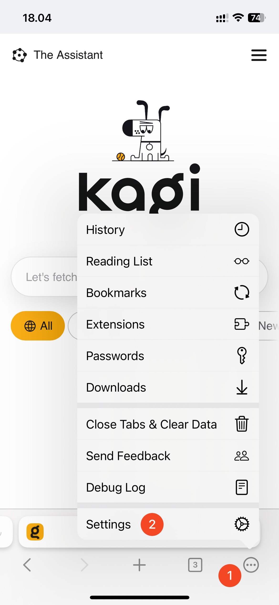

# Vertical Tabs

If you love to have your browser tabs on the side, Orion has you covered with native vertical tabs support. Here's what it looks like on macOS.

 

## Table of Contents

- [macOS Vertical Tabs](#macos_vertical_tabs)
- [iOS Tab Styles](#ios_tab_styles)
- [iPadOS Vertical Tabs](#ipados_tab_styles)

## macOS Vertical Tabs {#macos_vertical_tabs}

You can enable vertical tabs by clicking the **View** menu and choosing **Show Vertical Tabs Sidebar**.

 

You can disable vertical tabs by going under the same **View** menu and choosing **Hide Vertical Tabs Sidebar**.

## iOS Tab Styles {#ios_tab_styles}

You can switch between **Sidebar** or **Grid** tab styles in Orion settings.

1. Tap the three-dot menu (•••) in the bottom-right corner of your screen.
2. Tap **Settings**.

 

3. Tap **Tabs**.
4. Select your desired tab view style.

 

## iPadOS Tab Styles {#ipados_tab_styles}

You can switch between **Sidebar** or **Grid** tab styles in Orion's settings.

1. Tap the three-dot menu (•••) in the upper-right corner of your screen.
2. Tap **Settings**.

 

3. Tap **Tab View Style**.

 

Then, choose between **Sidebar** or **Grid**.

 
