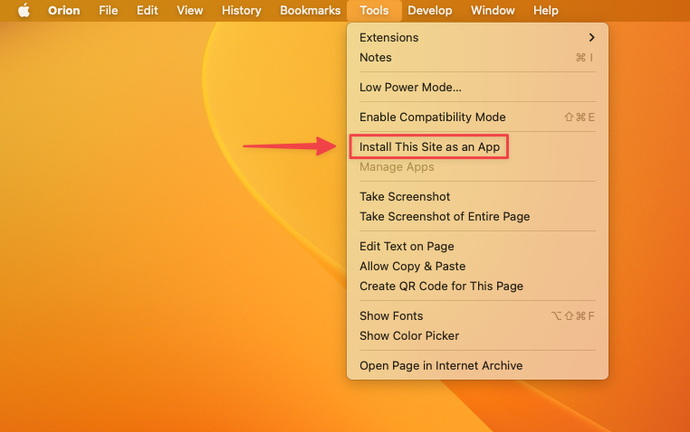
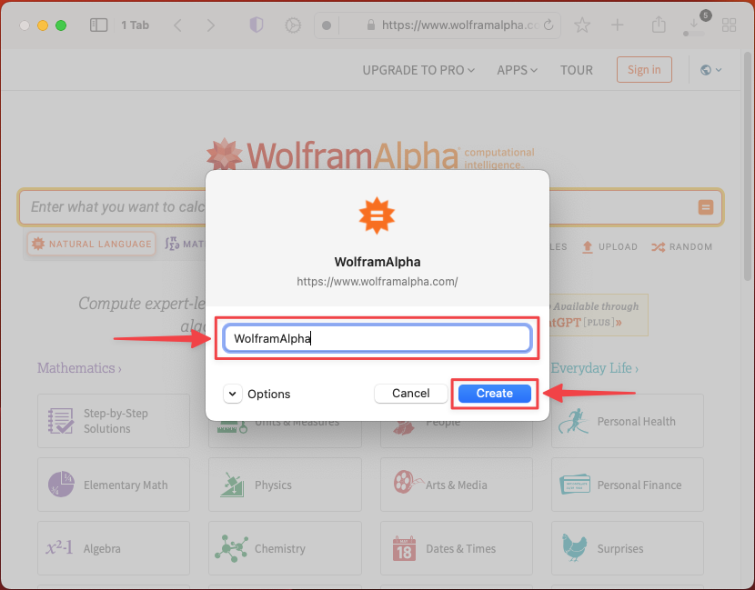
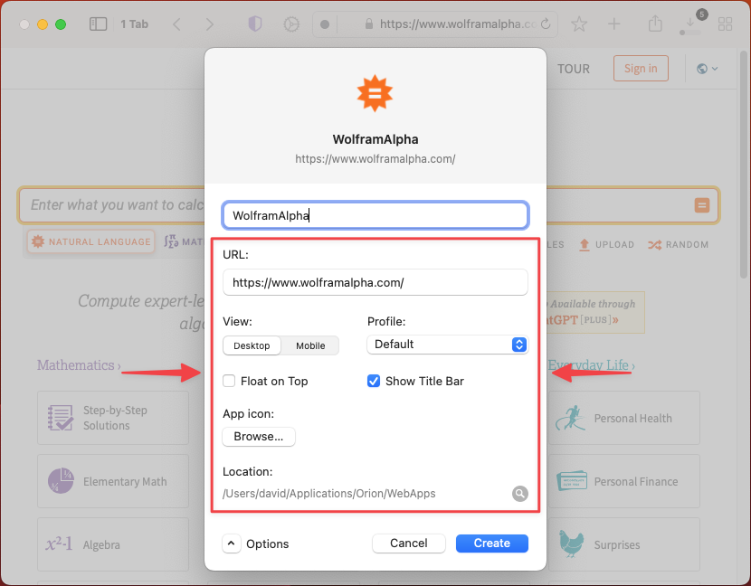
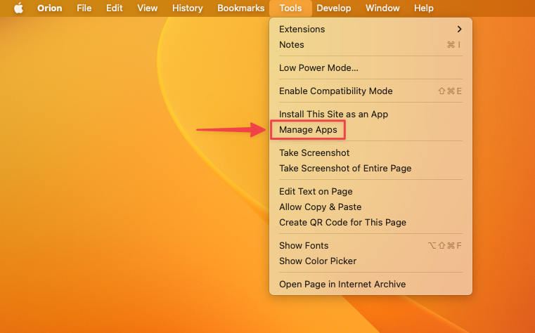
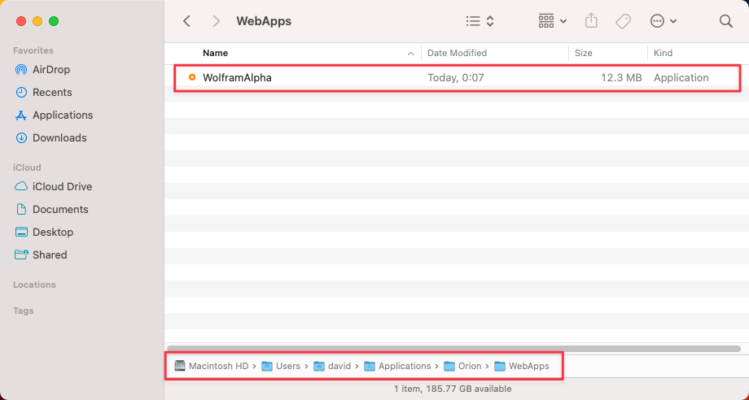

# Web Apps

Orion has a powerful feature that allows you to create dedicated apps for any website, letting you fully immerse in them without distractions. Web apps will have their own icon in your Dock and in the Finder.

To create a web app simply open the website you want to create the app for, then go to the **Tools** menu and select **Install This Site as an App**. This will bring up a modal where you can enter a name for the app. When you are ready, press the **Create** button.

 

 

If you expand the **Options** section using the arrow button, you can also:
- **Specify the exact URL** to load when launching the web app.
- Choose if you want the app to load the **Desktop or Mobile version** of the website.
- Select the Orion **Profile** to use.
- Make the app **Float on Top** of other windows.
- Select if you want the **Title Bar** to be shown.
- Choose a **custom app icon**.

 

## Install Site as an App from the Address Bar

On sites that follow the [web application manifest](https://developer.mozilla.org/en-US/docs/Web/Manifest) specification, you'll see an Install icon in the address bar that makes it easy to create an app for the site. To use it, simply click the icon and confirm by pressing Install. Then, review the app details and click Create.

 

<video src="./media/macos_install_this_site_as_an_app.mp4" width="720" type="video/mp4" autoplay muted loop playsinline disablepictureinpicture />

 

## Managing Web Apps

To manage your web apps, you can go to the **Tools** menu and select **Manage Apps**. Alternatively, you can also browse to "~/Applications/Orion/WebApps/" using the Finder.

 

 
