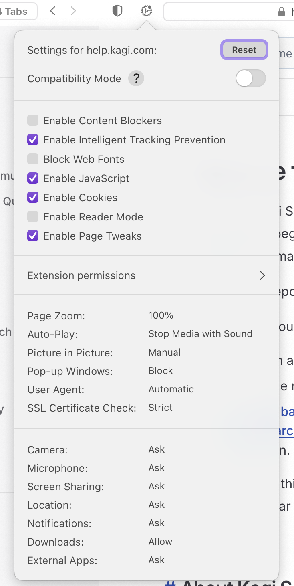
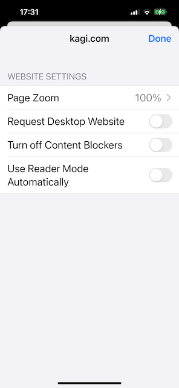
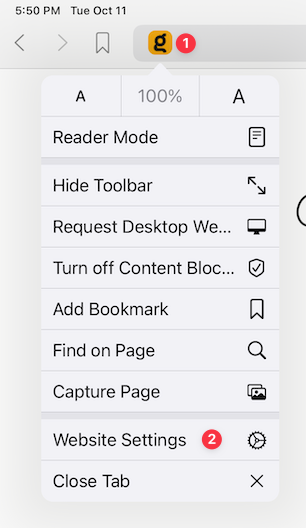

# Website Settings

## Table of Contents

- [macOS Website Settings](#macOS)
- [iOS Website Settings](#iOS)
- [iPadOS Website Settings](#iPadOS)

## macOS Website Settings {#macOS}

You can click the gear icon at the top of an Orion window to access the Website Settings for the current webpage.

 

You can control a number of settings related to the current website:

- Enable or disable [Compatibility Mode](../troubleshooting/troubleshooting-webpage-issues.md#orion-compatibility-mode)
- Enable or disable [Content Blockers](../privacy-and-security/protecting-privacy.md)
- Enable or disable Intelligent Tracking Prevention
- Block or unblock [Web Fonts](https://www.howtogeek.com/730585/what-is-a-web-font/)
- Enable or disable [Cookies](https://en.wikipedia.org/wiki/HTTP_cookie)
- Enable or disable [Reader Mode](reader-mode.md)
- Set **Page Zoom** between 50% and 300% to make content smaller or larger
- Control **Auto Play** so that:
  - Media is always allowed to automatically play
  - Media with sound is automatically stopped
  - Media is never allowed to automatically play
 - Block or Allow **Pop-up Windows**
 - Set the [User Agent](https://developer.mozilla.org/en-US/docs/Web/HTTP/Headers/User-Agent) to a web browser or custom User Agent String of your choice
 - Set whether the check of the [SSL Certificate](https://www.cloudflare.com/learning/ssl/what-is-an-ssl-certificate/) for the website must be [Strict](https://www.techslang.com/definition/what-is-strict-ssl/)
 - Control whether the website is set to **Allow** access, **Deny** access, or **Ask** for access to your **Camera**, **Microphone**, **Screen Sharing**, **Location**, **Notifications**, **Downloads**, and **External Apps**

## iOS Website Settings {#iOS}

You can tap the icon for a website in Orion's address bar to access the Website Settings for the current web page.

 

You can control several settings related to the current website:

- Set **Page Zoom** between 50% and 300% to make content smaller or larger
- Enable or Disable **Request Desktop Website**, which shows a desktop computer version of the site rather than a mobile version
- Use **Turn Off Content Blockers** to enable or disable [Content Blockers](../privacy-and-security/protecting-privacy.md)
- Enable or disable [**Use Reader Mode Automatically**](reader-mode.md)

 

## iPadOS Website Settings {#iPadOS}

You can tap the icon for a website in Orion's address bar to access the Website Settings for the current web page.

 

You can control several settings related to the current website:

- Set **Page Zoom** between 50% and 300% to make content smaller or larger
- Enable or Disable **Request Desktop Website**, which shows a desktop computer version of the site rather than a mobile version
- Use **Turn Off Content Blockers** to enable or disable [Content Blockers](../privacy-and-security/protecting-privacy.md)
- Enable or disable [**Use Reader Mode Automatically**](reader-mode.md)

 
