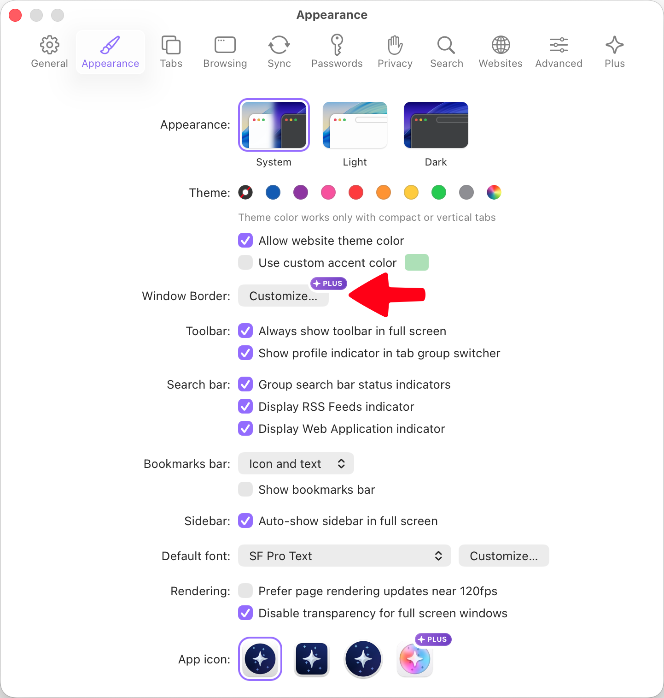
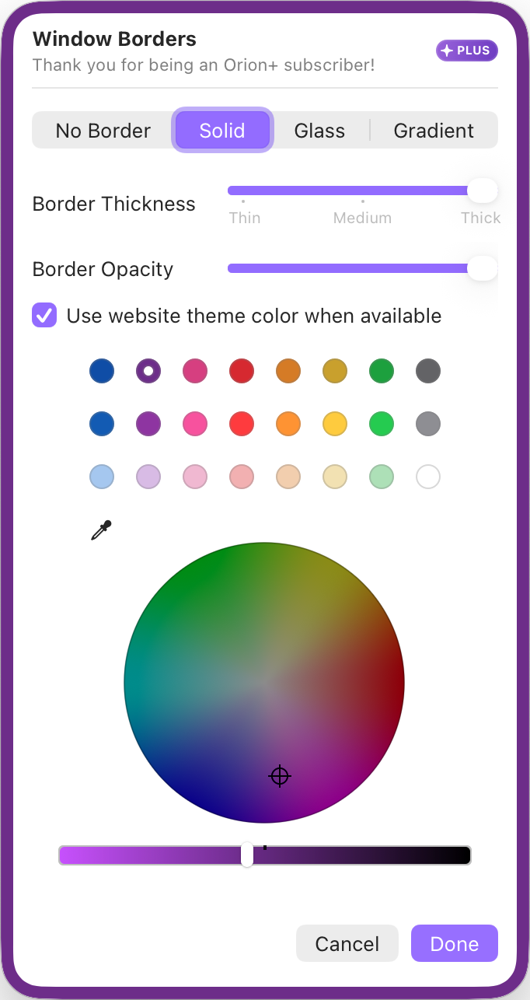

# Custom Borders

Make your browser truly yours by adding flair to the edges of your windows with custom borders.

Custom borders range from minimal additions to extravagant animations.
Something for everyone.

## Configuring Custom Borders

Orion+ subscribers can add a custom border to their browser windows in the settings.

1. In your menu bar, go to **Orion** > **Settings**.
 
2. Navigate to the Appearance tab.
3. Select Window Border: Customize...

 

In the window that opens, you can make the window border uniquely yours.
 

## Border options 

### No Border

As the name suggests, selecting this disables the window border feature altogether.

### Solid

Selecting this option adds a solid border of your choosing.
You can configure the thickness of the border as well as its opacity.

The Solid option also enables you to use the website theme color, when available, for a pleasant and apt experience.

 

### Glass

Selecting this option adds a glassy border, which allows the wallpaper or other apps underneath to shine through the border.

 

### Gradient 

Lastly, the most significant of them all, allowing you to stand out from all other browsers.
The Gradient option allows you to add a gradient border.
The border can also be animated, if you so wish!

 
