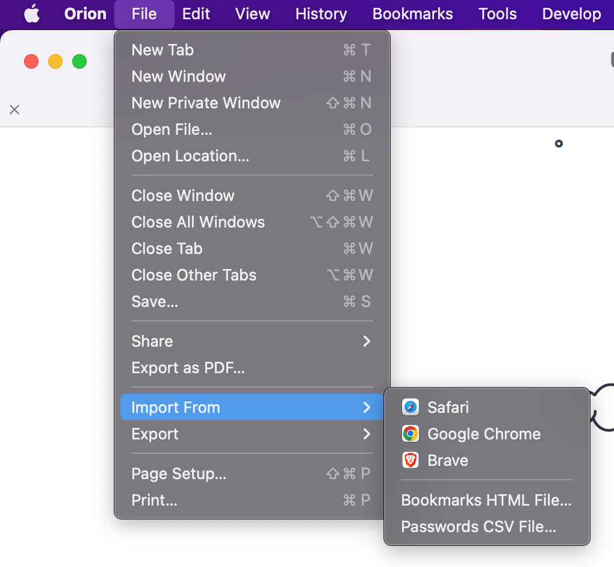
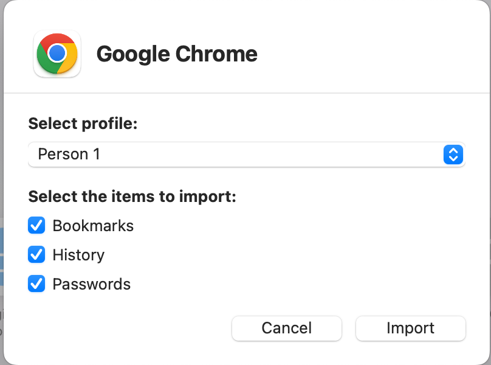

# Importing Data From Other Browsers

Changing to a different browser always involves some tedious steps.
In particular, bringing your **bookmarks** and **passwords** with you is typically the bare minimum.
This help page is intended to make that process smooth, quick, and effortless.
The process varies based on the operating system you are using.
On macOS, you have more options, and the process is overall easier.
On iOS, the only options are importing via HTML and CSV files.

## Table of Contents

- [Importing Data on macOS](#import_macos)
- [Importing Data on iOS](#import_ios)

## macOS {#import_macos}

On macOS, there are various methods for importing your data to Orion.
Most browsers are supported for direct import of bookmarks, history, and passwords.
If a browser is not supported, you can still move your data by exporting it from the browser and then importing it into Orion.

### Supported browsers and methods
Orion for macOS can import data from several web browsers and source files:

- Safari
- Google Chrome
- Firefox
- Brave
- Microsoft Edge
- Opera
- Arc
- 1Password
- LastPass
- Bookmarks HTML File
- Passwords CSV File

### Importing Data

1. Click the **File** menu, click **Import From**, and click on a web browser or source file of your choosing.

 

2. The data that you can import will depend on your choice of web browser or source file.
  - Web browsers may allow you to choose a browser Profile to import from and will allow you to choose the specific browser data that you wish to import.
  - Bookmarks HTML Files and Passwords CSV Files will need to you to choose a specific file in the appropriate format from your file system,
  
3. Click the **Import** button for web browser imports or the **Open** button for file imports.

### Safari Import

 

### Google Chrome Import

 

### Brave Import

 

## iOS and iPadOS {#import_ios}

On iOS, the options are more limited.
There is currently no way to import data from other browsers per se.
However, it is still possible to import passwords via CSV files and bookmarks via HTML files.

If you have access to a macOS device, you can also import your data on it and then use [sync](../features/syncing-data.md) to bring it over to your iOS device as well.

### Passwords

Passwords can be imported from a CSV file using the following steps:
1. Tap the ... button on your toolbar
2. Select **Passwords**
3. At the top of the screen, tap the **Share**  button.
4. Select **Import Passwords CSV File...**
5. Locate the CSV file you wish to import
6. After importing, Orion will ask if you'd like to delete the CSV file for security reasons. This action cannot be reversed.
7. The imported passwords are now available in Orion.

### Bookmarks

Bookmarks can be imported from an HTML file using the following steps:
1. Tap the ... button on your toolbar
2. Select **Bookmarks**
3. In the bottom right corner of your screen, tap the **Share**  button.
4. Select **Import Bookmarks HTML File...**
5. Locate the Bookmarks HTML file you wish to import
6. After selecting it, the bookmarks from that file are added to Orion.
