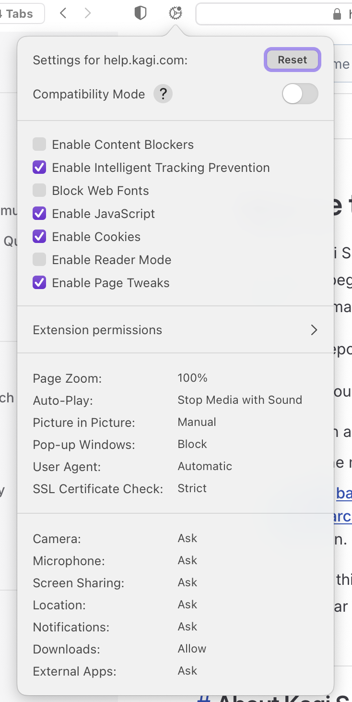

# Quick Start

## Table of Contents

- [Installing Orion](#install)
- [Website Settings](#website_settings)
- [Vertical Tabs](#vertical_tabs)
- [Reader Mode](#reader_mode)
- [Quick Searches](#quick_searches)
- [Web Archives](#web_archives)
- [Video Picture-in-Picture](#pip)
- [Focus Mode](#focus_mode)
- [Edit Text on a Page](#edit_text)
- [Show Console Errors](#show_errors)

## Installing Orion {#install}

You can download an installer for [Orion for macOS](https://browser.kagi.com/#download_sec) and install [Orion for iOS/iPadOS](https://apps.apple.com/app/orion-browser-by-kagi/id1484498200) from the App Store.

Orion is free and no account or signup is required to use it.

## Website Settings {#website_settings}

You're in control of your privacy and security with Orion. Click the gear icon at the top of an Orion for macOS window to access the [Website Settings](../features/website-settings.md) for the current webpage.

 

## Vertical Tabs {#vertical_tabs}

If you love to have your browser tabs on the side, Orion has you covered with [native vertical tabs support](../features/vertical-tabs.md).

 

## Reader Mode {#reader_mode}

Bring peace to a cluttered webpage with [Reader Mode](../features/reader-mode.md).

 

## Quick Searches {#quick_searches}

Get right to the content you're looking for by using [Quick Searches](../features/quick-searches.md) that directly search your favorite websites.

 

## Web Archives {#web_archives}

If a webpage won't load in Orion for macOS or you want to see an earlier version of it, you can see if the page is available in a [Web Archive](../features/web-archives.md).

Here's an example of kagi.com's previous life when our domain was used by a payment processor:

 

## Video Picture-in-Picture {#pip}

When playing a video in Orion for macOS, you can view it in [Picture-in-Picture](../features/pip.md) mode.

 

## Focus Mode {#focus_mode}

[Focus Mode](../features/focus-mode.md) allows you to completely remove toolbars from your browser interface. Browse the web distraction-free!

 

## Edit Text on a Page {#edit_text}

Sometimes you may want to quickly [edit text on a page](../features/edit-text-on-page.md) so you can take that perfect screenshot. Orion for macOS makes this possible.

 

## Show Console Errors {#show_errors}

Web developers, we got you! You can [add an indicator](../features/show-errors.md) to the address bar of Orion for macOS that shows the number of errors on the page. This error indicator will allow you to quickly open Console and inspect the errors.

 

