# Default Search Engine

## Table of Contents

- [No Preset Default Search Engine](#no-preset-default-search-engine)
- [Setting or Changing the Default Search Engine](#setting-or-changing-the-default-search-engine)
  - [macOS](#macos)
  - [iOS](#ios)
  - [iPadOS](#ipados)

## No Preset Default Search Engine

Orion doesn't come with a default search engine preset. If it did, the moment you started typing in the address bar, it would leak your IP address and browser fingerprint to a search engine that you may prefer to avoid.

Our commitment to your privacy means that Orion will ask you to set your default search engine on your first use of the address bar. You can choose any search engine you wish. Or, you can choose "None" to not have a default search engine at all.

## Setting or Changing the Default Search Engine

You can easily set or change Orion's default search engine at any time.

### macOS

1. Click the **Orion** menu and choose **Settings**.

 

2. Click the **Search** tab.
3. You can choose your preferred "Search engine" from the list.

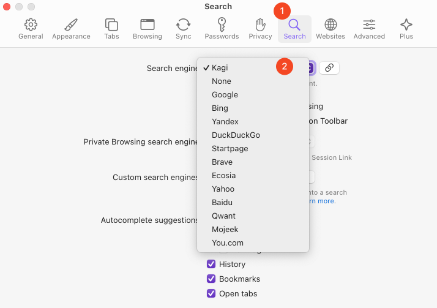 

4. Or, you can click the **Manage** button to manually configure a search engine.

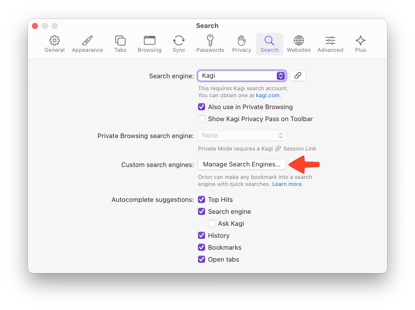 

  - Click the **+** button to add a new search engine.
  
  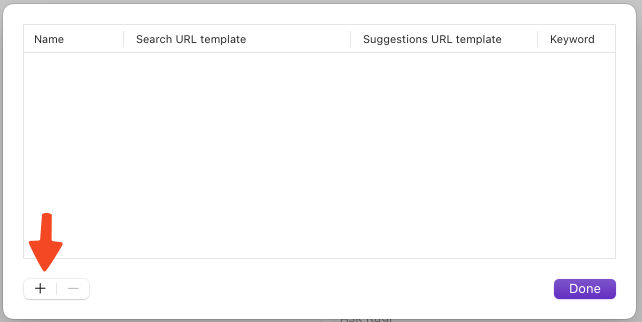 
  
  - Fill in the **Name**, **Search URL Template**, **Suggestion URL Template** (optional), and keyword (optional) fields.
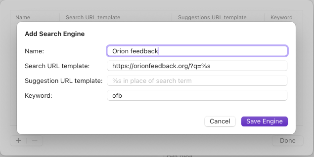 
	- The **Name** will be showh in settings and when you use the search engine via a keyword, see below.
	- **Search URL Template** is the URL you need to actually be able to search. Your search engine provider should have this listed somewhere. If you are creating a custom search engine for a specific site, you can usually get the search URL by performing a search on the site, copying the URL, and replacing the search term you used with `%s`
	- **Suggestion URL Template** is used for getting suggestions from your search engine. For example, if you type 'lin' to your URL bar, your search engine might suggest terms such as Linux, Linkedin, Linkin Park etc.
	- **Keyword** is a quick way to access your custom search engines. Your keyword should be short and easy to type so you can use it to its full potential. With a keyword configured, you can activate the custom search engine by typing the keyword followed by your search query.
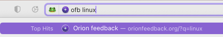 
- Click the **Save Engine** button.

### iOS

1. Tap the three-dot menu (•••) in the bottom-right corner of your screen.
2. Tap **Settings**.

 

3. Tap **Search**.

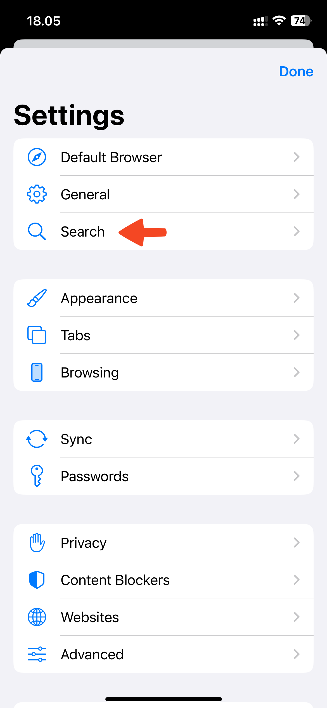 

4. You can choose your preferred "Search engine" by tapping on Search Engine. Note that you can select a separate search engine for private mode.

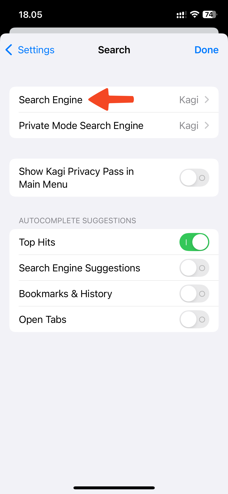 
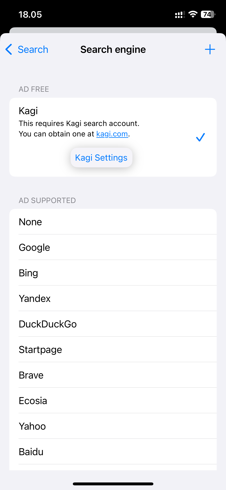 

5. If you would like to manually add a search engine, you can do so by tapping the `+` in the top right corner.

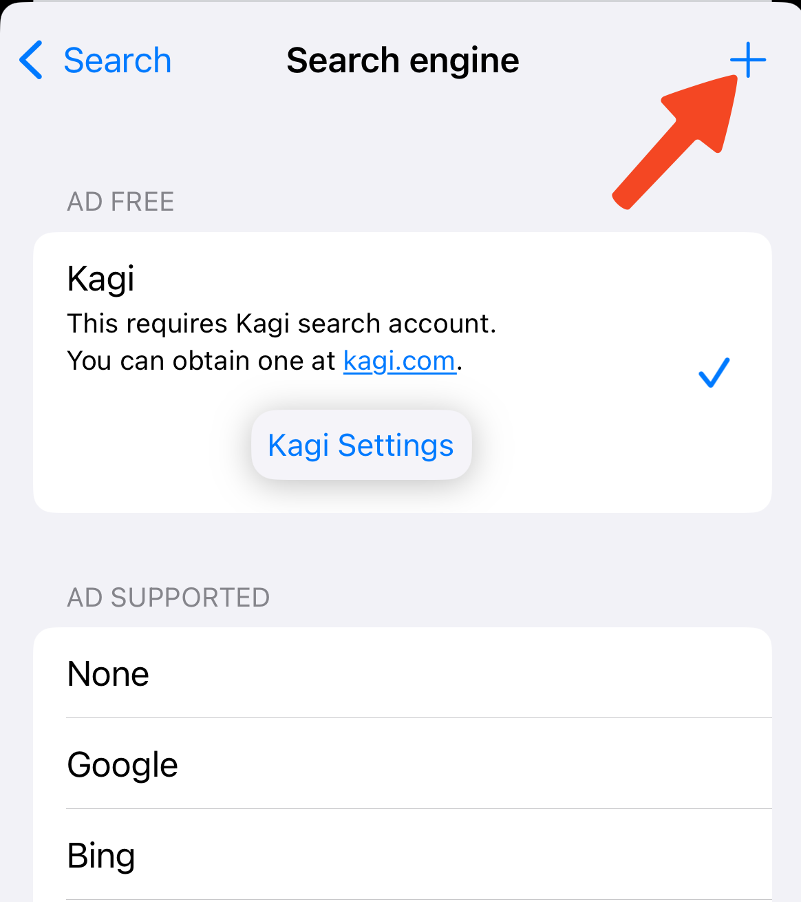 

  - Fill in the **Name**, **Search URL Template**, and  **Suggestion URL Template** (optional) fields.
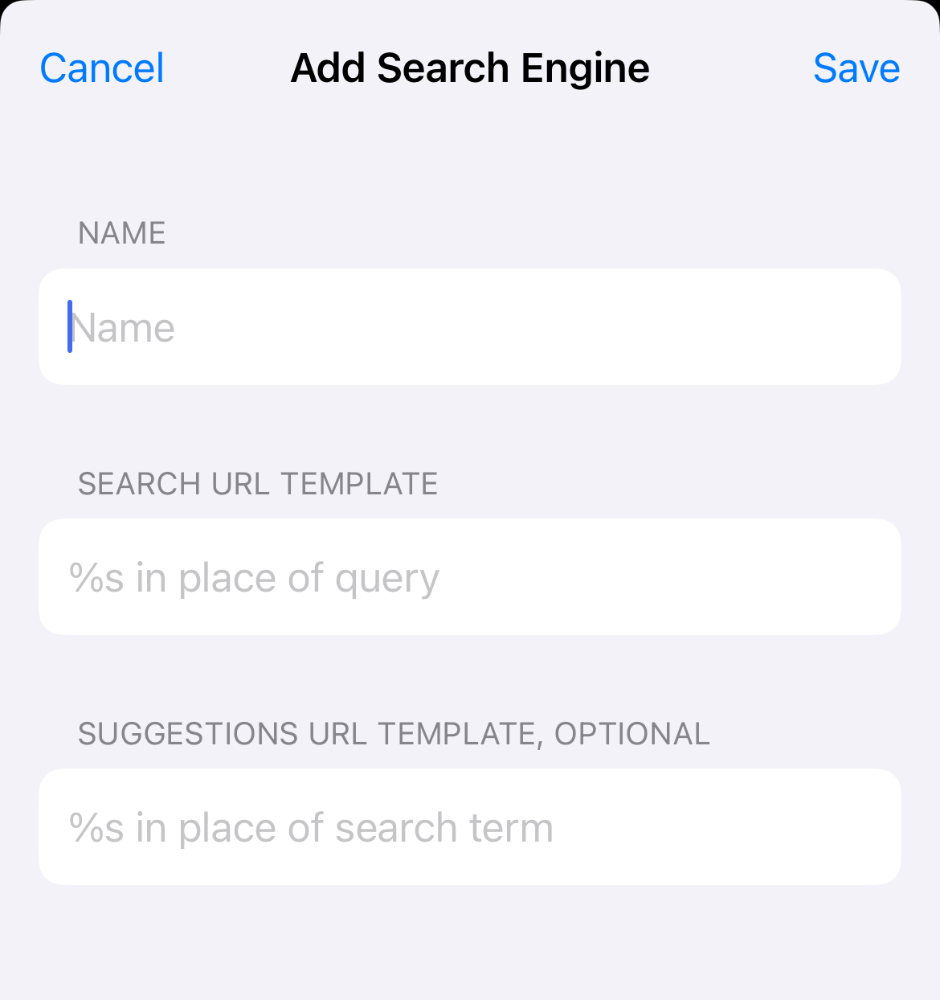 
	- The **Name** will be showh in settings and when you use the search engine via a keyword, see below.
	- **Search URL Template** is the URL you need to actually be able to search. Your search engine provider should have this listed somewhere. If you are creating a custom search engine for a specific site, you can usually get the search URL by performing a search on the site, copying the URL, and replacing the search term you used with `%s`
	- **Suggestion URL Template** is used for getting suggestions from your search engine. For example, if you type 'lin' to your URL bar, your search engine might suggest terms such as Linux, Linkedin, Linkin Park etc.
   
  - Click the **Save** button.

### iPadOS

1. Tap the three-dot menu (•••) in the upper-right corner of your screen.
2. Tap **Settings**.

 

3. Tap **Search Engine**.

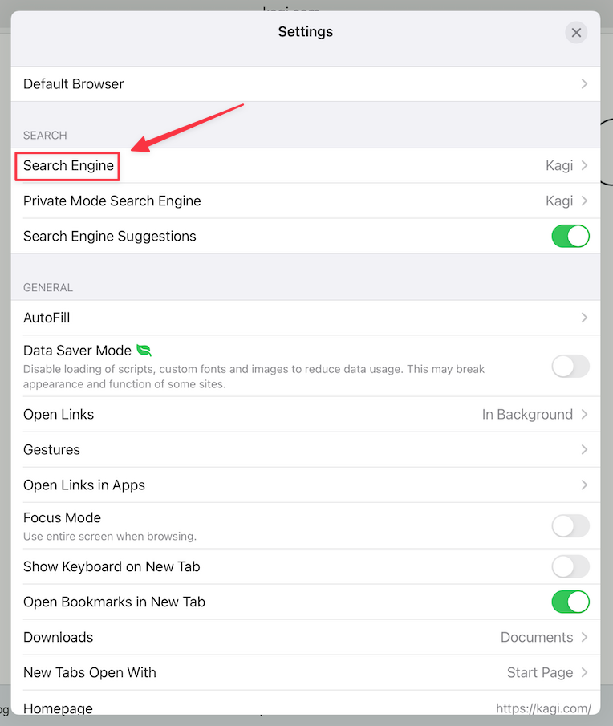 

4. You can choose your preferred "Search engine" from the list.

 

5. Or, you can tap the **+** button in the upper right corner to manually configure a search engine.

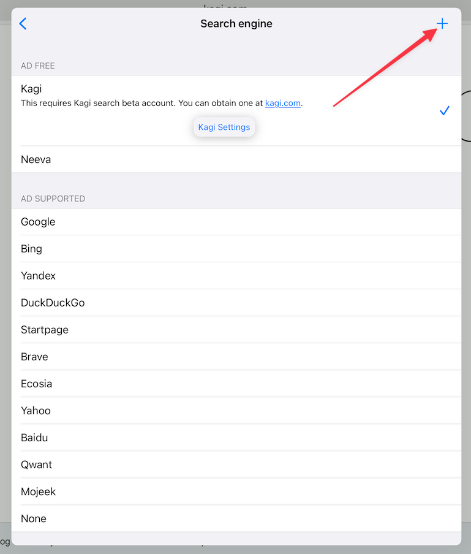 

  - Fill in the **Name**, **Search URL Template**, and **Suggestions URL Template** (optional) fields. If you don't know the template URLs, ask the provider of your search engine for them.
  - Click the **Save** button.

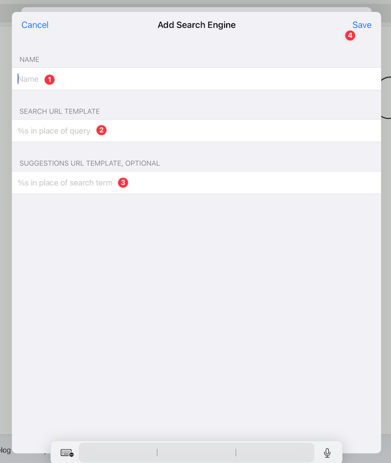 
