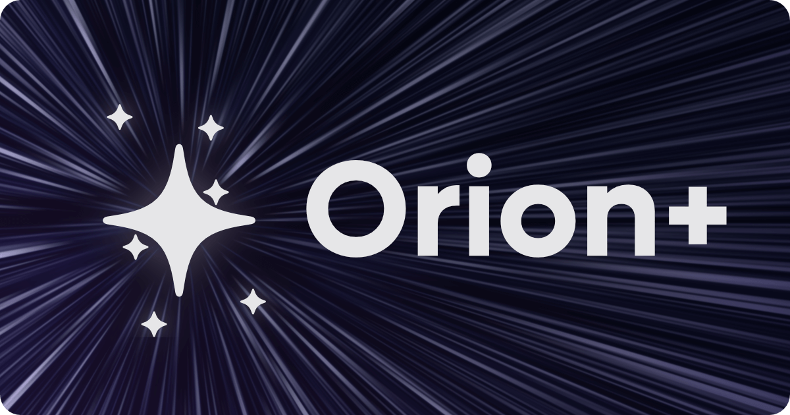

# What is Orion+?

 

While the Orion browser is free to use, [Orion+](https://kagi.com/onboarding?p=orion_plan) is an optional way for you to support the Orion project and mission. Your contribution will help us stay independent and deliver on our promise to become the best browser for our users.

For a small cost ($5 per month, $50 per year, or $150 for lifetime), you’ll get:

- Access to Release Candidates with bleeding-edge WebKit (faster than stable) and experimental features
- An Orion+ badge  on the [feedback forum](https://orionfeedback.org) to show your support
- The Orion+ role in the [Kagi Community Discord](https://kagi.com/discord), giving you access to the release candidate (macOS) and TestFlight (iOS) channels
- Higher influence in the browser’s development
- Exclusive Orion+ app icons
- The satisfaction of supporting an independent, ad-free, zero-telemetry browser

We plan to add more benefits in the near future, check back soon for updates!

::: info You can subscribe to Orion+ for all platforms [here](https://kagi.com/onboarding?p=orion_plan).
*Keep in mind that Orion+ does not include access to Kagi Search.*

You can also help by spreading the word about Orion, from social medias to the dinner table.
:::