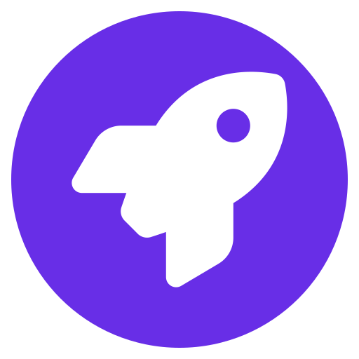

# What is Orion+?

[Orion+](https://browser.kagi.com/orionplus.html) allows you to support the Orion project and mission.

For a small fee ($5 per month, $50 per year, or $150 for a lifetime subscription), you’ll get:

- Direct communication with the development team
- The ability to influence the browser’s development
- Access to nightly builds, bleeding-edge WebKit (faster than stable), and experimental features
- The satisfaction of supporting an ad-free, zero-telemetry browser 
- An Orion+ icon on the feedback forum to represent that support 
- The Orion+ role in the [Kagi Community Discord](https://kagi.com/discord), giving you access to the release candidate (macOS) and TestFlight (iOS) channels.

We are still working on some of these features, and they will be released shortly.

Your financial contribution will help us stay independent and deliver on our promise to become the best browser for our users.
You can also help by spreading the word about Orion everywhere you go, from social media to the dinner table.

 
