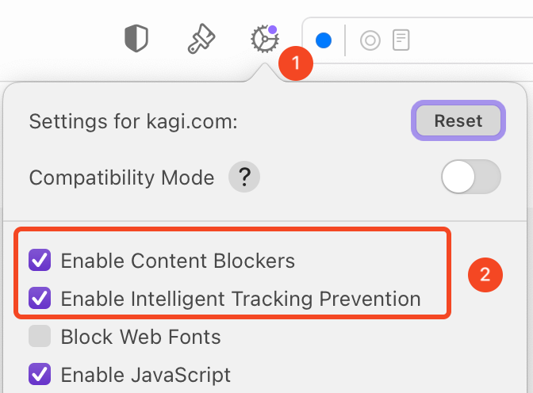
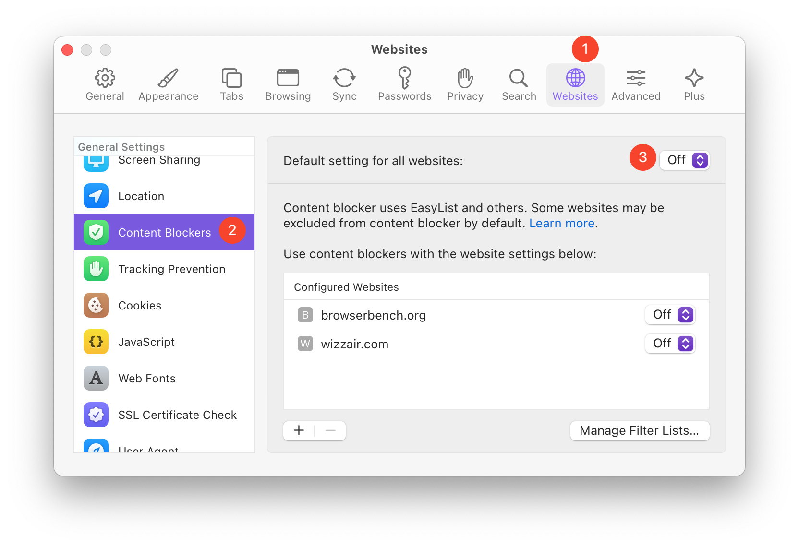
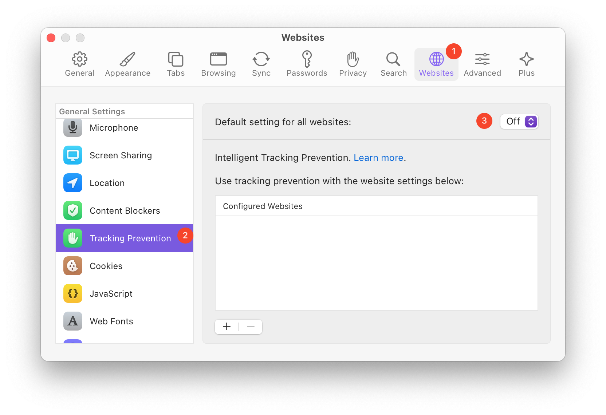
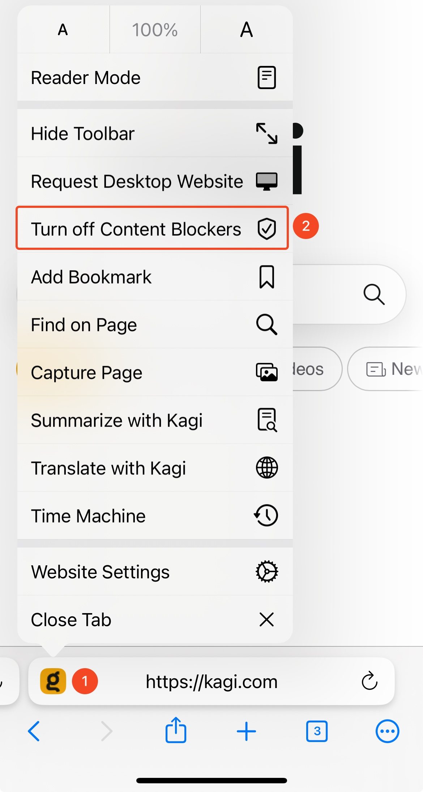
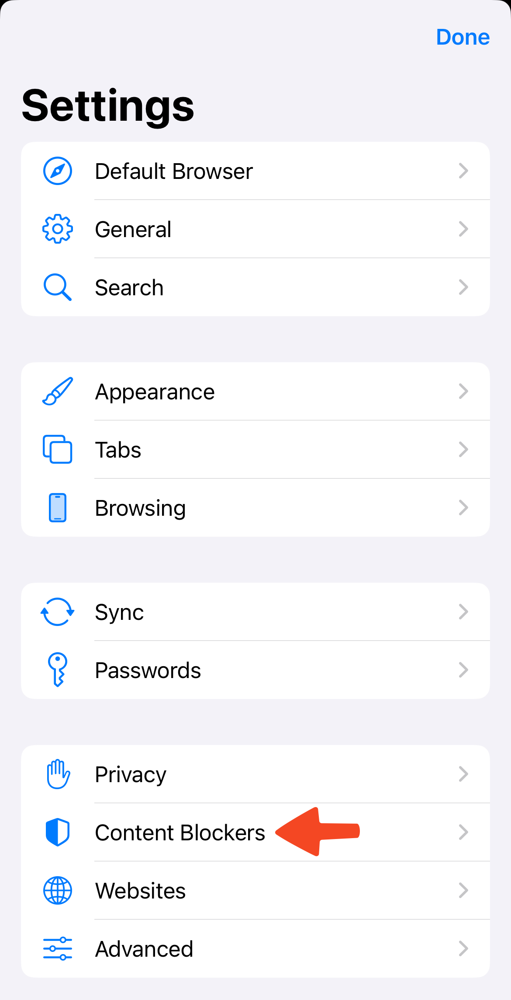
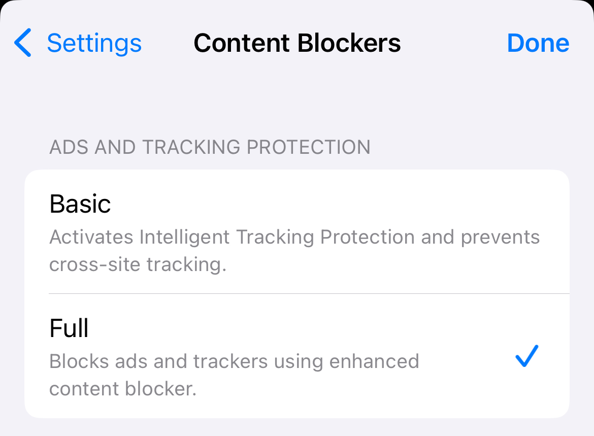

---
next:
  text: 'Respecting Privacy'
  link: '/orion/privacy-and-security/respecting-privacy'
---

# Configure Ad & Tracking Blocking

## Table of Contents
- [Why Use Blocking?](#why_blocking)
- [macOS Configuration](#blocking_macos)
- [iOS and iPadOS Configuration](#blocking_ios_ipados)
- [Websites Whitelisted From Blocking](#whitelist)

## Why Use Blocking?

Over [700 million devices block online ads](https://www.statista.com/statistics/435252/adblock-users-worldwide/), creating the largest silent protest in human history. We too believe in a cleaner, more humane web.   
  
Orion blocks both first-party and third-party ads, trackers, and other annoyances by default. We do this to make your online adventures more enjoyable and more private. It also saves you time, battery, and data. Yes, it may occasionally break a site, but in most cases the benefit outweighs the risk.

If you wish, you can disable blocking either for a specific website or globally.

## macOS Configuration

You can disable the content blocking or tracker prevention for a specific site using the gear icon on Orion's toolbar:

 

To disable Orion's content blocking and/or tracking prevention for all websites:

1. In Orion, click the **Orion** menu and choose **Settings**.

 

2. Click the **Websites** tab.
3. Click  **Content Blockers** or **Tracking Prevention** in the list of options.
4. Set "Default settings for all websites" to **Off**.

 
 

## iOS and iPadOS Configuration

You can disable content blocking for a specific site by tapping the site's favicon image:

 

You can also configure content blocking globally:

1. Tap the three-dot menu (•••).
2. Tap **Settings**.
 
3. Go to **Content Blockers**
 
4. In the **Ads and Tracking Protection** section you can configure whether **Basic** tracking protection or **Full** tracking and advertising protection is enabled. Please note that **Basic** protection does **not** include any ad-blocking features.

 

## Websites Whitelisted From Blocking

Orion comes with a built-in content blocker that in rare cases can affect proper functionality of some websites. We maintain a whitelist of websites where content blocker will be turned off by default.

This list currently consists of:

-   browserbench.org - The content blocker interferes with JavaScript performance benchmarking. We decided it is best to have it off to measure the real speed of WebKit's JavaScript engine.
-   wizzair.com - The content blocker interferes with rendering of the website.

If you wish, you can enable blocking on any whitelisted website using the instructions above.

