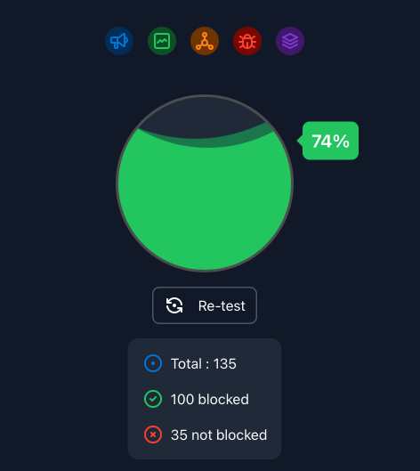
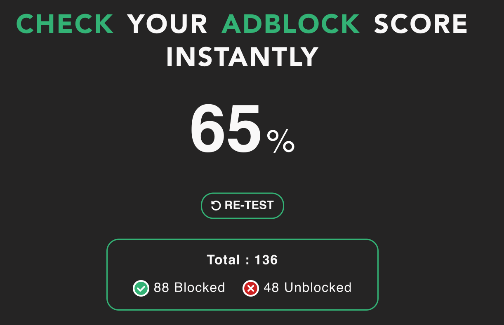

# Orion and Ad-blocking Tests

## Table of Contents

- [Overview](#overview)
- [The Problems with Ad-blocking Tests](#problems)
- [Orion's Stance](#orions_stance)
- [Further Reading](#further_reading)

## Overview {#overview}

This documentation page is intended to answer questions users might have about the scores Orion receives on various ad-blocking test sites.
In short, the tests are flawed and do not reflect real-world usage in any meaningful way, and there is no reason to be concerned about the test results.
This is explained in greater detail below, with links to further reading.

## The problems with ad-blocking tests {#test_problems}

The demand for privacy and security is greater than ever before.
This trend is particularly relevant when it comes to web browsers.
Consequently, it is common for users to test the ad-blocking features of their browsers and extensions by running various content-blocking tests found online.
These tests generally report the percentage of ads and trackers that the user's browser configuration was able to block:
 
 

Unfortunately, these tests do not reflect the real-world content-blocking capabilities of any browser or extension, often resulting in concerned reports about the privacy or security features of said browser or extension.
For example, based on the example results above, a user might think that 26% or 35% of the undesired content online, respectively, is making its way through the content blocker, exposing the user to great dangers and indicating that their configuration is inadequate for safe browsing.

Fortunately, the above example is not true.
Instead, the tests that claim to accurately measure ad-blocking capabilities mislead their users either into a false sense of security or into mistakenly thinking that there is something wrong with their setup, even if they are not encountering any issues on the web pages they visit daily.

## Orion's stance{#stance}
As can be seen from the above, users should not expect their browsers to ace any content-blocking test; instead, they should focus on real-world usage.
Orion strives to provide a thorough yet sleek approach to ad blocking out of the box.
This is achieved by having sensible default filter lists in the content blocker.
The default configuration is designed to be more than adequate for the vast majority of users while also minimizing website breakage and any performance hits.
If you encounter sites where that is not the case, please [report the issue](../support-and-community/roadmap-feedback-forum.md).
Advanced users can configure their content blockers to fit their needs.
Please see the [custom blocklists](../features/custom-blocklists.md) documentation page for further information.

Previously, Orion shipped with lists that, in addition to the above, also included rules to score well on the aforementioned test as this reduced the number of reports created about these tests.
As the Orion team continues to improve the built-in content blocker, it was decided that the test should no longer receive any attention, and the unnecessary rules were removed from the default content blocker configuration, as they did not improve the privacy of the users or the performance of the browser.

We believe this is the correct way forward, and we invite our users to focus on real-world content blocking rather than flawed tests.

## Further reading{#further_reading}

- [How “test your adblocker” websites can harm users and the adblocker ecosystem](https://brave.com/blog/adblocker-testing-websites-harm-users/) ([Archived](https://web.archive.org/web/20250110081559/https://brave.com/blog/adblocker-testing-websites-harm-users/))

A more technical and detailed post written by the Lead for Privacy Engineering of Brave.

- [uBlock Origin creator Raymond Hill (gorhill) on X](https://x.com/gorhill/status/1583581072197312512)

The post is a couple of years old at this point but the misinterpretation of ad-blocker test results continues.

- [The workarounds added to uBlock Origin due to flawed tests](https://github.com/uBlockOrigin/uAssets/blob/4a654ecf710749e39c50baa86e86e26681ea3aca/filters/filters.txt#L13688-L13692)
- [The workarounds added to AdGuard lists due to flawed tests](https://github.com/AdguardTeam/AdguardFilters/blob/daba77058c72b983f2a46b97dca5b669710a7414/SpywareFilter/sections/specific.txt#L4491-L4521)
