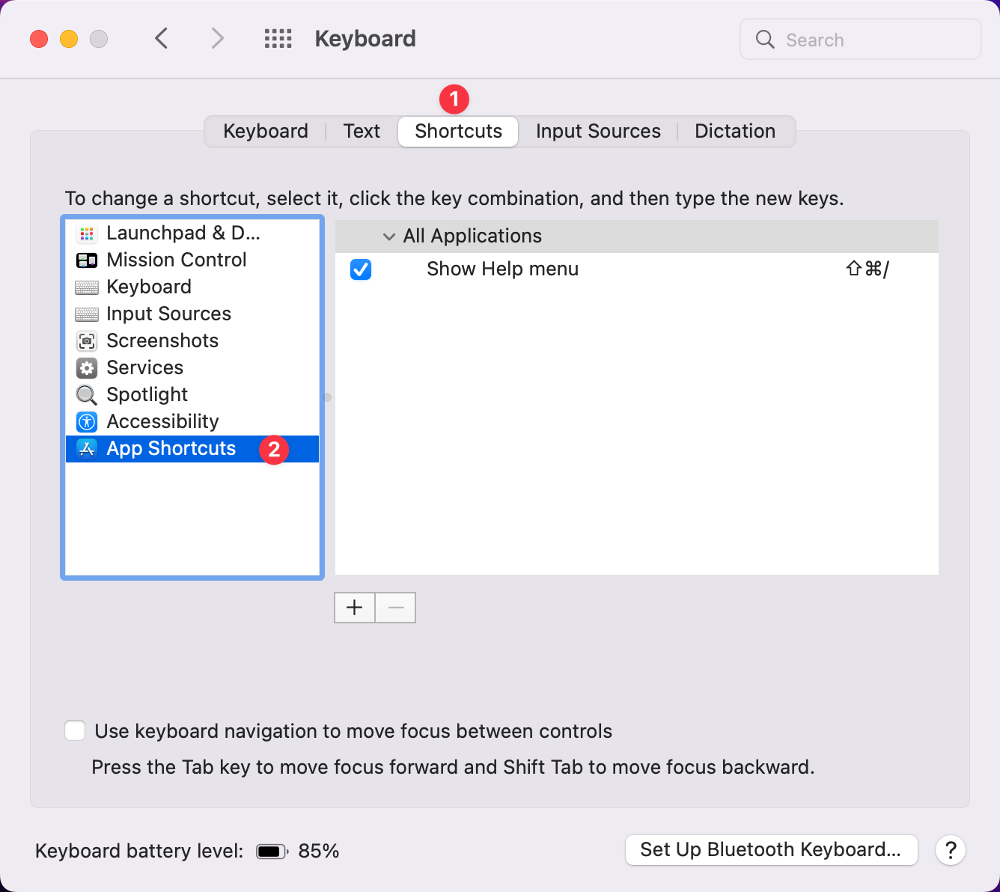

# Keyboard Shortcuts

Orion for macOS uses OS-level keyboard shortcuts. You may wish to change certain shortcuts from their defaults. You may also find other apps have shortcuts that conflict with Orion's defaults. You can change the keyboard shortcuts for Orion or other apps based on your specific needs.

To change your shortcuts in macOS:

1. Click the Apple menu () and click **System Preferences**.
2. Click **Keyboard**.
3. Click the **Shortcuts** tab.
4. Click **App Shortcuts** in the list of options.

 

Apple provides more detailed information about [creating keyboard shortcuts](https://support.apple.com/guide/mac-help/create-keyboard-shortcuts-for-apps-mchlp2271/mac) and [resolving shortcut conflicts](https://support.apple.com/guide/mac-help/change-a-conflicting-keyboard-shortcut-on-mac-mchlp2864/12.0/mac/12.0).
